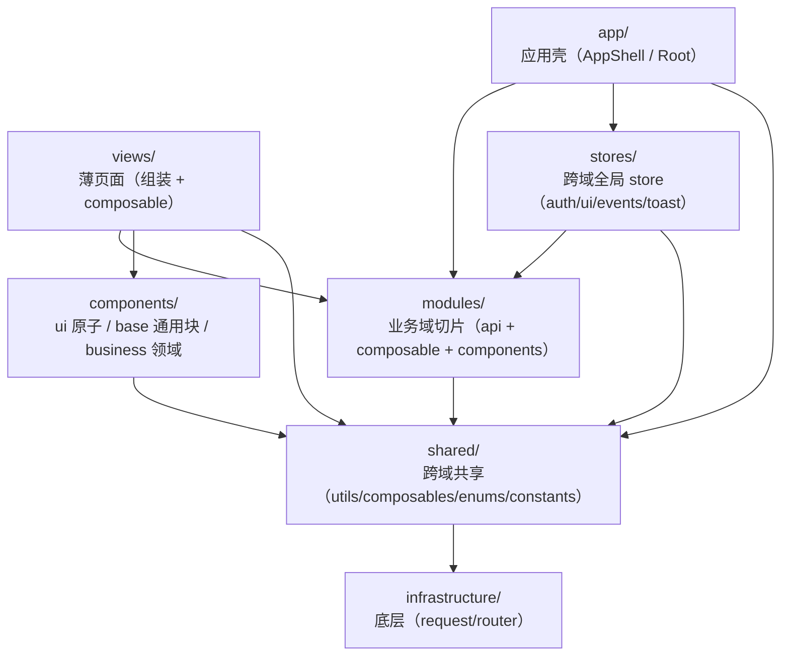

# 前端分层架构

P11 收尾后的四层 + 业务域 modules 架构。依赖方向是铁律，违反即不合格。

## 分层总览



依赖方向（铁律）：

```
views / app / stores  ->  modules  ->  shared  ->  infrastructure
```

- 左侧依赖右侧，**右侧禁止反向依赖左侧**。
- **infrastructure / shared 禁止 import modules / views / stores 里的业务逻辑**（constants/enums 中的领域名词除外）。
- infrastructure 不依赖 shared；shared 可依赖 infrastructure。
- modules 之间原则上互不依赖（各自独立域）；确需共享走 shared。

## 目录说明

```
src/
├── infrastructure/          # 零业务语义
│   ├── request/             # HTTP 底层：token.ts(令牌) + client.ts(apiUrl/request<T>) + index.ts
│   └── router/              # 路由表 + router 实例（hash 模式）
├── shared/                  # 跨域共享，不懂具体业务页面
│   ├── utils/               # cn / format / keyboard / timeTokens / theme
│   ├── composables/         # useRequest / useAsyncLoad / usePane
│   ├── enums/               # Workspace / Theme / TaskStatus（canonical 单一来源）
│   └── constants/           # storage-keys（lx_pane_* 等应用层键）
├── modules/                 # 按业务域切片（api + composable + types + constants）
│   ├── auth/                # AuthAPI
│   ├── admin/               # AdminAPI（adminOverview/adminUser，供 admin/ 后台）
│   ├── app/                 # AppAPI（getState/capture/search/mentions，跨域无单一属主）
│   ├── tasks/               # TasksAPI + composables(useDatabaseBoard/useProjects/useTaskDetail) + types
│   ├── clarify/             # ClarifyAPI + composables/useClarify
│   ├── nontodo/             # NonTodoAPI + composables/useNonTodo
│   ├── agent/               # AgentAPI + constants.ts(AI_PRESETS) + composables/useAgentConfig
│   ├── settings/            # SettingsAPI + composables/useSettings（+ SETTINGS_KEY 注入）
│   ├── chat/                # ChatAPI + composables(useChat 门面 + Conversations/Messages/Send/Feed) + types + utils
│   ├── friends/             # FriendsAPI + composables/useFriends
│   └── notifications/       # NotificationsAPI
├── components/
│   ├── ui/                  # ShadCN 原子（button/input/label/switch/textarea/card）
│   ├── base/                # 应用通用块（ViewHeader/PageBody/SectionLabel/TabPills/ListRow/ContentCard/LoadingState/EmptyState）
│   └── business/            # 领域组件（Friend*/Agent*/AutoRuleItem + Chat*/TaskCard/BoardColumn/Settings*）
├── app/                     # 应用壳
│   ├── AppShell.vue         # 登录屏 + 侧栏 + 视图 switch + toast + 详情面板
│   └── Root.vue             # RouterView 出口
├── stores/                  # 跨域全局 store：auth / ui / events / toast（直引 modules API）
├── views/                   # 薄页面（9 个，script <110 行：Chat/Database/Projects/Friends/Clarify/NonTodo/Agent/Settings/TaskDetail）
├── motion/                  # GSAP 指令与 FLIP（useFlip 被 tasks/useDatabaseBoard 复用，见已知例外）
├── types/api.ts             # API 实体类型（TaskStatus/Workspace 等已 re-export 自 shared/enums）
└── main.ts                  # 入口（Pinia + router + 全局指令 + 错误兜底）
```

## 新增功能落在哪一层（checklist）

| 需求 | 落点 |
|------|------|
| 新 HTTP 端点 / 底层 fetch / token | `infrastructure/request/` |
| 路由表 / 路由守卫 | `infrastructure/router/` |
| 通用纯函数（cn / 格式化 / 键盘 / 时间 / 主题） | `shared/utils/` |
| 跨域枚举（Workspace / Theme / TaskStatus …） | `shared/enums/` |
| 应用层常量（storage key 等） | `shared/constants/` |
| 通用 composable（请求三态 / 分栏拖拽） | `shared/composables/` |
| 某业务域的后端调用 | `modules/<域>/api.ts`（youlai 风格对象） |
| 某业务域的类型 | `modules/<域>/types.ts`（或暂留 `types/api.ts`） |
| 某业务域的状态+操作（load/mutate/toast） | `modules/<域>/composables/use<域>.ts` |
| 某业务域的常量（如 AI 预设） | `modules/<域>/constants.ts` |
| 领域组件（带业务语义、props/emits、禁 fetch） | `components/business/` |
| 通用布局块（零 API 零 store） | `components/base/` |
| ShadCN 原子 | `components/ui/` |
| 页面 | `views/`（只组装 + 调 composable，不直接写业务规则） |
| 全局跨域状态 | `stores/` |

## 兼容层（P11 已删除）

P10 渐进迁移期间保留的薄 re-export 兼容层已在 P11 全部删除（消费者迁至 canonical 路径后）：

- `lib/{utils,format,keyboard,timeTokens,theme,aiPresets,api}.ts`、`composables/{useRequest,useAsyncLoad,useFriends,useAgentConfig}.ts`、`app/composables/usePane.ts`、`app/router.ts` 全部移除。
- canonical 路径单一来源：`@/shared/utils/*`、`@/shared/composables/*`、`@/modules/<域>/{api,composables/*}`、`@/infrastructure/{request,router}`。新代码禁止 `@/lib/*`、`@/composables/*`、`@/app/router`。

> `lib/api.ts` 聚合层已删：stores/AppShell/admin 改直引 modules API + infrastructure 令牌，无长期例外。

## 已知分层例外

- **`infrastructure/router/index.ts` 引用 `@/app/AppShell.vue`**：路由表需指向路由宿主组件。AppShell 属 app 壳（非 modules/views/stores 业务逻辑），故不违反「infrastructure 禁止 import 业务逻辑」铁律。这是路由耦合的不可避免引用。
- **`modules/tasks/composables/useDatabaseBoard.ts` 引用 `@/motion`（useFlip）**：看板拖拽的 FLIP 动画复用全局 GSAP 工具。`motion/` 是与 shared 同级的基础设施层（GSAP 指令 + FLIP），非业务逻辑，故不违反 modules 依赖铁律。
- **`SettingsView` 经 `provide/inject(SETTINGS_KEY)` 向 6 个 section 组件注入 `useSettings`**：设置页 section 多达 6 个、绑定 30+，逐个 props 钻取冗长；provide/inject 限定在 SettingsView 子树内，composable 仍「禁 fetch」语义不变。属 props/emits 约定的有限例外。
