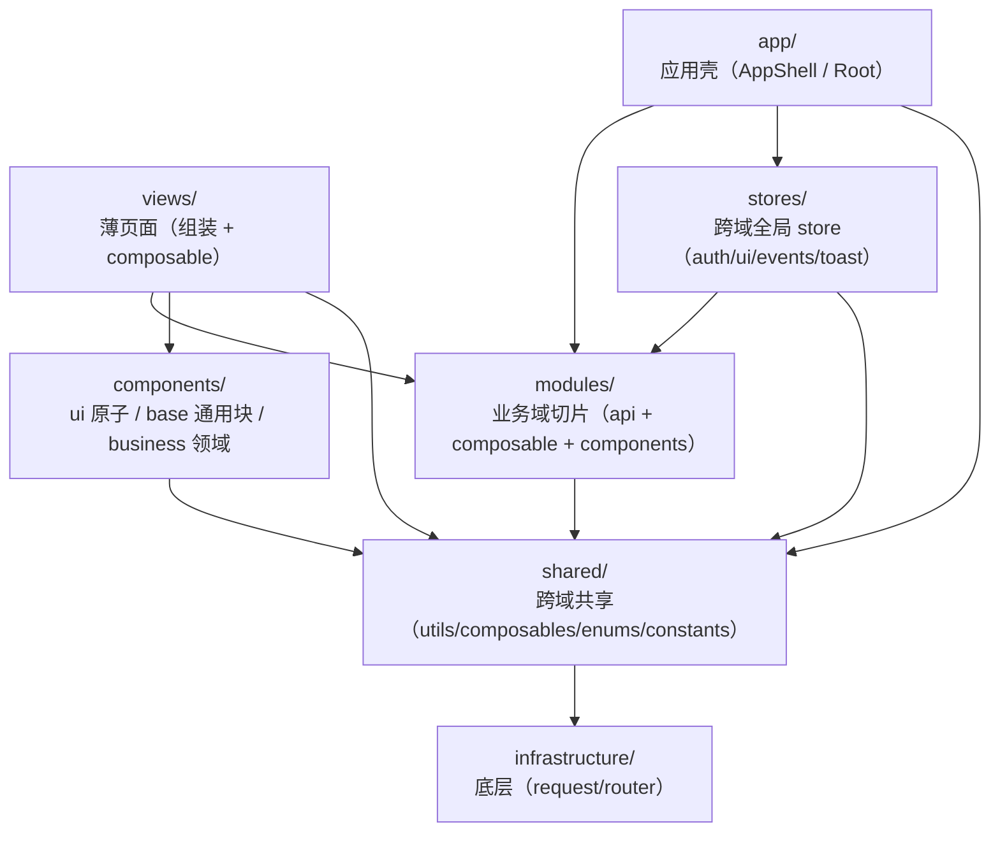

# 前端分层架构

P10 收敛后的四层 + 业务域 modules 架构。依赖方向是铁律，违反即不合格。

## 分层总览



依赖方向（铁律）：

```
views / app / stores  ->  modules  ->  shared  ->  infrastructure
```

- 左侧依赖右侧，**右侧禁止反向依赖左侧**。
- **infrastructure / shared 禁止 import modules / views / stores 里的业务逻辑**（constants/enums 中的领域名词除外）。
- infrastructure 不依赖 shared；shared 可依赖 infrastructure。
- modules 之间原则上互不依赖（各自独立域）；确需共享走 shared。

## 目录说明

```
src/
├── infrastructure/          # 零业务语义
│   ├── request/             # HTTP 底层：token.ts(令牌) + client.ts(apiUrl/request<T>) + index.ts
│   └── router/              # 路由表 + router 实例（hash 模式，从 app/router.ts 迁入）
├── shared/                  # 跨域共享，不懂具体业务页面
│   ├── utils/               # cn / format / keyboard / timeTokens / theme
│   ├── composables/         # useRequest / useAsyncLoad / usePane
│   ├── enums/               # Workspace / Theme / TaskStatus（canonical 单一来源）
│   └── constants/           # storage-keys（lx_pane_* 等应用层键）
├── modules/                 # 按业务域切片（api + composable + types + constants）
│   ├── auth/                # AuthAPI + （login/register/logout/me/...）
│   ├── admin/               # AdminAPI（adminOverview/adminUser，供 admin/ 后台）
│   ├── app/                 # AppAPI（getState/capture/search/mentions，跨域无单一属主）
│   ├── tasks/               # TasksAPI（任务CRUD/子任务/评论/协作邀请/项目/团队/规划）
│   ├── clarify/             # ClarifyAPI（ideaConvert/Archive/Discard）
│   ├── nontodo/             # NonTodoAPI（nonToTodo/nonDiscard）
│   ├── agent/               # AgentAPI + constants.ts(AI_PRESETS) + composables/useAgentConfig
│   ├── settings/            # SettingsAPI + composables/useSettings
│   ├── chat/                # ChatAPI（chat/chatStream/conversations/subscribeEvents + SSE 实现 + 类型）
│   ├── friends/             # FriendsAPI + composables/useFriends
│   └── notifications/       # NotificationsAPI
├── components/
│   ├── ui/                  # ShadCN 原子（button/input/label/switch/textarea/card）
│   ├── base/                # 应用通用块（ViewHeader/PageBody/SectionLabel/TabPills/ListRow/ContentCard/LoadingState/EmptyState）
│   └── business/            # 领域组件（FriendRow/FriendListSection/FriendAddForm/AgentSectionPanel/AutoRuleItem）
├── app/                     # 应用壳
│   ├── AppShell.vue         # 登录屏 + 侧栏 + 视图 switch + toast + 详情面板
│   ├── Root.vue             # RouterView 出口
│   └── router.ts            # re-export 兼容层（指向 infrastructure/router，P11 删）
├── stores/                  # 跨域全局 store：auth / ui / events / toast
├── views/                   # 薄页面（9 个：Chat/Database/Projects/Friends/Clarify/NonTodo/Agent/Settings/TaskDetail）
├── lib/                     # 兼容层：api.ts(聚合 api) + utils/format/keyboard/timeTokens/theme/aiPresets re-export（P11 删）
├── composables/             # 兼容层：useRequest/useAsyncLoad/useFriends/useAgentConfig re-export（P11 删）
├── motion/                  # GSAP 指令与 FLIP
├── types/api.ts             # API 实体类型（TaskStatus/Workspace 等已 re-export 自 shared/enums）
└── main.ts                  # 入口（Pinia + router + 全局指令 + 错误兜底）
```

## 新增功能落在哪一层（checklist）

| 需求 | 落点 |
|------|------|
| 新 HTTP 端点 / 底层 fetch / token | `infrastructure/request/` |
| 路由表 / 路由守卫 | `infrastructure/router/` |
| 通用纯函数（cn / 格式化 / 键盘 / 时间 / 主题） | `shared/utils/` |
| 跨域枚举（Workspace / Theme / TaskStatus …） | `shared/enums/` |
| 应用层常量（storage key 等） | `shared/constants/` |
| 通用 composable（请求三态 / 分栏拖拽） | `shared/composables/` |
| 某业务域的后端调用 | `modules/<域>/api.ts`（youlai 风格对象） |
| 某业务域的类型 | `modules/<域>/types.ts`（或暂留 `types/api.ts`） |
| 某业务域的状态+操作（load/mutate/toast） | `modules/<域>/composables/use<域>.ts` |
| 某业务域的常量（如 AI 预设） | `modules/<域>/constants.ts` |
| 领域组件（带业务语义、props/emits、禁 fetch） | `components/business/` |
| 通用布局块（零 API 零 store） | `components/base/` |
| ShadCN 原子 | `components/ui/` |
| 页面 | `views/`（只组装 + 调 composable，不直接写业务规则） |
| 全局跨域状态 | `stores/` |

## 兼容层（re-export，待 P11 删除）

P10 渐进迁移期间保留薄 re-export 维持旧 import 路径零破坏。P11 迁完剩余消费者后删除：

- `lib/utils.ts` `lib/format.ts` `lib/keyboard.ts` `lib/timeTokens.ts` `lib/theme.ts` `lib/aiPresets.ts` —— `export * from '@/shared/...'` / `@/modules/agent/constants`
- `composables/useRequest.ts` `useAsyncLoad.ts` `useFriends.ts` `useAgentConfig.ts` —— `export * from '@/shared/...'` / `@/modules/.../composables/...`
- `app/composables/usePane.ts` —— `export * from '@/shared/composables/usePane'`
- `app/router.ts` —— `export { router } from '@/infrastructure/router'`

> `lib/api.ts` **不是**纯 re-export，而是**聚合层**：`api = { ...各域API }` 拼装统一 `api` 对象 + re-export `setToken/getToken/req/ChatStreamHandlers/ServerEvent`。当前仍被 `app/AppShell.vue`、`stores/{auth,ui,events}`、`admin/Admin.vue` 使用；P11 视情况收敛（admin/ 独立入口可能长期保留聚合）。

## 已知分层例外

- **`infrastructure/router/index.ts` 引用 `@/app/AppShell.vue`**：路由表需指向路由宿主组件。AppShell 属 app 壳（非 modules/views/stores 业务逻辑），故不违反「infrastructure 禁止 import 业务逻辑」铁律。这是路由耦合的不可避免引用。
- **stores 仍经 `@/lib/api` 聚合 `api`**：auth/ui/events store 跨域调用，暂用聚合 `api`（P11 可按域拆）。views 已全部改为 `modules/*/api`（直接或本地合并）。
