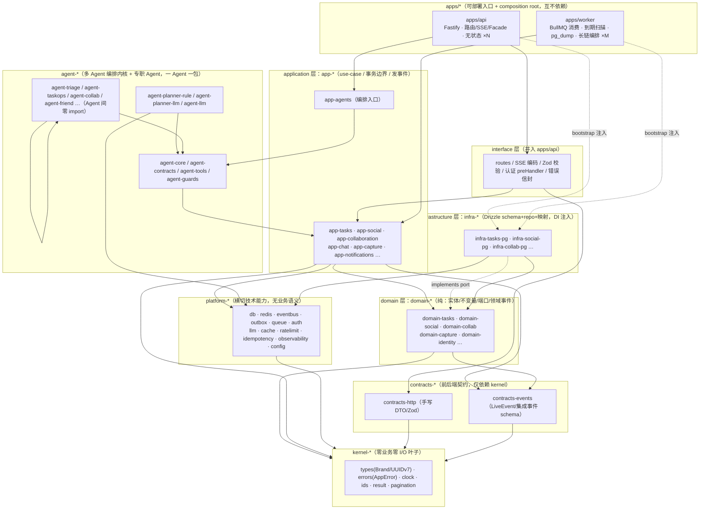
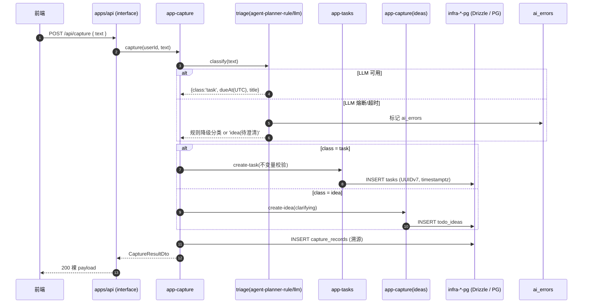
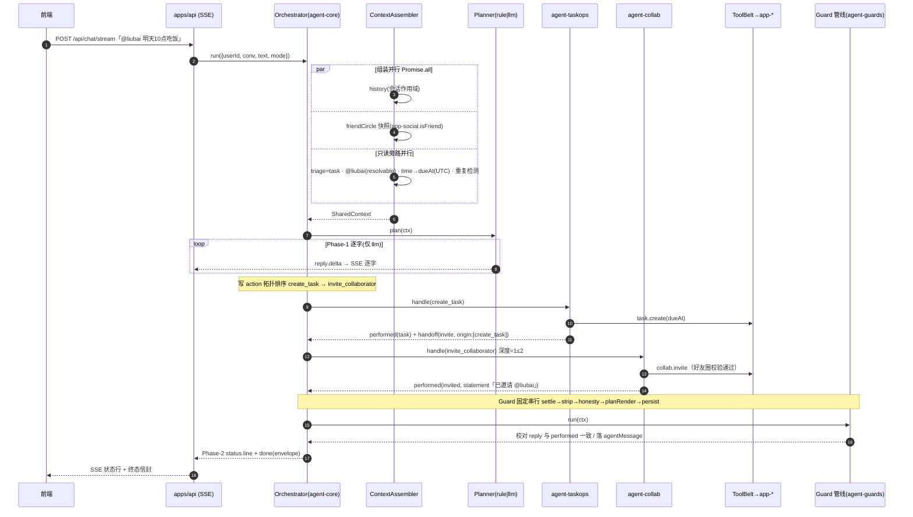
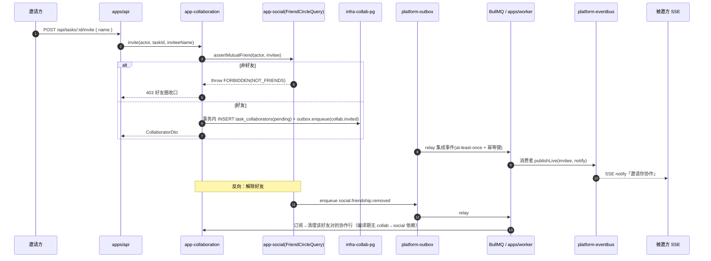
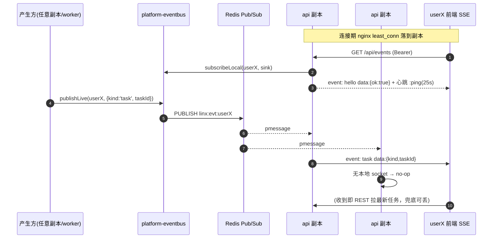

# LinX 灵信 · 后端架构总览（Backend Architecture Design）

> 面向读者：接手本后端重构的工程师 / AI。
> 本文是**装配层文档**——把《统一架构决策记录（ADR-000）》与七篇细化文档缝合成一张「一图看懂、四流看透」的总览。任何与本文冲突处，以 ADR-000 主文档为准；本文不重开技术选型，只解释**形态、地图、数据流、并发/Agent 应对与风险**。
>
> ⚠️ **施工前必读**：本设计集经对抗式评审（[`backend-architecture-review.md`](backend-architecture-review.md)）发现 4 个违反硬约束的 Blocker，已在 [`backend-reliability-amendment.md`](backend-reliability-amendment.md) 逐条收口。**冲突以修订 ADR 为准**；开工前先过其 §D.2 的 15 项检查清单。
>
> **本文档集导航**：本总览 · [ADR-000 决策记录](backend-decisions.md) · [可靠性收口 ADR](backend-reliability-amendment.md) · [对抗式评审](backend-architecture-review.md) · [包结构与目录规范](backend-package-structure.md) · [数据模型与迁移](backend-data-model.md) · [API 契约与类型共享](backend-api-contract.md) · [横切设计](backend-cross-cutting.md) · [多 Agent 子系统](backend-multi-agent.md) · [测试与 CI](backend-testing-ci.md) · [迁移落地计划](backend-migration-plan.md) · [需求与现状](backend-rearchitecture-requirements.md)

---

## 1. 设计目标（五北极星）与一句话定性

本次重构由用户明确要求的**五北极星**统摄，全程不可动摇：

| # | 北极星 | 一句话含义 |
|---|---|---|
| ① | **易于扩展** | 新增一个实体/功能有清晰可复制的落点，改动局部化在纵切内。 |
| ② | **支持高并发** | I/O 密集路径吃满事件循环，重活下沉，副本可线性扩。 |
| ③ | **多 Agent 协同** | 意图分诊/任务增删改查/规划/协作/记忆/澄清/守卫等专职 Agent 协同，需编排层。 |
| ④ | **万人级（1 万+）水平扩展** | 状态全在 PG+Redis，无状态副本，包边界即未来服务边界。 |
| ⑤ | **【硬】细粒度多包 / 命名清晰 / 易改** | monorepo + 一 bounded context×一层职责一个包，禁 God-file、禁循环依赖。 |

**一句话架构定性：**

> **模块化单体（Modular Monolith）+ monorepo 细粒度多包（45–60 包），单机 Docker 部署 `apps/api`×N + `apps/worker`×M，四层严格向内依赖（interface / application / domain / infrastructure）+ 确定性多 Agent 编排层；不切微服务，但包边界即未来服务边界，可零重写演进。**

核心工程等式：**Drizzle（数据访问单一真相源）× outbox+BullMQ（唯一可靠投递）× Redis Pub/Sub（实时可丢）× layer×context 细拆 × 确定性 Orchestrator+PlannerStrategy（消灭双 God-file）** —— 五北极星在同一形态内自洽。

---

## 2. 分层与包地图（一图看懂 apps/packages 与四层）

依赖方向**只准向内**：端口（port）定义在 `domain`、实现在 `infrastructure`、`application` 只依赖端口，`apps/*` 的 composition root 注入。DIP 是消循环依赖、拆细包的关键。

**允许方向速记：** `apps → interface/app → domain ← infra`；`app → platform 接口`；`agent-* → agent-core/contracts/tools`；一切 → `kernel`。
**禁止（三道边界闸物理拦截）：** domain→外层、app→具体 infra、domain-A→domain-B、agent 专职包互相 import、apps 互依、任何环。

**四层职责一句话：**

| 层 | 职责 | 允许依赖 | 硬禁 |
|---|---|---|---|
| **interface**（apps/api） | 路由、Zod、SSE 编码、认证中间件、错误信封 | app-*、contracts-* | 直接碰 PG/Redis、写业务 |
| **application**（app-*） | use-case 编排、事务边界、发领域事件、调端口 | domain-*、其它 app-* 查询接口、platform-* 接口、agent | import 具体 infra、import 别的 domain 内部 |
| **domain**（domain-*） | 实体/值对象/不变量/纯服务/领域事件/端口接口 | 仅 kernel-*、contracts-events | 任何 infra/框架/其它 context domain |
| **infrastructure**（infra-*/platform-*） | 端口实现：Drizzle repo+映射、Redis 总线、LLM adapter、argon2 | 对应 domain-*、platform-*、kernel-* | 被 domain/app import（只能 DI 装配） |

**包分类前缀白名单（命名铁律 `@linx/<prefix>-<context>[-<tech>]`）：** `apps` · `kernel` · `contracts` · `platform` · `domain` · `app` · `infra` · `agent`。看包名即知**层 + 上下文 + 技术**三要素。规模约 45–60 包（宁细勿混，停止条件：一个包应有独立不变量或独立变更理由）。

---

## 3. 四条关键数据流（叙事 + 时序图）

### 3.1 数据流 ① Capture：想法 → triage → 落库

**叙事：** 用户抛入一句自然语言（「下周三前把季度报告初稿写完」）。`app-capture` 用例接管：先经 triage 判定（rule 或 llm）分类为 `task | idea | nonTodo`，再走对应 `app-*` 用例落库，同时写 `capture_records` 溯源。**闭环红线：即便 LLM provider 熔断/超时，也降级 RulePlanner 或直接落为「待澄清 idea」并标 `ai_errors`——想法绝不丢。** 时间统一 UTC `timestamptz`，ID 应用层 UUIDv7。

命中北极星：① 新增 capture 类型只碰 `domain-capture`/`app-capture` 纵切；② triage 重活可下沉 worker；③ triage 即 rule/llm 两 Planner 的雏形收口点。

---

### 3.2 数据流 ② 多 Agent 对话：@成员+时间 → 并行 Agent → tool → 守卫 → 流式

**叙事：** 「@liubai 明天10点吃饭」。`Orchestrator`（确定性、无 LLM）先**并行组装** SharedContext（会话历史 / 好友圈快照 / 只读旁路：triage+@解析+重复检测），再由 `PlannerStrategy`（rule 或 llm）产出 `Action[]`——**这是离线与 AI 模式的唯一差异点**。之后完全共用：写 action 按聚合依赖**拓扑排序**（`create_task` 先于引用它的 `invite_collaborator`），专职 Agent 经 `ToolBelt`（权限收口）调 `app-*` use-case，Agent 间只走**类型化 handoff**（白名单、深度≤2、origin 去重防环）。最后 **Guard 中间件管线固定串行**：`settle → strip → honesty → planRender → persist`。流式两段：Phase-1 Planner 逐字 reply（仅 llm），Phase-2 权威状态行；罕见 strip 删已流出文字时发 `{reply.final}` 兜底。对外信封 `{intent,reply,entities,plan,performed,userMessage,agentMessage}` 冻结不变。

命中北极星：③ 一 Agent 一包 + 确定性编排 + handoff/Flow；⑤ 消灭 `chat.js`/`agentChat.js` 双 God-file（决策/执行/守卫分属不同包）；② 长链 LLM 编排可整段下沉 worker（见 3.4 变体）。

---

### 3.3 数据流 ③ 协作：邀请-确认 + 权限收口

**叙事：** 协作的两个方向都被**结构性消环**。正向（collab 邀请前判好友）走 `app-social.FriendCircleQuery.isFriend()`——「好友圈判定」在 team·@·指派·邀请四处复用的**单点真理**；反向（解除好友 → 清理协作）走**领域事件** `social.friendship.removed`，`app-collaboration` 订阅、编译期不再依赖 social。协作三态（pending/accepted/left|declined）由 `agent-guards.collabSettle` 或 `app-collaboration` 用例定稿，权限收口在 use-case 内（HTTP 与 Agent Tool 双入口共同的收口处，防 Tool 绕过路由越权）。可靠副作用（邀请通知扇出）走 **事务 outbox → BullMQ**。

命中北极星：③⑤ collab↔friends 循环被「事件 + 查询接口 + 类型化 handoff」三重消环，`dependency-cruiser` 的 `no-circular`/`no-cross-domain` 是硬门禁证据；④ outbox+BullMQ 保证跨用户扇出多实例安全、at-least-once。

---

### 3.4 数据流 ④ 实时：SSE + Redis 扇出（无 sticky）

**叙事：** `/api/events` 是实时扇出通道，语义**至多一次、可丢、REST 重连拉全量兜底**。产生方 `publishLive(userId, evt)` → Redis Pub/Sub → **每个 api 副本都收到** → 仅持有该 userId socket 的副本 `deliverLocal` 成功，其余 no-op。故**无需 sticky session**，nginx `least_conn`/轮询即可，多副本对宿主 nginx 透明。`/api/events`、`/api/chat/stream` 必须 `proxy_buffering off; proxy_read_timeout 3600s`。事件不带业务全量，客户端收到即走对应 REST 拉最新——可丢也不脏读。

命中北极星：②④ 无状态副本 + Redis 扇出线性扩，重连拉全量对断连容错；实时（可丢 Pub/Sub）与可靠副作用（outbox+BullMQ）**物理分离**，不叠第二套手搓 Redis Streams。

---

## 4. 高并发/万人级 与 多 Agent 的架构应对

### 4.1 高并发 / 万人级（②④）

| 维度 | 应对 | 机制 |
|---|---|---|
| **无状态副本** | API `--scale api=N` 线性扩，宿主 nginx `upstream` 列多端口 | 状态全在 PG16+Redis7；session/限流/事件/幂等全多实例安全 |
| **请求路径瘦身** | LLM/Agent 长链、到期扫描、pg_dump、批量协作下沉 `apps/worker` | BullMQ 5 + FlowProducer，重活不占 API 事件循环 |
| **ID/时间** | UUIDv7 应用层生成（时间有序、多实例零碰撞）；timestamptz+全 UTC | 消除排序打平与多实例 ID 碰撞 |
| **分页** | keyset/cursor（`(user_id, created_at, id)`）而非 OFFSET | 深翻页不全表扫，与 UUIDv7 有序契合 |
| **索引** | 多租户列表首列必 `user_id`；到期扫描/未读用**部分索引** | 5M 行 tasks 单查毫秒级，worker 全量扫 <100ms |
| **限流/会话/缓存** | Redis 共享计数、opaque session（PG 真相源+Redis 热缓存）、单层 Redis 缓存主动失效 | 改密即吊销/即时封禁刚需有状态；多副本一致 |
| **可靠投递** | 事务 outbox → BullMQ（at-least-once + 重试 + DLQ + 幂等键） | 通知扇出/跨用户 pushChat 不丢不重 |
| **演进阶梯** | 单机 compose 多副本 → 队列深度扩 worker → pgBouncer(>60 连接) → 读副本(读 QPS>3000) | 包边界=服务边界，剥服务零重写 |

### 4.2 多 Agent（③）

| 维度 | 应对 |
|---|---|
| **编排** | 确定性 `Orchestrator`（无 LLM）+ 可替换 `PlannerStrategy(rule\|llm)`；离线/AI 唯一差异只在「谁产 action」 |
| **专职 Agent** | 一 Agent 一包（triage/taskops/plan/clarify/collab/friend/memory/identity/converse），Agent 间**零 import** |
| **协作协议** | 类型化 handoff（闭集白名单、深度≤2、origin 去重防环）；SharedContext 组装并行、只读旁路并行、写 action 拓扑串行 |
| **Guard** | 是**中间件不是 Agent**：诚实守卫/协作 settle/SSRF/限流固定顺序串行、观测聚合产物，保证顺序不脆 |
| **异步边界** | 单 turn 内 handoff 走进程内；跨请求整段编排走 BullMQ `chat.orchestrate`（边生成边 `publishLive`）；turn 后副作用走 outbox |
| **弹性** | provider 超时/429/5xx 熔断 → 降级 RulePlanner → 兜底 idea，capture 闭环不丢 |
| **新增零侵入** | 新 Tool = app 用例 + `agent-tools` 注册 + Agent allowlist + 两 Planner 映射；新 Agent = `defineAgent` + 注册，Guard 零改动 |

---

## 5. 文档索引（七篇细化文档）

| # | 细化文档 | 落点文件（建议） | 一句话 |
|---|---|---|---|
| 1 | 包结构与目录规范 | `docs/backend-package-structure.md` | monorepo 目录树、单包模板、三道边界闸、命名规范、copy-paste 扩展步骤 |
| 2 | 数据模型与迁移 | `docs/backend-data-model.md` | ERD、目标表结构、索引、drizzle-kit + advisory-lock runner、expand→backfill→contract 零丢失 |
| 3 | API 契约与类型共享 | `docs/backend-api-contract.md` | 路由清单、成功裸体+错误加法信封、keyset 分页、OpenAPI 生成、SSE 契约、`/api` 版本别名 |
| 4 | 横切设计 | `docs/backend-cross-cutting.md` | 错误层级、鉴权/授权 policy、限流、配置、ID/时钟、EventBus、可观测、DI、SSRF、幂等并发 |
| 5 | 多 Agent 子系统详细设计 | `docs/backend-multi-agent.md` | Orchestrator/Registry/上下文接口、专职 Agent 契约、Tool Registry、rule/llm 回退、Guard 管线、worker×流式 |
| 6 | 测试策略与 CI | `docs/backend-testing-ci.md` | 四层测试金字塔、Agent 可测性、159 用例迁 Vitest+PGlite、Turbo affected、dependency-cruiser 入 CI、覆盖率门禁 |
| 7 | 迁移与落地计划 | `docs/backend-migration-plan.md` | Strangler 8 阶段、进程内 Facade 逐路由切换、契约对拍、单机 Docker 双 entrypoint |

> 上述七篇均在 ADR-000 主文档拍板与 §5 命名法内展开，冲突以主文档为准。ADR 编号索引（ADR-000~020）见主文档 §10。

---

## 6. 关键取舍与已知风险

### 6.1 已拍板的关键取舍（含被否方案）

| 取舍 | 选定 | 被否 | 理由 |
|---|---|---|---|
| 数据访问 | **Drizzle ORM** | Kysely / Prisma | schema-as-code「加实体=加 schema 文件」直落①⑤；`sql\`\`` 逃生舱保 SQL 全控 |
| 可靠投递 | **outbox+BullMQ 一套** | 再叠 raw Redis Streams | BullMQ 已给 at-least-once/重试/DLQ，不搓第二套 ack/pending |
| 实时 vs 可靠 | **Pub/Sub（可丢）+ outbox（可靠）分离** | 用 Streams 兼做实时 | 实时可容忍丢失（重连拉全量），可靠副作用另走 outbox |
| 包粒度 | **layer×context 细拆** | 一个 context 一个大包（context-bundling） | 硬约束⑤原文「一层职责一个包」 |
| 契约派生 | **contracts-http 手写 Zod** | drizzle-zod 派生 API DTO | API DTO≠DB row，且需与前端 1:1；派生会让 contracts→infra 耦合 |
| 响应信封 | **成功裸体冻结 + 错误加法兼容** | 全局 `{data}` 信封 | 现网前端读裸 payload/裸 error 字符串，套信封即破坏契约 |
| 多 Agent | **确定性 Orchestrator + PlannerStrategy** | 模型自由编排 / Nest Module 编排 | 消灭双 God-file，收敛到「谁产 action」一层差异 |
| 部署形态 | **Modular Monolith 单机双 entrypoint** | 微服务 | 单机 Docker 下微服务运维税无收益；负载 I/O 密集，单进程+多副本即够 |
| DI | **Fastify plugin + composition root** | awilix | 依赖图编译期静态已知，无需运行时容器 |
| ID/时间默认落地 | **`text` 存 UUIDv7 字符串 + timestamptz** | 整库 `uuid` remap | 既修碰撞又零数据风险；原生 uuid 类型列为可选高风险后续项 |

### 6.2 已知风险与缓释

| 风险 | 影响 | 缓释 |
|---|---|---|
| **P7 Agent 编排回归**（领域口径：诚实守卫/@三态/dueAt/多轮/流式增量） | 最高 | 159 用例迁 Vitest 全绿 + chat 影子流量高一致率门控；对外信封冻结 |
| **P5 collab↔friends 消环耦合** | P4/P5 需同批回滚 | 三道闸 `no-circular` 硬门禁；正向查询接口 + 反向领域事件双管齐下 |
| **TEXT→timestamptz 时间迁移** | 唯一较重数据动作 | expand→backfill→contract，新旧列并存随时回退；naive 值按 `Asia/Shanghai` 解释转 UTC，空串显式排除 |
| **SSRF（用户可配 AI baseUrl）** | 内网/元数据端点攻击面 | 两道闸：config 期形态校验 + 调用前 DNS 解析拒私网段；理想加固为解析后固定 IP 发起连接（防 rebinding） |
| **Redis 持久化冲突** | BullMQ 需持久化 vs 实时 Pub/Sub 不需 | 队列用独立逻辑库/独立实例开 AOF，实时总线保持无持久化，物理/逻辑分离 |
| **多实例迁移竞态** | 多副本启动重复跑迁移 | `pg_advisory_lock` 串行，只跑一次；每 migrate 前 `pg_dump` |
| **Windows napi 依赖**（@node-rs/argon2 / PGlite） | 本地/CI 装配失败 | P0 即在 CI matrix(linux+win) 验证预编译可装 |
| **契约漂移破坏前端** | 前端零改动硬约束 | OpenAPI 快照冻结为回归基线 + golden corpus 对拍，破坏性 diff 即 CI 红 |
| **包数量膨胀**（45–60 包） | 认知/维护成本 | 拆包停止条件（独立不变量/独立变更理由）+ 三道闸兜底 + copy-paste 扩展模板 |
| **worker 优雅关闭** | 在途 job/连接泄漏 | `SIGTERM` → BullMQ `close()` 排空 + `closeEvents()` 断 Redis；测试态 PGlite `syncToFs` 顺序保留 |

---

## 7. 硬约束回执（不破坏项）

- **单机 Docker**：`apps/api`×N + `apps/worker`×M（同镜像不同 entrypoint）+ PG16 + Redis7；宿主 nginx `/todo/api/` → `127.0.0.1:8788` 反代**一字不改**，同机 `liubai.autos` 零感知，多副本对宿主 nginx 透明。
- **API 契约稳定**：`contracts-http` 冻结现有 request/response 形状（成功裸体、错误 `error:string`、两条 SSE 事件名），OpenAPI 作回归基线，前端零改动。
- **数据零丢失**：Strangler 期不搬库只切写路径；迁移人工 review + expand→contract 多步 + migrate 前 `pg_dump`，可回退。
- **多实例就绪**：session（PG+Redis）、限流（Redis）、事件（Pub/Sub）、可靠投递（outbox+BullMQ）、ID（UUIDv7）全多实例安全。
- **领域逻辑与测试保留**：优雅关闭、Redis 扇出+进程内回退、诚实守卫、@协作三态口径、流式增量提取——下沉对应包并迁移 Vitest 全绿。

---

*本文为装配层总览。落地细节见 §5 七篇细化文档；决策依据与 ADR 全表见《统一架构决策记录（ADR-000）》。*
