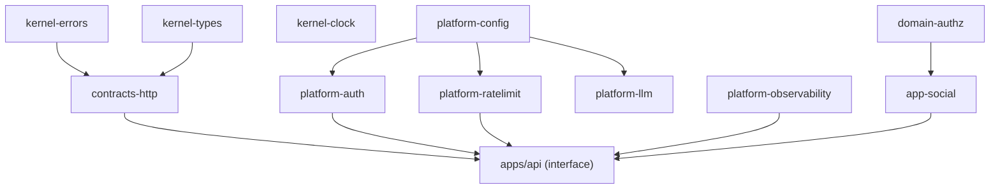

已充分对照现网代码（`server/src/lib/rateLimit.js`、`services/{auth,events}.js`、`config.js`、`lib/{ids,dates}.js`、`app.js` 的 preHandler/setErrorHandler、`routes/health.js`），下面是横切关注点设计，严格遵循 ADR-000 拍板与 §5 命名法。

---

# LinX 灵信 · 横切关注点设计（Cross-Cutting Concerns / ADR-006·008·009·018 落地细化）

> 范围：错误模型 / 鉴权授权 / 限流 / 配置 / ID·时间·时钟 / EventBus / 可观测 / DI 装配 / SSRF / 幂等并发。
> 铁律：横切能力一律 `platform-*`（无业务语义）或 `kernel-*`（零 I/O 叶子）；**授权 policy 是领域概念，落 `domain-*`/`app-*`，不落 platform**。所有中间件在 `apps/api` 的 interface 层按固定顺序装配。

## 0. 横切能力包总览与依赖层级

| 包 | 层 | 单一职责 | 替换现状 |
|---|---|---|---|
| `kernel-errors` | kernel | `AppError` 层级 + `Result<T,E>` | P10 裸 `{error}` |
| `kernel-types` | kernel | `Brand<>`、`Uuid`、UUIDv7 生成 | P6 `makeId` |
| `kernel-clock` | kernel | `Clock` 端口 + 系统/固定实现 | P7 `nowIso` |
| `contracts-http` | contracts | 错误信封 Zod schema、DTO | P11/P12 |
| `platform-config` | platform | Zod env 强类型单例 + SSRF 静态校验 | P8 裸 `process.env` |
| `platform-auth` | platform | opaque `SessionStore` + argon2 + `preHandler` | P3 手写 scrypt/Bearer |
| `platform-ratelimit` | platform | Redis 滑动窗口 + `@fastify/rate-limit` store | P4 两处内存限流 |
| `platform-eventbus` | platform | `LiveBus`（Pub/Sub + 回退） | 封装现 `events.js` |
| `platform-observability` | platform | pino + reqId(ALS) + prom-client + `/health`⟂`/ready` | P13 |
| `platform-idempotency` | platform | 幂等键（Redis SETNX） | 新增 |
| `platform-llm` | platform | LLM 端口 + SSRF 运行时深检 | P15 |
| `domain-authz`(见§2) | domain | `Policy`/`PolicyResult`、好友圈判定端口 | P9 权限散落 |



---

## 1. 错误模型与统一信封 + 异常层级（ADR-006 / ADR-010）

### 1.1 异常层级 —— `kernel-errors`（叶子包，零依赖）

单一基类 `AppError`，子类只声明 `code`+`httpStatus`，**领域包只 throw 语义子类，绝不 throw 带 HTTP 状态的错误**（HTTP 是 interface 关切）。

```ts
// packages/kernel-errors/src/app-error.ts
export type ErrorCode =
  | 'UNAUTHORIZED' | 'FORBIDDEN' | 'NOT_FOUND' | 'VALIDATION'
  | 'CONFLICT' | 'RATE_LIMITED' | 'IDEMPOTENCY_REPLAY'
  | 'UPSTREAM_LLM' | 'SSRF_BLOCKED' | 'INTERNAL';

export abstract class AppError extends Error {
  abstract readonly code: ErrorCode;
  abstract readonly httpStatus: number;
  readonly details?: unknown;          // 结构化上下文（字段错误、冲突资源 id…）
  readonly retryable: boolean = false; // 供 worker/前端决定是否重试
  constructor(message: string, details?: unknown) { super(message); this.details = details; }
}

export class NotFoundError extends AppError   { code='NOT_FOUND' as const;   httpStatus=404; }
export class ForbiddenError extends AppError  { code='FORBIDDEN' as const;   httpStatus=403; }
export class UnauthorizedError extends AppError{ code='UNAUTHORIZED' as const; httpStatus=401; }
export class ValidationError extends AppError { code='VALIDATION' as const;  httpStatus=400; }
export class ConflictError extends AppError   { code='CONFLICT' as const;    httpStatus=409; }
export class RateLimitedError extends AppError{ code='RATE_LIMITED' as const;httpStatus=429; retryable=true; }
export class UpstreamLlmError extends AppError{ code='UPSTREAM_LLM' as const;httpStatus=502; retryable=true; }
export class SsrfBlockedError extends AppError{ code='SSRF_BLOCKED' as const;httpStatus=400; }
```

`Result` 用于**领域内可预期失败**（如 triage 判定），异常保留给**跨层中断**（授权拒绝、找不到）：

```ts
// packages/kernel-errors/src/result.ts
export type Result<T, E = AppError> = { ok: true; value: T } | { ok: false; error: E };
export const Ok  = <T>(value: T): Result<T, never> => ({ ok: true, value });
export const Err = <E>(error: E): Result<never, E> => ({ ok: false, error });
```

### 1.2 统一信封 schema —— `contracts-http`（前后端 1:1）

```ts
// packages/contracts-http/src/envelope.ts
import { z } from 'zod';
export const ErrorEnvelope = z.object({
  error: z.object({
    code: z.string(),                    // ErrorCode
    message: z.string(),                 // 面向用户，脱敏
    details: z.unknown().optional(),
    requestId: z.string(),               // 贯穿链路，供用户报障
  }),
});
export type ErrorEnvelope = z.infer<typeof ErrorEnvelope>;
```

> **契约稳定取舍**：现网前端读的是裸 `{error: string}`。冻结契约要求**双读兼容**——过渡期信封同时保留顶层 `error.message`，前端逐步迁到读 `error.code`。OpenAPI 把 `ErrorEnvelope` 登记为所有路由的 4xx/5xx `default` response，作回归基线。

### 1.3 统一 handler 落点 —— interface 层单点（替换 `app.js:111` 现 handler）

```ts
// apps/api/src/plugins/error-handler.ts   ← Fastify setErrorHandler
export function installErrorHandler(app: FastifyInstance) {
  app.setErrorHandler((err, req, reply) => {
    const e = normalize(err);            // AppError → 原样；ZodError → ValidationError；
                                         // Fastify 校验错→VALIDATION；未知→InternalError(500) 且不泄漏 message
    const level = e.httpStatus >= 500 ? 'error' : 'warn';
    req.log[level]({ code: e.code, details: e.details, err }, e.message);
    reply.status(e.httpStatus).send({
      error: { code: e.code, message: safeMessage(e), details: e.details, requestId: req.id },
    });
  });
}
```

- `req.id` 由 `platform-observability` 注入（§7），前端展示即报障凭证。
- 5xx 一律吞掉原始 `message`（防栈泄漏），4xx 透传语义 message。
- **中间件位置**：`setErrorHandler` 在所有路由注册之后、`app.ready()` 之前，是 Fastify 全局唯一出口。

---

## 2. 鉴权（Bearer/会话）与授权（policy）—— ADR-008

**鉴权（你是谁）= platform 技术能力；授权（你能否）= 领域策略。** 两者严格分离是消 P9「业务漏进路由」的关键。

### 2.1 鉴权：opaque session —— `platform-auth`

真相源 PG（`infra-identity-pg` 的 `sessions` 表），Redis 热缓存（`resolve` 命中率优先，miss 回源 PG）。这直接满足 ADR「改密即吊销/即时封禁」需有状态。

```ts
// packages/platform-auth/src/session-store.ts
export interface SessionStore {
  issue(userId: Uuid, meta: SessionMeta): Promise<{ token: string; sessionId: Uuid }>;
  resolve(token: string): Promise<AuthPrincipal | null>;   // Redis→PG 回源 + 续期
  revoke(sessionId: Uuid): Promise<void>;
  revokeAllExcept(userId: Uuid, keepSessionId: Uuid): Promise<void>; // 改密吊销其它
}
export interface AuthPrincipal { userId: Uuid; role: 'admin' | 'member'; sessionId: Uuid; }
```

密码哈希（argon2id，旧 scrypt 透明 rehash，替换 `services/auth.js:5-17`）：

```ts
// packages/platform-auth/src/password.ts
import { hash, verify } from '@node-rs/argon2';
export async function hashPassword(pw: string): Promise<string> { return hash(pw); } // $argon2id$...
export async function verifyAndMaybeRehash(pw: string, stored: string):
  Promise<{ ok: boolean; rehashed?: string }> {
  if (stored.startsWith('$argon2')) return { ok: await verify(stored, pw) };
  // 旧 "salt:hex" scrypt：校验通过则顺手 rehash
  const ok = verifyScryptLegacy(pw, stored);
  return ok ? { ok, rehashed: await hashPassword(pw) } : { ok };
}
```

鉴权中间件（替换 `app.js:71-86` 的 preHandler，逻辑等价但 principal 化 + 缓存化）：

```ts
// packages/platform-auth/src/plugin.ts   ← Fastify plugin, decorateRequest('principal')
export const authPlugin: FastifyPluginAsync = async (app) => {
  app.decorateRequest('principal', null);
  app.addHook('preHandler', async (req, reply) => {
    if (!req.url.startsWith('/api')) return;
    const token = /^Bearer\s+(.+)$/i.exec(req.headers.authorization ?? '')?.[1];
    const principal = token ? await app.sessions.resolve(token) : null;
    if (principal) { req.principal = principal; return; }
    if (isOpenPath(req.url)) return;            // /api/health, /api/auth/*
    throw new UnauthorizedError('unauthorized');// → 统一信封
  });
};
```

> **数据隔离**：现状每请求 `reposFor(userId)` 绑定用户（`app.js:41`）。重构后**不再靠 repo 工厂闭包**，而是把 `userId` 显式入 use-case 入参 + repo 查询强制带 `WHERE user_id = $1`。per-user 隔离从「工厂约定」升级为「查询签名强制」，防止漏传。

### 2.2 授权：Policy as code —— `domain-authz` + `app-social`

授权是领域规则（admin 门禁、好友圈收口、协作作用域），**必须可单测、可复用、与 HTTP 解耦**。定义 `Policy` 端口，实现在各 `app-*`，interface 层只做 `assert`。

```ts
// packages/domain-authz/src/policy.ts
export type PolicyResult = { allowed: true } | { allowed: false; reason: string };
export const allow = (): PolicyResult => ({ allowed: true });
export const deny  = (reason: string): PolicyResult => ({ allowed: false, reason });

export interface Policy<Ctx> { (ctx: Ctx): PolicyResult | Promise<PolicyResult>; }

// 「好友圈判定」单点真理（team·@·指派·邀请四处复用，消 collab↔friends 环）
export interface FriendCircleQuery {                 // 端口，实现在 app-social
  isFriend(a: Uuid, b: Uuid): Promise<boolean>;
  assertMutualFriend(actor: Uuid, target: Uuid): Promise<void>; // 非好友抛 ForbiddenError
}
```

interface 层的授权断言（薄封装，零业务）：

```ts
// apps/api/src/lib/authorize.ts
export function assertRole(req: FastifyRequest, role: 'admin') {
  if (req.principal?.role !== role) throw new ForbiddenError('admin_only'); // 后台 403 门禁
}
export async function assertPolicy<C>(policy: Policy<C>, ctx: C) {
  const r = await policy(ctx);
  if (!r.allowed) throw new ForbiddenError(r.reason);
}
```

| 授权场景 | Policy 落点 | 断言位置 |
|---|---|---|
| 后台 admin 门禁（403） | `assertRole` | `apps/api` admin 路由 preHandler |
| 协作邀请/指派/@/team 限好友圈 | `FriendCircleQuery`（`app-social`） | `app-collaboration` use-case 内 |
| 任务归属（只能改自己/被协作的） | `TaskAccessPolicy`（`domain-tasks`） | `app-tasks` use-case 内 |
| 隐私 scope（work/personal 可见性） | `PrivacyPolicy`（`domain-tasks`） | repo 查询 + use-case |

> 关键取舍：授权断言放在 **application use-case 内部**（非路由），因为同一 use-case 可被 HTTP 路由与 Agent Tool 双入口调用（多 Agent 场景），授权必须在两条路径共同的收口处，否则 Tool 绕过路由即越权。

---

## 3. 限流 —— ADR-009（替换 `lib/rateLimit.js` 两处内存实现，修 P4）

现状 `isLimited(key,max,windowMs)` 单实例内存，多副本失效。改为 Redis 共享计数。

**`@fastify/rate-limit` + Redis store 承全局默认**；**复合业务键**（好友请求限流「每用户每小时 N 次」、chat「每会话每分钟 N 条」）用 `rate-limiter-flexible` 显式封装于 `platform-ratelimit`。

```ts
// packages/platform-ratelimit/src/limiter.ts
export interface RateLimiter {
  // 返回剩余额度；超限抛 RateLimitedError（带 retryAfterSec，供信封与 Retry-After 头）
  consume(key: string, opts: { points: number; durationSec: number; cost?: number }): Promise<{ remaining: number }>;
}
export function makeRedisLimiter(redis: Redis): RateLimiter { /* rate-limiter-flexible RateLimiterRedis */ }
```

```ts
// apps/api/src/plugins/rate-limit.ts  ← 全局默认限流
app.register(fastifyRateLimit, {
  global: true,
  max: cfg.rateLimit.globalMax, timeWindow: '1 minute',
  redis: app.redis.ratelimit,                    // ioredis 实例，多实例共享
  keyGenerator: (req) => req.principal?.userId ?? req.ip, // 认证用户按 userId，否则按真实 IP
  errorResponseBuilder: () => { throw new RateLimitedError('too_many_requests'); }, // 走统一信封
});
```

| 限流点 | 键 | 机制 | 位置 |
|---|---|---|---|
| 全局兜底 | `userId`\|`ip` | `@fastify/rate-limit` global | 全局 onRequest |
| 好友请求（防骚扰） | `friend-req:{userId}` | `RateLimiter.consume` | `app-social` use-case |
| chat 发送 | `chat:{userId}` | `RateLimiter.consume` | `app-chat` use-case |
| 登录/注册（防爆破） | `auth:{ip}` | 路由级 `config.rateLimit` | `apps/api` auth 路由 |
| LLM 调用配额 | provider 级 | BullMQ `limiter` | worker（非请求路径） |

> `req.ip` 依赖 `trustProxy:true`（现 `app.js:35` 已开），nginx 传 `X-Forwarded-For` 才是真实来源。

---

## 4. 配置校验 —— ADR（修 P8，替换 `config.js` 裸 `process.env`）

`platform-config`：Zod schema 启动即验，**fail-fast**，输出强类型冻结单例。SSRF 静态形态校验也在此（§9）。

```ts
// packages/platform-config/src/schema.ts
import { z } from 'zod';
const Env = z.object({
  NODE_ENV: z.enum(['development','test','production']).default('development'),
  PORT: z.coerce.number().int().positive().default(8788),
  HOST: z.string().default('127.0.0.1'),
  DATABASE_URL: z.string().url(),                          // 生产必填，不再回退朴素
  REDIS_URL: z.string().url(),                             // 多实例硬需求，必填
  CORS_ORIGIN: z.string().default(''),
  SESSION_TTL_DAYS: z.coerce.number().int().positive().default(30),
  RATE_LIMIT_GLOBAL_MAX: z.coerce.number().int().positive().default(300),
  AI_PROVIDER: z.enum(['rule','openai','anthropic']).default('rule'),
  AI_BASE_URL: z.string().url().optional(),
  AI_MODEL: z.string().optional(),
  AI_API_KEY: z.string().optional(),
}).superRefine((v, ctx) => {
  if (v.AI_PROVIDER !== 'rule' && !v.AI_API_KEY)
    ctx.addIssue({ code: 'custom', path: ['AI_API_KEY'], message: 'required when AI_PROVIDER != rule' });
});

export type AppConfig = z.infer<typeof Env>;
export function loadConfig(env = process.env): AppConfig {
  const r = Env.safeParse(env);
  if (!r.success) { console.error('❌ config invalid:\n', z.prettifyError(r.error)); process.exit(1); }
  return Object.freeze(r.data);
}
```

> 取舍：否 `envalid`/`zod-env` 第三方——已用 Zod 4 做契约校验栈，复用同一栈避免二义。`REDIS_URL` 从「可选回退」升为**必填**（ADR 多实例就绪硬约束；测试环境用 `platform-eventbus` 本地回退，不需 Redis）。

---

## 5. ID / 时间 / 时钟适配器 —— ADR-007（可测，修 P6/P7）

### 5.1 ID —— `kernel-types`（UUIDv7，应用层生成，多实例零碰撞）

```ts
// packages/kernel-types/src/id.ts
import { v7 as uuidv7 } from 'uuid';
export type Uuid = string & { readonly __brand: 'Uuid' };
export const newId = (): Uuid => uuidv7() as Uuid;    // 时间有序，索引友好
export const asUuid = (s: string): Uuid => { /* zod/正则校验 */ return s as Uuid; };
```

> 现状 `makeId('u')` 带业务前缀（`u_`、`conv_`、`msg_`）。迁移取舍：**保留前缀语义于列注释/类型 brand，不再入值**（UUIDv7 全局唯一无需前缀区分）；`conversations.id='conv_'+userId` 这类**派生 id** 改为独立 UUIDv7 + `user_id` 外键，消除耦合。

### 5.2 时钟 —— `kernel-clock`（端口 + 可注入，替换 `lib/ids.js`/`dates.js`）

现状 `nowIso()` 存本地朴素 ISO（无时区，曾致排序打平 P7）。改为 `Clock` 端口返回 UTC `Date`，DB 列 `timestamptz`（Drizzle `withTimezone`），**时间不再手拼字符串**。

```ts
// packages/kernel-clock/src/clock.ts
export interface Clock { now(): Date; }                       // 端口
export const systemClock: Clock = { now: () => new Date() }; // 生产
export class FixedClock implements Clock {                    // 测试可控
  constructor(private t: Date) {}
  now() { return this.t; }
  advance(ms: number) { this.t = new Date(this.t.getTime() + ms); }
}
// 领域判定纯函数（替换 dates.js，接受注入 now，去掉隐式 Date.now）
export const isOverdue = (dueAt: Date | null, now: Date) => !!dueAt && dueAt.getTime() < now.getTime();
export const isToday   = (d: Date | null, now: Date) => !!d && sameUtcDay(d, now);
```

> `Clock` 经 DI 注入 use-case（不 import 全局），到期提醒/今日视图/会话排序全部可用 `FixedClock` 确定性测试。**这是「可测时钟」的核心**——现状 159 用例里凡碰时间的都靠真实墙钟，脆。

---

## 6. EventBus 接口 —— ADR-012（封装现 `events.js`，多实例）

`platform-eventbus` 把现有 Redis Pub/Sub + 进程内回退语义（`events.js` 已正确）封装为端口，SSE 无 sticky 模型不变。**仅实时、至多一次、可丢、REST 重连兜底**——可靠副作用走 outbox+BullMQ（本主题不展开，见事件总线细化文档）。

```ts
// packages/platform-eventbus/src/live-bus.ts
export interface LiveEvent { kind: string; [k: string]: unknown; }
export type Unsubscribe = () => void;

export interface LiveBus {
  publishLive(userId: Uuid, evt: LiveEvent): Promise<void>;   // 现 publish()
  publishManyLive(userIds: Uuid[], evt: LiveEvent): Promise<void>;
  subscribeLocal(userId: Uuid, sink: SseSink): Unsubscribe;   // 现 subscribe()，SSE socket 注册
  connectionCount(userId?: Uuid): number;                     // 观测/测试
  close(): Promise<void>;                                     // 优雅关闭断 Redis（现 closeEvents）
}
// SseSink 抽象掉 ServerResponse，便于 interface 层适配 Fastify reply.raw
export interface SseSink { write(frame: string): boolean; }
```

工厂保留现 `initEvents` 的注入点（测试可传 `{publisher,subscriber}`，生产连 `REDIS_URL`，失败回退 local）：

```ts
export async function makeLiveBus(opts: {
  redis?: { publisher: Redis; subscriber: Redis }; logger: Logger;
}): Promise<LiveBus> { /* 移植 events.js：pSubscribe 'linx:evt:*' → deliverLocal */ }
```

> 迁移取舍：ioredis 替换 node-redis（ADR-010），`pSubscribe` → ioredis `psubscribe`+`pmessage` 事件；`frameOf` 的 SSE 编码保持不变（前端已依赖 `event: <kind>\ndata: <json>`）。落点：`apps/api` 的 `/api/events` 路由把 `reply.raw` 包成 `SseSink` 注册进 `subscribeLocal`；产生方在 use-case 里 `publishLive`。**优雅关闭顺序**：worker/api `close()` 时先停接新连接 → `bus.close()` 断 Redis → PGlite `syncToFs`（仅测试态），此顺序必须保留。

---

## 7. 日志 + request-id 贯穿 + health/ready 分离 + metrics —— ADR-018（修 P13）

### 7.1 request-id 贯穿（pino + AsyncLocalStorage）

`platform-observability`：Fastify 用 `req.id`（`genReqId` 取 `X-Request-Id` 或生成 UUIDv7），并塞入 ALS，使**非 HTTP 上下文**（BullMQ worker job、outbox relay、Agent 编排内部日志）也能带同一 reqId 贯穿全链路 grep。

```ts
// packages/platform-observability/src/context.ts
import { AsyncLocalStorage } from 'node:async_hooks';
export const als = new AsyncLocalStorage<{ requestId: string; userId?: string }>();
export const currentRequestId = () => als.getStore()?.requestId;

// packages/platform-observability/src/logger.ts
export const rootLogger = pino({
  level: cfg.logLevel,
  mixin: () => ({ requestId: currentRequestId() }),   // 每条日志自动带 reqId
  redact: ['req.headers.authorization', '*.apiKey', '*.password_hash'],
});
```

```ts
// apps/api：Fastify 集成
const app = Fastify({
  loggerInstance: rootLogger,
  genReqId: (req) => (req.headers['x-request-id'] as string) ?? newId(),
  trustProxy: true,
});
app.addHook('onRequest', (req, _r, done) =>
  als.run({ requestId: req.id, userId: req.principal?.userId }, done));
```

### 7.2 health ⟂ ready 分离（替换单一 `/api/health`）

现状 `routes/health.js` 只有 `/api/health` 返 `{ok:true}`，无法区分「进程活着」与「依赖就绪」，会被编排误杀或过早导流。

```ts
// packages/platform-observability/src/probes.ts → apps/api 挂载
// /health  存活探针：进程能响应即 200，绝不查依赖（查了会因 DB 抖动被杀重启）
app.get('/health', async () => ({ status: 'ok' }));

// /ready   就绪探针：DB SELECT 1 + Redis PING + 迁移已应用；任一失败 503（摘出负载均衡）
app.get('/ready', async (_req, reply) => {
  const checks = await Promise.allSettled([db.ping(), redis.ping(), migrations.isUpToDate()]);
  const ok = checks.every((c) => c.status === 'fulfilled' && c.value);
  return reply.status(ok ? 200 : 503).send({ status: ok ? 'ready' : 'not_ready', checks: summarize(checks) });
});
```

> nginx/compose：`/health` 做 liveness，`/ready` 做就绪导流。**兼容取舍**：保留 `/api/health` 别名指向 `/health`（前端/现有探针可能已引用），新探针用无 `/api` 前缀（不经鉴权 preHandler）。

### 7.3 metrics（可选，prom-client）

```ts
// packages/platform-observability/src/metrics.ts
export const httpDuration = new Histogram({ name:'http_request_duration_seconds',
  labelNames:['method','route','status'] });
export const llmTokens  = new Counter({ name:'llm_tokens_total', labelNames:['provider','kind'] });
export const queueDepth = new Gauge({ name:'bullmq_queue_depth', labelNames:['queue'] });
// GET /metrics —— 仅内网/admin 门禁，nginx 不对外暴露
```
onResponse hook 记录 `httpDuration`；worker 记 `queueDepth`/`llmTokens`。OTel 留接口不首日接入。

---

## 8. 依赖注入 / 装配 —— ADR-003（Fastify plugins，否 awilix）

**决策：用 Fastify encapsulated plugin + `decorate` 作 DI 容器，composition root 在 `apps/api/src/bootstrap.ts` 集中装配，不引入 awilix。**

理由：Fastify plugin 封装本就是轻量 DI（`decorate` = 单例注册，encapsulation = 作用域），再叠 awilix 会有两套容器语义打架；且我们的依赖图是**编译期已知的静态图**（DIP 端口在 domain、实现在 infra、根注入），无需运行时容器解析。

```ts
// apps/api/src/bootstrap.ts —— composition root（唯一 import 具体 infra 之处）
export async function bootstrap(cfg: AppConfig) {
  // 1. platform 单例
  const db    = makeDb(cfg);                       // platform-db (Drizzle+Pool)
  const redis = makeRedis(cfg);                    // platform-redis (分逻辑库)
  const bus   = await makeLiveBus({ redis, logger: rootLogger });
  const sessions = makeSessionStore(db, redis);    // platform-auth

  // 2. infra 实现（注入端口）
  const taskRepo = makeTaskRepoPg(db);             // infra-tasks-pg 实现 domain-tasks 端口
  const friendCircle = makeFriendCircleQuery(db);  // app-social

  // 3. application use-cases（注入 domain 端口 + platform 接口 + clock）
  const clock = systemClock;
  const taskUseCases = makeTaskUseCases({ repo: taskRepo, clock, bus, outbox });

  // 4. Fastify 装配
  const app = Fastify({ loggerInstance: rootLogger, genReqId, trustProxy: true });
  app.decorate('sessions', sessions).decorate('bus', bus).decorate('redis', redis)
     .decorate('useCases', { task: taskUseCases, /* … */ });
  await app.register(observabilityPlugin);
  await app.register(authPlugin);                  // §2 preHandler
  await app.register(rateLimitPlugin);             // §3
  await app.register(routes);                      // interface 路由只读 app.useCases
  installErrorHandler(app);                        // §1，最后
  return app;
}
```

**装配顺序（中间件管线，固定）**：`onRequest`(ALS reqId) → `onRequest`(rate-limit global) → `preHandler`(auth) → 路由 handler（内含 use-case，use-case 内含 authz policy 断言）→ `onResponse`(metrics) → `setErrorHandler`(信封)。

> `apps/worker` 有独立但**共享 packages** 的 composition root（无 Fastify，装 BullMQ Worker + outbox relay + repeatable jobs），同一 infra 工厂复用，零重复。

---

## 9. SSRF 防护 —— ADR-015（AI baseUrl，两道闸）

分**静态形态校验**（配置期，`platform-config`）+ **运行时 IP 深检**（调用前，`platform-llm`）。用户可配 `ai_config.baseUrl`（团队级/每用户级覆盖），是主要攻击面。

```ts
// packages/platform-llm/src/ssrf.ts —— 运行时深检，每次调用前
import { lookup } from 'node:dns/promises';
import ipaddr from 'ipaddr.js';
const BLOCKED = ['private','loopback','linkLocal','uniqueLocal','reserved','carrierGradeNat'];

export async function assertPublicUrl(raw: string): Promise<URL> {
  const url = new URL(raw);
  if (!/^https?:$/.test(url.protocol)) throw new SsrfBlockedError('protocol_not_allowed');
  const records = await lookup(url.hostname, { all: true });   // 解析所有 A/AAAA
  for (const { address } of records) {
    const range = ipaddr.parse(address).range();
    if (BLOCKED.includes(range)) throw new SsrfBlockedError(`blocked_ip_range:${range}`); // 拒私网/环回/元数据
  }
  return url;
}
```

关键取舍与加固：
- **解析后校验 IP，而非只查 hostname**——防 DNS rebinding（`evil.com` 解析到 `169.254.169.254`）。理想加固：解析一次后**固定该 IP 发起连接**（custom `lookup`/agent），杜绝 TOCTOU；首版至少调用前实时解析拒绝。
- **配置期**（`platform-config`）只校 `z.string().url()` + 协议，运行期才 DNS 解析（配置期解析不可靠且会阻塞启动）。
- 云元数据端点（`169.254.169.254`）落在 `linkLocal`，天然被拒。
- 落点：`platform-llm` 的每个 provider adapter 在 `fetch` 前 `await assertPublicUrl(cfg.baseUrl)`；`agent-llm` gateway 不重复实现（传输层单点收口）。TLS 由 nginx 终结，API 只认 `X-Forwarded-*`。

---

## 10. 幂等与并发控制 —— ADR-013/014 配套

三种并发关切，三种机制：

| 关切 | 机制 | 包 / 位置 |
|---|---|---|
| **写接口/消费者去重**（重复提交、BullMQ at-least-once 重投） | 幂等键 Redis SETNX | `platform-idempotency` |
| **聚合更新丢更新**（两个请求同改一任务） | 乐观并发（version 列） | `infra-*-pg` repo |
| **跨实例串行化**（迁移、每日 pg_dump、session GC 单跑） | PG advisory lock | `platform-db` |

### 10.1 幂等键 —— `platform-idempotency`

```ts
// packages/platform-idempotency/src/idempotency.ts
export interface Idempotency {
  // 首次执行返回 fresh，重复返回缓存结果；键 TTL 覆盖重试窗口
  run<T>(key: string, ttlSec: number, fn: () => Promise<T>): Promise<{ replayed: boolean; result: T }>;
}
export function makeIdempotency(redis: Redis): Idempotency { /* SET key NX EX + 结果 JSON 缓存 */ }
```
- HTTP 写接口读 `Idempotency-Key` 头（客户端生成）；BullMQ 消费者用 `job.id`/业务键（如 `notify:{taskId}:{date}`）——正好承接现状「到期逾期提醒**每任务每天一次**」，键 `remind:{taskId}:{yyyy-mm-dd}`，天然去重跨副本。
- 好友「反向自动成好友」、协作「完成通知」等副作用消费者均包 `idempotency.run`，防 at-least-once 重复扇出。

### 10.2 乐观并发（version 列，修丢更新）

```ts
// infra-tasks-pg repo：更新带 version 断言
async function update(task: Task): Promise<Task> {
  const rows = await db.update(tasks)
    .set({ ...toRow(task), version: sql`${tasks.version} + 1`, updatedAt: clock.now() })
    .where(and(eq(tasks.id, task.id), eq(tasks.version, task.version)))
    .returning();
  if (rows.length === 0) throw new ConflictError('stale_write', { id: task.id }); // 409 → 前端重取重试
  return toDomain(rows[0]);
}
```
> 取舍：任务/会话等**用户可并发编辑**的聚合加 `version`；纯 append（chat_messages、capture_records、ai_errors）无需。避免全表悲观锁伤并发。

### 10.3 advisory lock（跨实例单跑）—— `platform-db`

```ts
// packages/platform-db/src/advisory-lock.ts
export async function withAdvisoryLock<T>(db: Db, key: string, fn: () => Promise<T>): Promise<T> {
  const k = hashToBigInt(key);
  await db.execute(sql`SELECT pg_advisory_lock(${k})`);
  try { return await fn(); } finally { await db.execute(sql`SELECT pg_advisory_unlock(${k})`); }
}
```
用于：迁移 runner（多副本启动只跑一次，ADR-005）、每日 pg_dump、session GC repeatable job（`revokeAllExcept` 之外的过期清理，替换 `services/auth.js:89` 每登录 GC 的散乱做法）。

---

## 与决策记录一致性回执

| 主题 | 命中 ADR | 修复的现状问题 |
|---|---|---|
| 错误信封+层级 | ADR-006 | P10 |
| 鉴权/授权 policy | ADR-008 + 分层 DIP | P3、P9（授权散落） |
| 限流 Redis | ADR-009 | P4 |
| 配置 Zod fail-fast | ADR（platform-config） | P8 |
| ID UUIDv7 / 时钟端口 | ADR-007 | P6、P7 |
| EventBus 封装 | ADR-012 | 保留 events.js 语义、多实例 |
| pino+reqId+health/ready+metrics | ADR-018 | P13 |
| DI = Fastify plugins（否 awilix） | ADR-003 | P9 |
| SSRF 两道闸 | ADR-015 | 硬约束 SSRF |
| 幂等+乐观并发+advisory lock | ADR-013/014 | 多实例就绪、每任务每天一次提醒 |

所有横切能力落 `platform-*`/`kernel-*`（无业务），**授权 policy 明确落 `domain-authz`/`app-*`**（领域概念不外包给平台），中间件在 `apps/api` composition root 按固定顺序装配，与 §4 分层「依赖只向内」及 §5.4 三道边界闸一致。未写入磁盘文件，按要求以文本返回。
