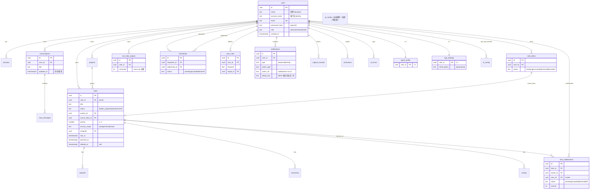

已勘验现网 schema(`server/src/db/schema.sql`，21 张表)、ID 生成(`lib/ids.js`：`prefix_<base36>` 非 UUID)、时间(`lib/dates.js`：naive local ISO TEXT、`nowIso` 截到秒`:00`、`nowIsoMs` 带毫秒)、到期提醒去重(`routes/state.js` 用 `existsToday(text)` 文本匹配)。以下为主题交付物。

---

# LinX 灵信 · 数据模型 + 迁移基线（ADR-004/005/007 落地细化）

> 严格遵循 ADR-000：Drizzle schema-as-code 落 `infra-<context>-pg`、UUIDv7 应用层生成、timestamptz/UTC、drizzle-kit generate + 自研 advisory-lock runner、零丢失 + API 契约稳定。本文只写数据层，命名/取舍以主决策记录为准。

---

## 0. 现网基线盘点（迁移的事实起点）

| 事实 | 现状 | 迁移含义 |
|---|---|---|
| 表数量 | 21 张，全部 `IF NOT EXISTS` + 内联 `ALTER … ADD COLUMN IF NOT EXISTS` + 内联回填 | 基线迁移须**逐字复刻**，含 3 处内联回填语义 |
| 主键 | `TEXT`，值形如 `u_default` / `t_<base36>` / `conv_<userId>` —— **非合法 UUID** | 不能直接 `ALTER … TYPE uuid`；需 remap 表（§4.4） |
| 外键 | **全库零 FK 约束**，仅逻辑关联（`project_id`/`task_id`/`source_idea_id`…） | 基线不加 FK；后续 expand 迁移补 FK（先清孤儿） |
| 时间 | `TEXT` naive local ISO 无时区（`2026-07-14T18:00:00`），排序曾打平(P7) | TEXT→timestamptz 需按服务器时区(`Asia/Shanghai`)解释再转 UTC |
| user 隔离 | 每业务表带 `user_id TEXT DEFAULT 'u_default'`，无 FK、无 NOT NULL 强约束一致性 | 保留字段；后续补 FK + 去 default |
| 软删除 | 无 `deleted_at`；靠 `status` 枚举(archived/discarded/left) | 新增 `deleted_at` 软删除列（§2.4） |
| JSON 字段 | `tags`/`notif_prefs`/`preferences` 存 `TEXT`（JSON 字符串） | 升 `jsonb`（可选 expand 迁移） |
| 会话置顶 | 无 `is_pinned` 列，「置顶」= `touch(updated_at)` 重排 | 保留语义；不新增列 |
| 到期去重 | `notifications.existsToday(text)` 文本匹配（脆） | 新增 `dedup_key` + 部分唯一索引（§3） |

---

## 1. 领域实体与关系（ERD）



**关键关系口径**（服务端强制，不入约束）：`@提及 / 指派(assignee) / 协作邀请 / team` 四处的对象**必须是 accepted 好友**——「好友圈判定」由 `app-social.FriendCircleQuery.isFriend()` 单点真理裁决，DB 层仅保关联不做该校验（跨聚合业务规则不下沉约束）。

---

## 2. 表结构建议（目标形态）

### 2.1 通用列约定（所有业务表）

| 列 | 类型 | 说明 |
|---|---|---|
| `id` | `uuid` PK，默认由**应用层** UUIDv7 生成 | 时间有序、索引友好、多实例零碰撞（修 P6）。DB `DEFAULT` 不设，值由 `kernel-types.newId()` 提供，保证测试可注入 |
| `user_id` | `uuid NOT NULL REFERENCES users(id) ON DELETE CASCADE` | 租户/用户隔离硬边界；去掉现网 `DEFAULT 'u_default'`（回填后） |
| `created_at` | `timestamptz NOT NULL DEFAULT now()` | 全程 UTC |
| `updated_at` | `timestamptz NOT NULL DEFAULT now()` | 由 app 层或 trigger 维护 |
| `deleted_at` | `timestamptz NULL` | 软删除（仅用户内容表，§2.4） |

### 2.2 枚举策略：`text + CHECK` 而非 PG `enum`

```sql
status text NOT NULL DEFAULT 'todo'
  CONSTRAINT tasks_status_chk CHECK (status IN ('todo','in_progress','done','archived'))
```
**取舍**：PG 原生 `enum` 增值需 `ALTER TYPE … ADD VALUE`(不可回滚、不能在事务中删值)，与「可回退迁移」冲突；`text + CHECK` 改值只是重建约束，且 Drizzle 侧用 `$type<TaskStatus>()` 拿到 TS 联合类型，契约同样强。**被否**：PG enum。

### 2.3 各表目标定义（Drizzle schema 草图，节选关键表）

```ts
// packages/infra-tasks-pg/src/schema.ts
import { pgTable, uuid, text, smallint, integer, timestamp, index } from 'drizzle-orm/pg-core';

export const tasks = pgTable('tasks', {
  id:            uuid('id').primaryKey(),                    // app 层 UUIDv7
  userId:        uuid('user_id').notNull(),                 // FK 见 relations
  title:         text('title').notNull(),
  notes:         text('notes').notNull().default(''),
  status:        text('status').$type<TaskStatus>().notNull().default('todo'),
  projectId:     uuid('project_id'),
  tags:          jsonb('tags').$type<string[]>().notNull().default([]),  // TEXT→jsonb
  context:       text('context').notNull().default(''),
  dueAt:         timestamp('due_at',     { withTimezone: true }),
  plannedAt:     timestamp('planned_at', { withTimezone: true }),
  durationMinutes: integer('duration_minutes'),
  priority:      smallint('priority').notNull().default(3), // CHECK 1..4
  privacyScope:  text('privacy_scope').$type<PrivacyScope>().notNull().default('work'),
  sourceIdeaId:  uuid('source_idea_id'),
  assignee:      uuid('assignee'),
  createdAt:     timestamp('created_at', { withTimezone: true }).notNull().defaultNow(),
  updatedAt:     timestamp('updated_at', { withTimezone: true }).notNull().defaultNow(),
  deletedAt:     timestamp('deleted_at', { withTimezone: true }),
}, (t) => ({
  byUserStatus: index('idx_tasks_user_status').on(t.userId, t.status, t.dueAt),
  byDueOpen:    index('idx_tasks_due_open').on(t.dueAt),          // 见 §3 部分索引
  byProject:    index('idx_tasks_project').on(t.projectId),
  byAssignee:   index('idx_tasks_assignee').on(t.assignee),
  bySourceIdea: index('idx_tasks_source_idea').on(t.sourceIdeaId),
}));
```

> `domain-tasks` 保持纯净（值对象 `Priority(1..4)`、`PrivacyScope`、`TaskStatus`、时间值对象 UTC `Instant`），`infra-tasks-pg` 做显式 row↔domain 映射（修 P1）。**drizzle-zod 仅在 infra 内部**做 row 校验，不外泄为 API DTO（C9）。

### 2.4 软删除策略（分级）

| 级别 | 表 | 机制 | 理由 |
|---|---|---|---|
| **软删除**（`deleted_at`） | tasks, projects, todo_ideas, non_todo_outputs, conversations, chat_messages | 置 `deleted_at`，查询默认 `WHERE deleted_at IS NULL` | 用户内容不可被 Agent 硬删（安全红线）；支持撤销/审计 |
| **状态位替代** | task_collaborators(`left/declined`), friendships(`declined`) | 保留行改 status | 关系历史需留痕（反向自动成好友、撤回判定依赖历史） |
| **硬删除允许** | sessions, notifications(已读清理), capture_records/ai_errors(归档到冷表) | 直接 DELETE 或 worker 归档 | 纯运行时数据，无用户价值留存需求 |

Drizzle 侧封装 `softDeletable` helper + 仓库默认注入 `isNull(deletedAt)`，避免每处漏写。

---

## 3. 关键索引（面向 1 万用户高并发查询模式）

> 原则：所有多租户列表查询**索引首列必为 `user_id`**（隔离即分区前缀）；到期扫描、好友图用**部分索引**压体积；分页统一 **keyset（`(user_id, created_at, id)`）** 而非 OFFSET。

| 查询模式（来源能力） | 索引 | 类型 |
|---|---|---|
| 任务列表 / view·scope·today 过滤 | `idx_tasks_user_status (user_id, status, due_at)` | 复合，覆盖 today/open 过滤 |
| **到期扫描**（worker 每日，仅未完成有到期） | `idx_tasks_due_open ON tasks(due_at) WHERE status NOT IN ('done','archived') AND due_at IS NOT NULL AND deleted_at IS NULL` | **部分索引**，扫描集≈待办总量而非全表 |
| 指派给我 / assignee 视图 | `idx_tasks_assignee (assignee) WHERE assignee IS NOT NULL` | 部分 |
| 任务详情子资源 | `idx_subtasks_task`/`idx_comments_task`/`idx_activity_task (task_id, created_at)` | 复合，含排序列 |
| 会话列表（按活跃/置顶） | `idx_conv_user (user_id, updated_at DESC)` | 复合 |
| 会话内消息分页 | `idx_chat_conv (conversation_id, created_at, id)` | keyset |
| **好友图**（我发起/收到 + 状态） | `idx_friend_requester (requester_id, status)`、`idx_friend_addressee (addressee_id, status)` | 双向 |
| 好友对唯一性 | `uidx_friend_pair (LEAST(a,b), GREATEST(a,b))` UNIQUE | 表达式唯一（保留现网设计）|
| 协作按任务/按人 | `idx_collab_task (task_id, status)`、`idx_collab_user (user_id, status)` | 复合 |
| **通知未读**（内联动作面板） | `idx_notifs_user_unread (user_id, created_at DESC) WHERE read = false` | 部分 |
| **到期提醒去重**（每任务每天一次，替换文本匹配 P-脆） | 新增列 `dedup_key text`（如 `due:<taskId>:<yyyy-mm-dd>`）+ `uidx_notif_dedup (user_id, dedup_key) WHERE dedup_key IS NOT NULL` | **部分唯一**，用 `INSERT … ON CONFLICT DO NOTHING` 原子去重 |
| auto_rules 命中扫描 | `idx_autorules_user (user_id)` | 单列 |
| capture 溯源回链 | `idx_records_user (user_id, created_at)` | 复合 |
| session 解析（热路径已走 Redis，PG 兜底） | `sessions.token` PK + `idx_sessions_user (user_id)`（吊销其它会话） | — |
| 全文搜索 `/search`（title/notes/raw_text） | `idx_tasks_fts USING GIN (to_tsvector('simple', title||' '||notes))`；中文可选 `pg_trgm` GIN | GIN（评估期，先 trgm 兜中文） |

**万人级容量心算**：1 万用户 × ~500 任务 = 5M 行 tasks；`(user_id,status,due_at)` B-tree ≈ 数百 MB，单查毫秒级。到期部分索引仅覆盖开放任务子集，worker 全量扫描一次 <100ms。远期读 QPS 阈值触发读副本（ADR-020）。

---

## 4. 迁移策略（工具、基线、版本化、回退、回填）

### 4.1 工具（与决策记录一致）

**drizzle-kit generate 产版本化 SQL + 自研 advisory-lock runner**（ADR-005）。放 `packages/migrations/`：

```
packages/migrations/
  sql/
    0000_baseline.sql            # 现网 schema 1:1 复刻（含既有回填）
    0000_baseline.down.sql       # 人工补写 down
    0001_add_dedup_key.sql
    0002_time_to_timestamptz.expand.sql
    …
  src/runner.ts                  # pg_advisory_lock 串行、记 __migrations、多实例只跑一次
  src/runner.ts (down)           # 显式 down 执行器
drizzle.config.ts (根)           # schema: './packages/infra-*/src/schema.ts'
```

Runner 契约：

```ts
// packages/migrations/src/runner.ts
export async function migrate(pool: Pool, dir: string, opts: { dryRun?: boolean }) {
  await pool.query('SELECT pg_advisory_lock($1)', [MIGRATION_LOCK_KEY]); // 多实例只跑一次
  try {
    await ensureMigrationsTable(pool);           // __migrations(version, name, checksum, applied_at)
    const applied = await loadApplied(pool);
    for (const f of pendingSorted(dir, applied)) {
      await pool.query('BEGIN');
      await pool.query(readSql(f));              // 每个迁移单事务（DDL 事务安全）
      await recordApplied(pool, f);              // 校验 checksum 防漂移
      await pool.query('COMMIT');
    }
  } finally { await pool.query('SELECT pg_advisory_unlock($1)', [MIGRATION_LOCK_KEY]); }
}
```

**CI 门禁（修 P14）**：`migrate:check` = 空库跑全部 up→跑全部 down→再跑 up，断言 schema 幂等且可回退（`migrate:reverse` 冒烟）。

### 4.2 基线迁移（`0000_baseline.sql`）——最关键决策

> **拍板：基线迁移 = 现网 schema 的逐字快照，`id text` / 时间 `text` / 无 FK 原样保留，零数据变形。** 类型升级(uuid/timestamptz)一律放**后续**独立 expand→contract 迁移。

**为什么不在基线直接上 uuid/timestamptz**：
- 现网 PK 值(`u_default`、`conv_u_default`)非合法 UUID，`ALTER TYPE … USING id::uuid` 必然抛错；强转需先 remap 全库 PK+FK，属高风险数据变形，**违背「基线可对现网无损应用」**。
- 基线的职责是「让版本系统认领现网真相」，不是「顺手改造」。改造拆成可 review、可单独回退的小步。

基线内容 = §schema.sql 全文，但**去掉 `IF NOT EXISTS`**（基线跑在受控空库/或用 `baseline --mark-applied` 对现网标记为已应用而不执行），并把 3 处内联回填（account_name、默认会话、conversation_id）保留为显式语句。

**对现网的落地方式**（零丢失关键）：
1. `pg_dump` 全量备份（对齐硬约束）。
2. `migrate baseline --mark-applied 0000`：对已存在真实数据的库，**只把 0000 写入 `__migrations` 不执行 DDL**（现网结构已等于基线）。
3. 此后 `0001+` 正常执行。
→ 现网数据一行不动，版本系统从此接管。

### 4.3 TEXT 时间 → timestamptz（`0002`，expand→backfill→contract）

现网值语义 = **服务器本地墙钟**（`nowIso` 用 `getHours()` 等本地方法），需按服务器时区解释再存 UTC。

```sql
-- 0002_time_to_timestamptz.expand.sql  （对每个时间列，此处以 tasks.due_at 为例）
ALTER TABLE tasks ADD COLUMN due_at_ts timestamptz;
UPDATE tasks
  SET due_at_ts = (due_at::timestamp AT TIME ZONE 'Asia/Shanghai')  -- naive→按 CST 解释→转 UTC
  WHERE due_at IS NOT NULL AND due_at <> '';
-- 应用双写窗口：新版本代码同时写 due_at(旧,兼容) 与 due_at_ts(新)
```
```sql
-- 0003_time_to_timestamptz.contract.sql （确认新列无误、旧代码已下线后）
ALTER TABLE tasks DROP COLUMN due_at;
ALTER TABLE tasks RENAME COLUMN due_at_ts TO due_at;
```
```sql
-- 0002.down.sql（回退：timestamptz→原 naive TEXT）
UPDATE tasks SET due_at = to_char(due_at_ts AT TIME ZONE 'Asia/Shanghai','YYYY-MM-DD"T"HH24:MI:SS')
  WHERE due_at_ts IS NOT NULL;
ALTER TABLE tasks DROP COLUMN due_at_ts;
```

**边界处理**：`nowIso` 秒恒为 `00`、`nowIsoMs` 带毫秒——两者都是合法 `timestamp` 字面量，`::timestamp` 直接解析，毫秒精度 timestamptz 保留。空串 `''` 显式排除（现网 nullable 时间可能是 `''` 或 `NULL`）。

### 4.4 TEXT id → uuid（`0010+`，可选、最高风险、独立回退）

**取舍：默认不做整库 remap；仅当 profiling/DBA 要求原生 uuid 性能时启动。** 因牵动全库 PK+FK，代价大而收益（相对「text 存 UUIDv7 字符串」）有限。

若执行，兼容做法 = **remap 影子列 + 映射表**，绝不原地强转：

```sql
-- 1) 映射表：旧 text id ↔ 新 uuid（确定性：合法 uuid 原样，非法如 'u_default' 生成 uuidv5 命名空间派生，保证可重跑幂等）
CREATE TABLE _id_remap (old_id text PRIMARY KEY, new_id uuid NOT NULL);
INSERT INTO _id_remap
  SELECT id, CASE WHEN id ~ '^[0-9a-f-]{36}$' THEN id::uuid
                  ELSE uuid_generate_v5('<fixed-namespace>', id) END
  FROM users;   -- 每表重复
-- 2) 每表加 uuid 影子列，按 remap 回填 PK 与所有 FK 引用
ALTER TABLE tasks ADD COLUMN id_u uuid;
UPDATE tasks t SET id_u = m.new_id FROM _id_remap m WHERE t.id = m.old_id;
ALTER TABLE tasks ADD COLUMN user_id_u uuid;
UPDATE tasks t SET user_id_u = m.new_id FROM _id_remap m WHERE t.user_id = m.old_id;
-- 3) contract：切换 PK/FK 到 _u 列、加 FK 约束、drop 旧列、rename
```
**回退脚本**：保留 `_id_remap` 直到验收期结束；down = 反向 `UPDATE … FROM _id_remap` 写回 text 列再 drop uuid 列。验收通过后再删 `_id_remap`。

> **推荐路线**：跳过整库 remap，`id` 列**保持 `text`**，仅把**新行生成器**从 `makeId` 换成 UUIDv7 字符串（`kernel-types.newId()`），旧值共存。既修 P6（碰撞）又零数据风险；原生 uuid 类型作远期可选优化。此为默认落地。

### 4.5 其它回填/类型迁移清单

| 迁移 | 动作 | 回退 |
|---|---|---|
| `0001` 通知去重 | 加 `notifications.dedup_key text` + 部分唯一索引；worker 改 `ON CONFLICT DO NOTHING` | drop 列与索引 |
| `0004` 软删除 | 六张用户内容表加 `deleted_at timestamptz`；仓库默认过滤 | drop 列 |
| `0005` JSON→jsonb | `tags`/`notif_prefs`/`preferences` `USING col::jsonb` | `USING col::text` |
| `0006` user_id 收口 | 清孤儿(无对应 users 的行归档)→加 `FK … ON DELETE CASCADE`→去 `DEFAULT 'u_default'` | drop FK、恢复 default |
| `0007` CHECK 约束 | 补 status/priority/privacy_scope 的 CHECK | drop constraint |
| `0008` argon2 迁移 | 无 schema 变更；登录时识别旧 scrypt 前缀→校验→透明 rehash 写回 | 天然兼容 |

---

## 5. 表归属（domain / infra 包 → 表 + 仓库）

> 一个 bounded context 拆 `domain-*` / `app-*` / `infra-*-pg` 三层（ADR-002）。下表列「表 → 拥有它的 infra 包 / 对应 domain 端口」。跨 context **不得**互相 import 表（三道闸强制）。

| Bounded Context | domain 包（端口/模型） | infra 包（Drizzle schema+repo） | 拥有的表 |
|---|---|---|---|
| **identity** | `domain-identity` | `infra-identity-pg` | `users` |
| **auth/session** | `domain-identity`(SessionPort) | `platform-auth`(session store) | `sessions` |
| **tasks** | `domain-tasks` | `infra-tasks-pg` | `tasks`, `subtasks`, `comments`, `activity` |
| **projects** | `domain-projects` | `infra-projects-pg` | `projects` |
| **capture/triage** | `domain-capture` | `infra-capture-pg` | `todo_ideas`, `non_todo_outputs`, `capture_records`, `corrections`, `ai_errors` |
| **chat/conversation** | `domain-chat` | `infra-chat-pg` | `conversations`, `chat_messages` |
| **social/friends** | `domain-social` | `infra-social-pg` | `friendships` |
| **collaboration** | `domain-collab` | `infra-collab-pg` | `task_collaborators`, `auto_rules` |
| **notifications** | `domain-notify` | `infra-notify-pg` | `notifications` |
| **agent config/settings** | `domain-agents` / `domain-settings` | `infra-agents-pg` | `agent_profile`, `app_settings`, `ai_config` |

**跨 context 引用（如 `tasks.project_id`、`tasks.source_idea_id`、`task_collaborators.task_id`）落地口径**：
- DB 层允许列存在但**不加跨 schema FK 硬约束**（避免 infra 包间隐式耦合、便于分库演进）；`tasks.project_id → projects` 在同 tasks/projects 相邻可选加 FK。
- 引用完整性由 **application 层用例 + 领域事件** 保证：如删项目 → `app-projects` 发 `projects.project.deleted` → `app-tasks` 订阅置空 `project_id`（与 collab↔friends 消环同法）。
- `source_idea_id`（tasks→todo_ideas 跨 tasks/capture）**只读引用**，不加 FK，convert 用例保证一致。

`migrations` 包**横切拥有全部 SQL 与 runner**（不属任何单一 context），drizzle.config glob 汇聚各 `infra-*/schema.ts` 生成，避免聚合包（ADR-004）。

---

## 6. 与「不丢数据 / API 兼容」约束的对齐

| 约束 | 本设计如何满足 |
|---|---|
| **现网零丢失** | 基线 `--mark-applied` 不执行 DDL、对现网结构无操作；每次 migrate 前 `pg_dump`；破坏性变更一律 expand→backfill→contract 三步，中间态可回退；`_id_remap`/影子列保留至验收 |
| **可回退** | 每个版本配 `*.down.sql`；CI `migrate:check` 强制 up→down→up 幂等；时间/uuid 迁移回退脚本已给出反向 `UPDATE` |
| **API 契约稳定** | `id` 默认保持 `text`（UUIDv7 字符串），对前端 `string` 契约无感；DTO 走 `contracts-http` 手写 Zod，与 DB row 解耦——DB 内部升 uuid/timestamptz/jsonb **不改变** API 出参形状（映射层吸收）；时间对外仍序列化为 ISO 字符串 |
| **多实例就绪** | migrate runner 用 `pg_advisory_lock` 保证多副本启动只跑一次；UUIDv7 应用层生成消除 P6 多实例碰撞 |
| **领域语义保留** | 好友对 `LEAST/GREATEST` 唯一索引、协作三态、conversation 置顶=touch、到期每任务每天一次（升级为 `dedup_key` 原子去重）——全部在迁移中显式保留/加固 |
| **测试可迁移** | Drizzle 双驱动，Vitest + PGlite 跑同一批 SQL 迁移，159 用例在进程内真 PG 验证迁移正确性（ADR-019） |

---

**边界声明**：本文只覆盖数据模型与迁移基线，未触碰事件总线/编排/认证细节（各有专文）；ID 与时间的**默认落地**取「`text` 存 UUIDv7 + timestamptz 升级」组合以最小化对现网风险，整库原生 `uuid` remap 列为可选、高风险、独立回退的后续项。任何与主决策记录冲突处，以主决策记录为准。
