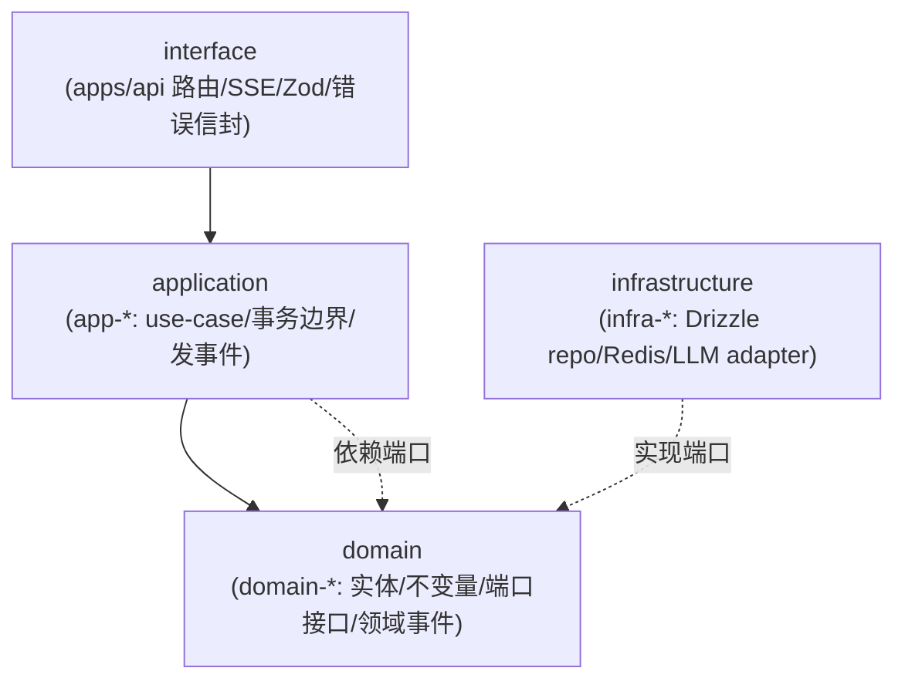

# LinX 灵信 · 后端重构统一架构决策记录（ADR-000 主文档）

> ⚠️ **已经对抗式评审并收口**：本文的部分决策被 [`backend-architecture-review.md`](backend-architecture-review.md) 指出 4 个违反硬约束的 Blocker + 一批矛盾，并已在 [`backend-reliability-amendment.md`](backend-reliability-amendment.md)（**施工前必读，冲突以它为准**）逐条终裁。**开工前先看修订 ADR 的 §D.1 修订项与 §D.2 检查清单。** 具体被改的 ADR 编号见修订 ADR §D.1。
>
> 本文将四份草案（A 架构形态 / B 技术选型 / C 高并发扩展 / D 多 Agent 协同）调和为**单一、无冲突、可直接落库**的权威决策记录。后续七篇细化文档（数据访问、迁移、事件、编排、认证、契约、可观测）**必须遵循本文的拍板与命名**，冲突以本文为准。
> 贯穿五北极星：① 易扩展 ② 高并发 ③ 多 Agent 协同 ④ 万人级水平扩展 ⑤【硬】细粒度多包/清晰/易改。

---

## 1. 决策速查表（Master Cheat-Sheet）

> 每行一项，「选定 + 一句理由」。这是全队的单一事实源；与任何草案不一致处，以本表为准。

| # | 关注点 | 选定方案 | 一句理由 | 命中北极星 |
|---|---|---|---|---|
| 1 | 语言 | **TypeScript 5.9 strict / ESM / NodeNext** | 静态类型是细拆包的粘合剂，无 TS 则跨包契约退化为口头约定 | ①⑤ |
| 2 | Web 框架 | **Fastify 5**（保留，升级） | encapsulated plugin = 轻量 DI，schema-driven 直出 OpenAPI；否 Nest（Module 图与包边界打架） | ②④⑤ |
| 3 | Monorepo workspace | **pnpm workspaces**（`workspace:*`，严格 node_modules） | 硬链省盘 + 天然堵幽灵依赖/串包 import | ⑤ |
| 4 | 构建编排 | **Turborepo（首日即用）** | 40+ 包起步即达 A 草案的引入门槛，任务图 + 缓存；否 Nx（过重、能力大半用不上） | ⑤ |
| 5 | 库打包 / 运行 | **tsup（库出 ESM+d.ts）+ tsx（dev 跑 apps）+ tsc（typecheck）** | esbuild 快，与 project references 分工清晰 | ⑤ |
| 6 | 边界强制 | **TS project references + dependency-cruiser（CI）+ eslint-plugin-boundaries（编辑器）** | 三道闸把「禁环/越层」从自觉变门禁 | ⑤ |
| 7 | 数据访问 | **Drizzle ORM 0.44**（否 Kysely / Prisma） | schema-as-code 单一真相源，「加实体 = 加一个 schema 文件」直落北极星①⑤；`sql\`\`` 逃生舱保 SQL 全控 | ①⑤ |
| 8 | 迁移 | **drizzle-kit generate → 版本化 SQL + 自研 advisory-lock runner** | 生成 SQL 可 review、可手改回填、多实例只跑一次 | ①（零丢失） |
| 9 | 契约/校验 | **Zod 4 + fastify-type-provider-zod + @fastify/swagger**；`contracts-http` **手写** DTO | API DTO ≠ DB row，手写保层纯净；drizzle-zod 仅在 infra 内部做行校验 | ①⑤ |
| 10 | DB 驱动 | **pg（生产 Pool）+ @electric-sql/pglite（仅测试，devDep）** | Drizzle 双驱动（`drizzle-orm/node-postgres` ⟂ `drizzle-orm/pglite`），进程内真 PG 承 159 用例 | ①⑤ |
| 11 | Redis 客户端 | **ioredis 5**（替换 node-redis） | BullMQ 强依赖、Streams/cluster 支持更好 | ②④ |
| 12 | 缓存 | **单层 Redis + 主动失效**（`platform-cache`），否两级进程内缓存 | 一致性简单，Redis 单跳 <1ms | ②④ |
| 13 | 限流 | **@fastify/rate-limit + Redis store**；复合键用 rate-limiter-flexible | 后端共享计数，多实例安全（修 P4） | ②④ |
| 14 | 会话/认证 | **有状态 opaque session**（PG 真相源 + Redis 热缓存） | 「改密即吊销/即时封禁」= 有状态刚需，JWT 反需 denylist | ②④ |
| 15 | 密码哈希 | **argon2id（@node-rs/argon2）**，旧 scrypt 登录时透明 rehash | OWASP 首选 memory-hard，napi 预编译免 node-gyp（Win 友好） | 安全 |
| 16 | ID | **UUIDv7（uuid@11）**，应用层生成 | 时间有序、索引友好、多实例零碰撞（修 P6） | ②④ |
| 17 | 时间 | **timestamptz + 全程 UTC**（Drizzle `withTimezone`） | 消除排序打平/时区歧义（修 P7） | ① |
| 18 | 配置 | **Zod env schema（`platform-config`），boot fail-fast** | 复用 Zod 单一校验栈（修 P8） | ⑤ |
| 19 | 实时事件（SSE 扇出） | **Redis Pub/Sub + 进程内回退**（`platform-eventbus`），至多一次 + REST 兜底，**无 sticky** | 在线刷新可容忍丢失，重连拉全量 | ②④ |
| 20 | 可靠投递 | **事务 outbox → BullMQ**（`platform-outbox`+`platform-queue`），**不引入 raw Redis Streams** | 一套可靠机制（BullMQ 已给 at-least-once/重试/DLQ），不叠第二套手搓 Streams | ②③④ |
| 21 | 异步队列 | **BullMQ 5（ioredis）+ FlowProducer** | LLM/Agent 重活出请求路径；Flow 承多 Agent fan-out | ②③④ |
| 22 | LLM 集成 | **Vercel AI SDK（`ai`+`@ai-sdk/*`）为传输**，守卫/口径/提取自持于 `agent-llm` | 统一多 provider 流式+tool-calling（多 Agent 刚需），领域逻辑不外包（修 P15） | ③ |
| 23 | 多 Agent 编排 | **确定性 Orchestrator + PlannerStrategy(rule\|llm) + 专职 Agent + Guard 中间件管线** | 消灭 `chat.js`/`agentChat.js` 双 God-file，收敛到「谁产 action」一层差异 | ①③⑤ |
| 24 | 测试 | **Vitest 3 + PGlite** | 与前端统一，进程内真 PG，迁移 159 用例 | ①⑤ |
| 25 | 可观测 | **pino + AsyncLocalStorage reqId + prom-client**；`/health` ⟂ `/ready`；OTel 可选 | 全链路 grep 同一 reqId，探针分离防误杀（修 P13） | ②④ |
| 26 | 错误信封 | **`AppError{code,httpStatus,message,details}` + Fastify `setErrorHandler`** | 类型化统一序列化（修 P10），contracts 侧定义 error schema | ①⑤ |
| 27 | 部署 | **单机 Docker：`apps/api`×N + `apps/worker`×M + PG16 + Redis7**，宿主 nginx `/todo/` 不变 | 无状态副本线性扩，包边界 = 未来服务边界 | ②④ |

---

## 2. 四份草案冲突消解（核心：拍板与理由）

> 本节是「调和」的实质。每条列出**分歧 → 拍板 → 依据 → 败者去向**。所有后续文档以此为不可推翻的前提。

| 冲突点 | 草案分歧 | **最终拍板** | 依据 | 被否方去向 |
|---|---|---|---|---|
| **C1 数据访问** | B=Drizzle；A/C=Kysely | **Drizzle ORM** | 北极星①⑤：schema-as-code「加实体=加 schema 文件」的工效强于 Kysely「加表+手写迁移+内省」；复杂 SQL 用 `sql\`\`` 逃生舱补齐 SQL 全控 | Kysely 降为「若 profiling 显示 ORM 成热点」的备选；C 草案 `@linx/db` 的 Kysely `PostgresDialect` 代码改写为 Drizzle 工厂（§7.1） |
| **C2 迁移框架** | 随 C1 联动 | **drizzle-kit generate + 自研 advisory-lock runner** | 必须与 Drizzle 配套；生成 SQL 可 review、破坏性变更拆 expand→backfill→contract、migrate 前 `pg_dump` | node-pg-migrate / Prisma Migrate 否决 |
| **C3 事件可靠性** | B=Redis Streams+消费组（可靠）；C-A4=Pub/Sub 至多一次+REST 兜底，暂不上 Streams；C/D=outbox+BullMQ | **三层分离**：实时 SSE=Pub/Sub（可丢，REST 兜底）；可靠副作用/集成事件=**事务 outbox → BullMQ**；**不引入 raw Redis Streams** | B 要的「可靠」由 BullMQ 的 at-least-once/重试/DLQ 提供，比第二套手搓 Streams 更省；C-A4 的「SSE 无需 Streams」成立 | B 的 Streams 方案被 outbox+BullMQ 取代（§8） |
| **C4 密码哈希** | B=argon2id；C=保留 scrypt | **argon2id（@node-rs/argon2）** | OWASP 首选 memory-hard；napi 预编译 Windows 友好；登录时透明 rehash 迁移平滑 | scrypt 仅保留用于「识别旧 hash 前缀 + 校验通过后 rehash」 |
| **C5 包粒度/命名** | B=一个 context 一个包（`@linx/tasks` 内含 schema+repo+service+plugin）；A/D=一个 context×一层一个包（`domain-tasks`/`app-tasks`/`infra-tasks-pg`） | **layer×context 细拆**（A/D 形态） | 硬约束 5 原文即「一个 bounded context / **一层职责**一个包」，直接指定 A/D 形态 | B 的 context-bundling 被否；统一命名法见 §5 |
| **C6 Monorepo 工具** | A=起步纯 pnpm+tsc，40+ 包再叠 Turbo；B/C=pnpm+Turborepo | **pnpm + Turborepo 首日即用** | 本设计首日即 40+ 包，A 的引入门槛当天达标；三家一致否 Nx | Nx 否决（一致） |
| **C7 LLM 网关落点** | B=`@linx/llm`（平台层，含守卫）；D=`agent-llm`（含 reply 提取/守卫） | **三分**：`platform-llm`（传输/流式/SSRF）+ `agent-llm`（gateway+reply 增量提取）+ `agent-planner-llm`（提示词） | 传输是技术能力（平台），提取/口径是 Agent 领域逻辑（不外包） | 无「败者」，是拆分统一 |
| **C8 会话 GC** | B=有状态 session + revokeAllExcept；C=手动 GC 改 BullMQ repeatable job | **合并**：opaque session（PG+Redis）+ GC 用 BullMQ repeatable job + `revokeAllExcept` | 两者正交、互补 | — |
| **C9 契约派生** | B=drizzle-zod 从 schema 派生 contracts；A=domain 纯净、手写映射 | **`contracts-http` 手写 Zod**（API DTO 独立于 DB row）；drizzle-zod 仅 infra 内部行校验 | API DTO 需与前端 TS 模块 1:1、且刻意异于 DB row；派生会让 contracts→infra 耦合 | drizzle-zod 降级为 infra 私有工具 |
| **C10 事件包命名** | A=`platform-eventbus`；C=`@linx/events`/`@linx/ratelimit`/…；D=`infra-events` | **统一 `platform-*` 前缀**（横切技术能力） | 命名法一致性（§5）；横切能力无业务语义，归 platform | C/D 的裸名/infra 名对齐到 `platform-*` |

**一句话总纲**：Drizzle 承数据访问单一真相源，outbox+BullMQ 承唯一可靠投递机制，Pub/Sub 承实时 SSE，layer×context 细拆承硬约束 5，确定性 Orchestrator+PlannerStrategy 承多 Agent 与双 God-file 消灭——五北极星在同一形态内自洽。

---

## 3. 架构形态（ADR-000）

**Modular Monolith（模块化单体）+ monorepo 细粒度多包，不切微服务。**

| 维度 | 选择 | 理由 |
|---|---|---|
| 部署形态 | **单可部署单元 `apps/api` + 独立 `apps/worker`**（同镜像不同 entrypoint） | 单机 Docker 硬约束下微服务运维税无收益；负载是 I/O 密集（PG+Redis+LLM fetch），单进程事件循环 + 多副本即吃满并发 |
| 代码形态 | **monorepo + 细粒度多包**（bounded context / 层职责各一包） | 硬约束 5 |
| 演进路径 | Modular Monolith → 抽 `apps/worker` → （远期必要时）按包边界剥服务 | 包边界即未来服务边界，零重写 |

**唯一进程拆分 = `apps/worker`**：到期提醒扫描、每日 `pg_dump`、`ai_errors` 归档、多 Agent 长任务（planNextBlock/批量协作/记忆整理）、**outbox relay 消费**。在线高并发路径与离线耗时路径物理隔离。

---

## 4. 分层：interface / application / domain / infrastructure

依赖方向**只准向内**，端口（port）定义在 domain、实现在 infrastructure、application 只依赖接口，composition root（`apps/api/src/bootstrap.ts`）注入——**DIP 是消循环依赖的关键**。



| 层 | 职责 | 允许依赖 | 禁止 | 修复的现状问题 |
|---|---|---|---|---|
| **interface** | Fastify 路由、Zod schema、SSE 编码、认证中间件、错误信封 | app-*、contracts-* | 直接碰 PG/Redis；写业务 | P9 业务漏进路由、P10、P12 |
| **application** | use-case 编排、事务边界、跨聚合协调、发领域事件、调端口 | domain-*、其它 app-* 的**查询接口**、platform-* 接口 | import 具体 infra；import 其它 domain 内部 | P9 chat God-file、P5 校验上移 |
| **domain** | 实体/值对象/不变量/纯领域服务/领域事件/端口接口 | 仅 kernel-*、contracts-events | import 任何 infra/框架/其它 context domain | P1 row↔domain、P7 时间值对象 |
| **infrastructure** | 端口实现：Drizzle repo（含 row↔domain 映射与 schema）、Redis 总线、LLM adapter、argon2 | 对应 domain-*、platform-*、kernel-* | 被 domain/app import（只能 DI 装配） | P1/P2/P3/P4/P6/P15/P16 |

**层与 context 正交，包 = (context × layer) 交叉单元**：

```
              domain 层        application 层     infrastructure 层
 tasks BC   domain-tasks     app-tasks          infra-tasks-pg
 social BC  domain-social    app-social         infra-social-pg
 collab BC  domain-collab    app-collaboration  infra-collab-pg
 chat BC    domain-chat      app-chat           infra-chat-*
 agents BC  domain-agents    app-agents(编排)   infra-agents-llm
```

**消除 collab↔friends 循环（现状 P9 实证）——双管齐下**：
- **反向依赖（friends→collab 清理协作）用领域事件打断**：`domain-social` 发 `social.friendship.removed`，`app-collaboration` 订阅，编译期不再依赖 collab。
- **正向依赖（collab 邀请前判好友）上移到 application 查询接口**：`app-social` 暴露 `FriendCircleQuery.isFriend()`，`app-collaboration` 依赖接口而非 friends 内部。「好友圈判定」（team·@·指派·邀请四处复用）从此单点真理。

---

## 5. 包分类法与命名（ADR-002，硬约束 5 落地）

### 5.1 命名铁律

```
@linx/<大类前缀>-<bounded context 或能力>[-<tech>]
```
全小写 kebab，npm scope 统一 `@linx/`。看包名即知**层 + 上下文 + 技术**三要素。

| 大类前缀 | 职责 | 允许依赖 | 举例 |
|---|---|---|---|
| `apps/*` | 可部署入口 + composition root | 一切 packages；**apps 互不依赖** | `apps/api`、`apps/worker` |
| `kernel-*` | 零业务零 I/O 纯工具（依赖树叶子） | 仅 kernel-* 间 | `kernel-types`(Brand/Result/UUIDv7)、`kernel-errors`、`kernel-clock` |
| `contracts-*` | 前后端契约 DTO/Zod/事件 schema | 仅 kernel-* | `contracts-http`、`contracts-events` |
| `platform-*` | 横切技术能力，无业务语义 | kernel-*、外部库 | 见下表 |
| `domain-*` | 领域模型/规则/端口/事件，纯 | 仅 kernel-*、contracts-events | `domain-tasks`、`domain-social` |
| `app-*` | use-case 编排、事务、发事件 | domain-*、其它 app-* 查询接口、platform-* 接口 | `app-chat`、`app-agents` |
| `infra-*` | 端口实现（Drizzle schema+repo+映射），被 DI 注入 | 对应 domain-*、platform-*、kernel-* | `infra-tasks-pg` |
| `agent-*` | 多 Agent 编排内核 + 专职 Agent（一 Agent 一包） | agent-core/-contracts/-tools（Agent 间**零 import**） | `agent-core`、`agent-triage`… |
| `interface-*`（可选） | 重接口层（一般并入 apps/api） | app-*、contracts-http | `interface-admin` |

### 5.2 `platform-*` 全清单（统一 C/D 裸名到此前缀）

| 包 | 职责（单一） | 依赖 |
|---|---|---|
| `platform-config` | Zod env 校验后的强类型配置单例 | zod |
| `platform-db` | Drizzle 实例 + `pg.Pool` + 事务助手 + 迁移 runner | drizzle-orm、pg、platform-config |
| `platform-redis` | ioredis 连接工厂（cache/ratelimit/events/queue 分逻辑库或前缀） | ioredis、platform-config |
| `platform-eventbus` | 实时 Pub/Sub 扇出 + 进程内回退（承 `events.js` 语义） | platform-redis |
| `platform-outbox` | 事务 outbox 表 + relay（LISTEN/NOTIFY 或轮询） | platform-db、platform-queue |
| `platform-queue` | BullMQ 队列/Flow/job 类型定义 | bullmq、platform-redis |
| `platform-cache` | 读穿 + 主动失效原语 `cached()`/`invalidate()` | platform-redis |
| `platform-ratelimit` | Redis 滑动窗口限流 | platform-redis |
| `platform-idempotency` | 幂等键（Redis SETNX），供写接口/消费者 | platform-redis |
| `platform-ratelimit` / `platform-observability` | pino+reqId+prom-client+`/health`·`/ready` | pino、prom-client |
| `platform-auth` | opaque session store + argon2 + preHandler 中间件 | platform-db、platform-redis、domain-identity |
| `platform-llm` | LLM Provider 端口 + Vercel AI SDK adapter + 流式 + SSRF 深检 | ai、@ai-sdk/* |

> **被否**：把限流/缓存/事件塞进一个 `platform-infra` 大包——违反「包多、职责单一」，且会让 `app-tasks` 为用一个 `cached()` 被迫依赖整个 infra+BullMQ。

### 5.3 「包要多」的量化与停止条件

- 现状 ~13 service + 内联 repo 单文件 → 重构后约 **45–60 个包**（含 agent-* 系）。
- 拆包停止条件：一个包应有**独立的不变量或独立的变更理由**；永远一起改、无独立测试价值的两个「包」应合并。反例：`Task` 与 `TodoIdea` 同属 tasks 聚合、共享生命周期（move-out→nonTodo），故同在 `domain-tasks`，不拆。

### 5.4 三道边界闸（ADR-003）

```javascript
// .dependency-cruiser.cjs（核心禁令）
module.exports = { forbidden: [
  { name:'domain-no-outward', severity:'error',
    from:{ path:'^packages/domain-' },
    to:{ path:'^packages/(infra-|app-|platform-(?!observability))' } },
  { name:'app-no-infra', severity:'error',
    from:{ path:'^packages/app-' }, to:{ path:'^packages/infra-' } },
  { name:'no-cross-domain', severity:'error',
    from:{ path:'^packages/domain-([^/]+)' },
    to:{ path:'^packages/domain-(?!\\1)' } },
  { name:'agents-no-cross-import', severity:'error',
    from:{ path:'^packages/agent-(?!core|contracts|tools|guards|llm|planner)' },
    to:{ path:'^packages/agent-(?!core|contracts|tools|guards)' } },
  { name:'no-circular', severity:'error', from:{}, to:{ circular:true } },
  { name:'apps-isolated', severity:'error',
    from:{ path:'^apps/([^/]+)' }, to:{ path:'^apps/(?!\\1)' } },
]};
```
- **闸 1 TS project references**（`composite:true`）：未 reference 的包物理 import 不到。
- **闸 2 dependency-cruiser**（CI 红线）：越层/环进不了 main。
- **闸 3 eslint-plugin-boundaries**（编辑器实时飘红）。
- **CI（修 P14）**：`pnpm -r typecheck && depcruise --validate && vitest run && migrate:check`，全绿才合并。

---

## 6. 数据访问 + 迁移最终组合（ADR-004 / ADR-005）

### 6.1 Drizzle 定案与落点

- **Schema-as-code 真相源** 落在 `infra-<context>-pg/src/schema.ts`（定义 PG 表 + Drizzle 类型来源）。domain 保持纯净，infra 做显式 row↔domain 映射（修 P1）。
- **drizzle-kit config** 用 glob 汇总所有 context schema，无需聚合包：

```ts
// drizzle.config.ts（根）
export default {
  schema: './packages/infra-*/src/schema.ts',
  out: './packages/migrations/sql',
  dialect: 'postgresql',
} satisfies Config;
```

- **`platform-db` 工厂**（改写 C 草案 Kysely 版为 Drizzle）：

```ts
// packages/platform-db/src/pool.ts
import { drizzle } from 'drizzle-orm/node-postgres';
import { Pool } from 'pg';
export function makeDb(cfg: DbConfig) {
  const pool = new Pool({
    connectionString: cfg.url,
    max: cfg.poolMax,                 // 按角色区分：api=10, worker=8
    idleTimeoutMillis: 30_000,
    connectionTimeoutMillis: 5_000,
  });
  return drizzle(pool, { schema });   // pgBouncer transaction 模式时 config 关 prepared
}
// 测试：drizzle-orm/pglite + @electric-sql/pglite，进程内真 PG
```

- **复杂查询**（privacy 过滤、collab 作用域收口、today 视图、全文检索、批量）用 `db.execute(sql\`…\`)` 逃生舱，保留 SQL 全控。
- **N+1 消除（C 草案约束，Drizzle 等价成立）**：任何「列表+每项关联」禁循环内查询，一律 `WHERE x = ANY($ids)` 批量 + 内存 group；`platform-db` 提供 `groupBy(rows,key)` 工具 + code-review 检查项。

### 6.2 迁移

- `drizzle-kit generate` 产带序号 `*.sql`（修 P2）；**`down` 人工补写**（明确取舍）。
- 生产 **自研 runner + `pg_advisory_lock`** 串行化，多实例并发启动只跑一次，记 `__migrations`。
- 破坏性 ALTER 拆 **expand → backfill → contract**（扩列→回填→切换→删列）满足零停机+可回滚；**每次 migrate 前 `pg_dump`**（对齐数据零丢失）。

---

## 7. 异步：队列 / 事件 / 流式的统一模型（ADR-012~014，C3 消解落地）

> 三种异步关切，三种机制，互不混淆——这是 B/C/D 之间最大冲突的统一答案。

| 关切 | 机制 | 语义 | 包 |
|---|---|---|---|
| **实时 SSE 扇出**（chat token、UI refresh） | **Redis Pub/Sub + 进程内回退** | 至多一次，可丢，**REST 重连兜底**，无 sticky | `platform-eventbus` |
| **可靠副作用/集成事件**（通知扇出、跨用户 pushChat、`friendship.removed`→清协作） | **事务 outbox → BullMQ** | 至少一次 + 幂等键 | `platform-outbox`+`platform-queue` |
| **请求路径卸载**（LLM/Agent 重活、planNextBlock、批量邀请、每日 pg_dump） | **BullMQ 5 + FlowProducer** | 持久化/重试/限速/独立伸缩 | `platform-queue` + `apps/worker` |

**关键拍板：不引入 raw Redis Streams。** B 草案要的「可靠领域事件」由 outbox+BullMQ 提供（BullMQ 已含 at-least-once/指数退避/DLQ），避免叠第二套手搓 Streams 的 ack/pending 复杂度——这同时满足 C-A4「SSE 无需 Streams」与 D「outbox」。

**统一接口草图**：

```ts
// platform-eventbus —— 仅实时、可丢
export interface LiveBus {
  publishLive(channel: string, evt: LiveEvent): Promise<void>;
  subscribeLive(channel: string, on: (e: LiveEvent) => void): Unsubscribe;
}
// platform-outbox —— 与业务写同一 tx 落行，relay 投 BullMQ
export interface Outbox {
  enqueue(tx: Tx, evt: IntegrationEvent): Promise<void>;   // 事务内
}
// platform-queue —— 可靠工作
export interface JobQueue {
  add<J extends JobDef>(job: J, opts?: { idempotencyKey?: string }): Promise<void>;
  flow(root: FlowJob): Promise<void>;                       // 多 Agent fan-out
}
// platform-auth —— 有状态会话
export interface SessionStore {
  issue(userId: Uuid, meta: SessionMeta): Promise<{ token: string }>;
  resolve(token: string): Promise<Session | null>;          // Redis→PG 回源
  revoke(sessionId: Uuid): Promise<void>;
  revokeAllExcept(userId: Uuid, keep: Uuid): Promise<void>; // 改密吊销其它会话
}
```

**SSE 无 sticky 证据链**（保留 `events.js` 已正确的 Redis 扇出模型）：产生事件方 `publishLive(userId, evt)` → Redis → 每副本都收到 → 仅持有该 userId socket 的副本 `deliverLocal` 成功，其余 no-op。故 nginx 用 `least_conn`/轮询即可，`/api/events` 需 `proxy_buffering off`、`proxy_read_timeout 3600s`。

**弹性策略**（`platform-llm` adapter 层，替换 P15 手写 fetch）：超时 30s（流式 300s）；BullMQ `attempts:3, backoff:exponential`，仅对 429/5xx/网络错重试；每 provider 熔断器，open 时降级规则 provider + 标 `ai_errors`（保证 capture 闭环不丢想法）；`limiter`/`concurrency` 尊重第三方配额。

---

## 8. 多 Agent 编排与队列/事件协同（ADR-016 / ADR-017）

### 8.1 收敛点：消灭两个 God-file

现状 `chat.js`（规则）与 `agentChat.js`（LLM）**双写**同一套 create/complete/update/convert/settle/guard。核心决策：

> **离线与 AI 两种模式的唯一差异，只应在「谁产 action 列表」这一层（Planner）。** action 之后的路由/Agent/Tool/Guard/流式信封完全共用。

由此拆为：**确定性 Orchestrator（无 LLM）+ 两个可替换 PlannerStrategy（Rule/LLM）+ 一组专职 Agent（各拥一簇 Tool）+ Guard 中间件管线**。`{reply, actions[]}` 为内部 A2A 总线；`{intent,reply,entities,plan,performed,userMessage,agentMessage}` 保持对外契约不变。

### 8.2 编排包落点（`agent-*` 系）

```
packages/
  agent-contracts/     # Action/Intent/Performed/Entity/Mention/StreamEvent 纯类型+Zod
  agent-core/          # Orchestrator/AgentRegistry/pipeline/ContextAssembler/handoff runner/PlannerStrategy 接口
  agent-tools/         # Tool Registry + ToolBelt(权限收口) + Tool→app use-case 接线
  agent-guards/        # collabSettle/stripInviteClaims/honesty/planRender/rateLimit 中间件
  agent-llm/           # LlmGateway：适配 platform-llm + makeReplyExtractor(流式增量) + extractJson
  agent-planner-llm/   # LlmPlanner（AGENT_SYSTEM 提示 + normalizeAction/TYPE_ALIAS + 流式）
  agent-planner-rule/  # RulePlanner（detectIntent/parseTaskCommand/规则 triage → actions）
  agent-triage/ agent-taskops/ agent-plan/ agent-clarify/
  agent-collab/ agent-friend/ agent-memory/ agent-identity/ agent-converse/   # 一 Agent 一包
```

**依赖铁律**：Agent → 只依赖 `agent-core`+`agent-contracts`+`agent-tools`，**不 import repo/db/其它 Agent**；Agent 间协作只走 **类型化 handoff action**（闭集白名单、深度≤2、`origin` 去重防环）。→ collab↔friends 循环**结构上不可能再现**。`agent-tools` → `app-*` → `domain-*` ← `infra-*`，与全局分层一致。

### 8.3 编排与异步的边界（关键协同）

| 层次 | 机制 | 说明 |
|---|---|---|
| **单 turn 内编排** | **进程内**（Orchestrator）：Planner → Agent 派发 → handoff → Guard 管线 | 确定性、单事件循环，可 await LLM I/O。handoff **不走 BullMQ**（是同一编排运行内的类型化 action 队列） |
| **跨请求/响应卸载** | **BullMQ job**（`chat.orchestrate`） | LLM 模式整段编排在 worker 跑，避免 8s LLM 占住 API 事件循环；worker 边生成边 `publishLive` token，API 侧 SSE 转发 |
| **turn 后可靠副作用** | **outbox → BullMQ → 消费者** | 通知扇出、跨用户 pushChat、集成事件；消费者可再 `publishLive` 到目标用户 SSE |

**串/并行规则（确定性，非模型决定）**：SharedContext 组装并行（`Promise.all`）；只读旁路（triage 分类 + @解析 + 重复检测）并行；写 action 按聚合依赖**拓扑排序**（`create_*` 先于引用它的 invite/update）；Guard 管线严格串行固定顺序 **settle → strip → honesty → planRender → persist**；通知/SSE 异步出队。

**Guard 是中间件不是 Agent（硬性）**：诚实守卫/协作 settle/SSRF/限流必须无视路由结果、观测聚合产物、固定顺序运行；做成可路由 Agent 会让顺序保证变脆。

**两段式流式**：Phase 1 Planner 流（`makeReplyExtractor` 增量抽 `reply`）；Phase 2 权威追加流（settle/planRender 产出的状态行）；罕见 strip 删已流出文字时发 `{type:'reply.final'}` 控制事件，前端以终态信封兜底。规则模式无 Phase 1 逐字，信封一致。

### 8.4 新增能力模板（北极星①，改动局部化）

- **新增实体**：`domain-X`(模型+端口) → `app-X`(用例) → `infra-X-pg`(Drizzle schema+repo+映射) → `contracts-http`(DTO) → `apps/api` 挂路由。5 步纵切，横向零污染。
- **新增 Tool**：`domain/app` 实现用例 → `agent-tools` 注册 `{name,input(Zod),sideEffect,scope,idempotent,handler}` → 归属 Agent allowlist → 扩 Planner（LLM 提示 + rule 映射）→ 契约测试（越权抛错/幂等重入/行为对齐）。
- **新增 Agent**：`defineAgent({name,handles,handle})` → `AgentRegistry` 注册 → 需推理经 `agent-llm` 受预算门控子调用 → Guard 无需改动。

---

## 9. 五北极星回执

| 北极星 | 如何满足 | 关键机制 |
|---|---|---|
| **① 易扩展** | 新增实体/Tool/Agent 均有可复制模板，改动局部化在纵切内 | 分层×context 正交、DIP、Drizzle schema-as-code、contracts 前后端同步 |
| **② 高并发** | API 无状态 `--scale api=N` 线性扩；I/O 密集靠事件循环；LLM 重活下沉 worker；限流/会话/事件/缓存全多实例安全 | 无状态副本、worker 拆分、platform-eventbus/queue/ratelimit/cache |
| **③ 多 Agent 协同** | 确定性 Orchestrator 编排 + 一 Agent 一包 + 类型化 handoff + BullMQ Flow fan-out；新增 Agent 零侵入 | agent-* 系 + app-agents 编排；长链走 worker |
| **④ 万人级/水平扩展** | 状态全在 PG16+Redis7；UUIDv7/Redis 限流/outbox 多实例安全；包边界=服务边界，零重写演进 | 单体→服务无锁死、composition root 集中装配、keyset 分页、连接池精算（预留 pgBouncer） |
| **⑤【硬】细粒度包/清晰/易改** | 45–60 包，`<层>-<context>[-<tech>]` 三要素自解释；God-file 拆为 app-chat 多用例 + 确定性 Orchestrator；循环被三道闸物理禁止 | §5 taxonomy + §5.4 三闸；collab↔friends 用事件+查询接口+handoff 三重消环 |

---

## 10. 关键 ADR 列表（供七篇细化文档遵循）

| ADR | 标题 | 一句结论 |
|---|---|---|
| **ADR-000** | 架构形态 | Modular Monolith + monorepo 细粒度多包，`apps/api`+`apps/worker` 单机部署，不切微服务 |
| **ADR-001** | 分层与 DIP | interface/application/domain/infrastructure 只向内依赖，端口在 domain、实现在 infra、composition root 注入 |
| **ADR-002** | 包分类法与命名 | `@linx/<prefix>-<context>[-<tech>]`，layer×context 细拆，45–60 包 |
| **ADR-003** | Monorepo 工具 | pnpm + Turborepo + tsup 首日即用，三道边界闸（project references + dependency-cruiser + eslint-boundaries），否 Nx |
| **ADR-004** | 数据访问 | **Drizzle ORM 0.44**，schema-as-code 落 infra，`sql\`\`` 逃生舱，否 Kysely/Prisma |
| **ADR-005** | 迁移 | drizzle-kit generate + 自研 advisory-lock runner，手写 down，pg_dump 前置，expand→backfill→contract |
| **ADR-006** | 契约/校验 | Zod 4 + type-provider + swagger；`contracts-http` 手写 DTO（不 drizzle-zod 派生 API DTO），错误信封类型化 |
| **ADR-007** | ID/时间 | UUIDv7（应用层生成）+ timestamptz/UTC |
| **ADR-008** | 会话/认证 | 有状态 opaque session（PG 真相源+Redis 缓存），argon2id + scrypt 透明 rehash，GC 用 BullMQ repeatable，revokeAllExcept |
| **ADR-009** | 限流 | @fastify/rate-limit + Redis store，复合键用 rate-limiter-flexible |
| **ADR-010** | Redis 客户端 | ioredis 5 替换 node-redis |
| **ADR-011** | 缓存 | 单层 Redis + 写穿主动失效，否两级进程内缓存 |
| **ADR-012** | 实时事件 | Redis Pub/Sub + 进程内回退，至多一次 + REST 兜底，SSE 无 sticky |
| **ADR-013** | 可靠投递 | 事务 outbox → BullMQ，**不引入 raw Redis Streams** |
| **ADR-014** | 异步队列 | BullMQ 5 + FlowProducer + 幂等键，LLM/Agent 重活出请求路径 |
| **ADR-015** | LLM 集成 | Vercel AI SDK 传输，守卫/口径/reply 提取自持于 agent-llm/agent-planner-llm，SSRF 深检 |
| **ADR-016** | 多 Agent 编排 | 确定性 Orchestrator + PlannerStrategy(rule\|llm) + 专职 Agent + Guard 中间件管线，类型化 handoff 消灭双 God-file |
| **ADR-017** | 编排×异步协同 | 单 turn 内 handoff 走进程内、跨请求走 BullMQ、turn 后副作用走 outbox；两段式流式 |
| **ADR-018** | 可观测 | pino + AsyncLocalStorage reqId + prom-client，`/health` ⟂ `/ready`，OTel 可选 |
| **ADR-019** | 测试 | Vitest 3 + PGlite（drizzle-orm/pglite），迁移 159 用例 |
| **ADR-020** | 部署演进 | 单机 compose 多副本 → 队列深度扩 worker → pgBouncer(门槛>60连接) → 读副本(门槛读QPS>3000)，宿主 nginx `/todo/` 与 liubai.autos 零感知 |

---

## 11. 硬约束回执（不破坏项）

- 单机 Docker（api+worker 同镜像不同 entrypoint + PG16 + Redis7）；宿主 nginx `/todo/api/`→127.0.0.1:8788 反代不变，同机 liubai.autos 零感知；多副本对宿主 nginx 透明（`upstream` 列多端口）。
- API 契约稳定：`contracts-http` 冻结现有 request/response 形状，OpenAPI 作回归基线。
- 数据零丢失：迁移人工 review + expand-contract 多步 + migrate 前 pg_dump，可回退。
- 多实例就绪：session（PG+Redis）、限流（Redis）、事件（Pub/Sub）、可靠投递（outbox+BullMQ）、ID（UUIDv7）全多实例安全。
- 领域逻辑与测试保留：优雅关闭（worker `close()` 排空在途 job + `closeEvents()` 断 Redis；PGlite `syncToFs` 仅测试态）、Redis 扇出+进程内回退、诚实守卫、@协作三态口径、流式增量提取——下沉对应包并迁移 Vitest。
- SSRF：`platform-config` 校 URL 形态 + `platform-llm` 调用前解析 IP 拒私网段；TLS 由 nginx 终结，API 只认 `X-Forwarded-*`。

---

**下一步**：七篇细化文档（数据访问 / 迁移 / 事件总线 / Agent 编排 / 认证会话 / 契约同步 / 可观测压测）在本文拍板与 §5 命名法内展开，任何与本文冲突处以本文为准。

---

（以上为完整交付物：统一、内部一致的《后端架构决策记录》markdown，已消解四份草案全部冲突，含决策速查表、冲突消解矩阵、完整技术栈表、21 条 ADR 列表。文件路径引用均对齐 `D:\workspace\project\todo\server\src\*` 实际结构。未写入磁盘文件，按要求以文本形式返回。）
