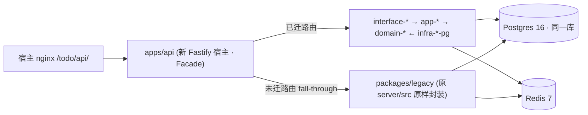

已核对现网结构与部署事实，与决策记录一致。以下为落地计划，直接返回（未写盘）。

---

# LinX 灵信 · 后端重构 Strangler 渐进迁移与落地计划

> 遵循 ADR-000 主文档全部拍板与 §5 命名法。本文只讲「怎么从现网 `server/src/*`(Node ESM JS 单进程) 安全绞杀到 `packages/*`(TS monorepo 45–60 包 + `apps/api`/`apps/worker`)」，不重开技术选型。核心事实已核对：`deploy/docker-compose.yml` = `chattodo-api`(build `../server`, 容器 8787 → 宿主 `127.0.0.1:8788`) + `postgres:16` + `redis:7`；根 `Dockerfile`/`docker-compose.yml` = 前端 nginx(dist)，与后端独立；宿主 nginx `/todo/api/` → `127.0.0.1:8788`。

---

## 0. 绞杀总原则（不可破坏的四条缝合线）

| # | 原则 | 落地机制 |
|---|---|---|
| G1 | **同一个 Postgres、同一套 session 表贯穿始终** | 新 Drizzle schema 首日用 `drizzle-kit pull` 对现网库**内省生成**，不建新库、不搬数据；写路径切换而非数据搬迁 → 数据零丢失从「不迁数据」这个事实兜底 |
| G2 | **单一写真相源**：一个 BC 一旦迁移，旧 route 与旧 chat 内部**全部改为薄委托**到新 `app-*` use-case | 杜绝新旧双写导致的状态漂移；旧代码退化为 adapter shell，随下线阶段删除 |
| G3 | **门面(Facade)在进程内做逐路由切换**，对宿主 nginx 与前端 100% 透明 | `apps/api` 成为新宿主，`legacy` 作为被 mount 的子应用；`RouteRegistry` 决定每条路由走 new 还是 legacy；nginx `/todo/api/` 上游端口不变 |
| G4 | **每次切换前有契约对拍(golden corpus + shadow diff)**，红即不合并、不切流量 | OpenAPI 冻结为回归基线；新旧响应 JSON 逐字段 diff(剔除易变 id/时间) |

**Strangler 形态图**（迁移中任意时刻）：



关键：**NEW 与 LEG 共用同一 `pg.Pool` 逻辑库、同一 session 表、同一 Redis**，故任意路由可独立、可逆地切换，无数据面分裂。

---

## 1. 阶段总览（先给速查，详细展开见 §2–§9）

| 阶段 | 名称 | 核心产物 | 退出判据(DoD) |
|---|---|---|---|
| **P0** | 脚手：monorepo/TS/CI | pnpm+Turbo 工作区、三道边界闸、CI 绿、`kernel-*`/`contracts-*` 骨架 | `pnpm -r typecheck && depcruise && vitest` 全绿；空 `apps/api` 可起 |
| **P1** | 平台底座 + 门面 + 认证 | `platform-*` 全家桶、`apps/api` Facade、`legacy` 封装、`platform-auth` 兼容现网 session、`/health`⟂`/ready` | 全流量经 `apps/api`→legacy，行为 100% 等价(全量对拍绿)；auth 中间件已换新但读同表 |
| **P2** | Tasks BC(含 ideas/nonTodos) | `domain-tasks`/`app-tasks`/`infra-tasks-pg`、tasks/ideas/nonTodos 路由切新 | 任务 CRUD/生命周期/视图/批量 对拍绿；旧 `services/tasks.js` 退化为委托 |
| **P3** | Projects + Capture/Triage(rule) | `domain-capture`/`app-capture`/`infra-*-pg`、`agent-planner-rule` 雏形承 triage 规则 | capture 闭环(rule 版)对拍绿，`capture_records`/`ai_errors` 落库一致 |
| **P4** | Social(friends) BC | `domain-social`/`app-social`/`infra-social-pg`、`FriendCircleQuery` | 好友全流程对拍绿；`isFriend()` 成好友圈单一真理 |
| **P5** | Collaboration BC | `domain-collab`/`app-collaboration`/`infra-collab-pg`、`social.friendship.removed` 事件消费 | 协作三态/权限收口对拍绿；**collab↔friends 循环编译期消失** |
| **P6** | Conversations/Notifications/Settings/Admin/Search/Plan | 对应 `domain/app/infra-*-pg` 各包、`platform-outbox`+`apps/worker` 接管到期提醒/pg_dump | 多会话/通知/设置/后台/搜索/规划对拍绿；离线 job 迁 worker |
| **P7** | Agent 子系统重构 | `agent-*` 全系(core/contracts/tools/guards/llm/planner-rule/planner-llm + 专职 Agent)，消灭 `chat.js`/`agentChat.js` | chat 流式/意图/守卫/协作口径对拍绿(含 159 领域用例);旧双 God-file 停用 |
| **P8** | 下线旧实现 | 删 `packages/legacy`、拆 Facade fall-through、`apps/worker` 定稿、compose 多副本 | 无任何路由指向 legacy；`server/src` 删除；`--scale api=N` 冒烟绿 |

> 顺序铁律：**叶子/低耦合先行，Agent 编排最后**。Agent 依赖所有 `app-*` use-case 就位(作为 Tool 接线)，故必须压到 P7；P1 auth 因「读同表、语义等价」风险反而低，故前置。

---

## 2. Phase 0 — 脚手：monorepo / TS / CI

| 维度 | 内容 |
|---|---|
| **范围** | 建 `pnpm-workspace.yaml`、`turbo.json`、根 `tsconfig`(composite project references)、`.dependency-cruiser.cjs`(§5.4 六禁令)、`eslint-plugin-boundaries`、CI workflow(`typecheck→depcruise→vitest→migrate:check`)。落 `kernel-types`(Brand/Result/UUIDv7)、`kernel-errors`(AppError)、`kernel-clock`、`contracts-http`/`contracts-events` 空壳。`apps/api` 空 Fastify(仅 `/health`)。**不碰现网。** |
| **产物** | 可编译空 monorepo；CI 绿；`apps/api` 本地起。现网 `server/` 原封不动继续在线。 |
| **风险** | 极低(纯新增，零现网触碰)。唯一坑：Windows 下 `@node-rs/argon2`/pglite napi 预编译——P0 即在 CI matrix(linux+win)验证可装。 |
| **回退** | 删分支即可，现网无感。 |
| **验收** | `pnpm -r build && depcruise --validate && vitest run` 全绿；CI 在 linux+win 均过。 |

```jsonc
// pnpm-workspace.yaml
packages: [ "apps/*", "packages/*" ]
// turbo.json —— 首日即用，任务图 build→typecheck→test 带缓存
```

---

## 3. Phase 1 — 平台底座 + 门面 + 认证兼容

这是整个 Strangler 的**承重墙**：把现网单体「装进」新宿主，且逐路由切换开关就位。

### 3.1 范围与产物

| 产物 | 说明 |
|---|---|
| `platform-config` | Zod env schema，boot fail-fast；读现网同名环境变量(`DATABASE_URL`/`REDIS_URL`/`PORT=8787`)，兼容 |
| `platform-db` | Drizzle(`node-postgres`) 工厂 + `pg.Pool` + tx 助手 + advisory-lock 迁移 runner；**测试用 `drizzle-orm/pglite`** |
| `platform-redis`/`platform-eventbus` | ioredis 工厂 + 实时 Pub/Sub+进程内回退，**语义 1:1 承接 `services/events.js`** |
| `platform-ratelimit`/`platform-cache`/`platform-idempotency` | Redis 版，修 P4(限流多实例) |
| `platform-observability` | pino+AsyncLocalStorage reqId+prom-client；`/health`(存活)⟂`/ready`(PG+Redis 就绪) |
| `platform-auth` | opaque session store(PG 真相源+Redis 缓存)+argon2id；**首版直接读现网 `sessions` 表结构**，登录时 scrypt→argon2 透明 rehash |
| `packages/legacy` | 把 `server/src/*` **整体原样**移入(近乎零改动)，导出 `buildLegacyApp()`；仅将其 DB/Redis 句柄改为由 `apps/api` 注入(共用 Pool) |
| `apps/api` Facade | 见 §3.2 |

### 3.2 门面(Facade)机制 —— 新旧路由并存且契约不破

`apps/api` 用 Fastify encapsulated plugin 做**逐路由权威切换**，不是两个进程：

```ts
// apps/api/src/facade.ts
import { RouteRegistry } from './route-registry';
// registry: 每条 (method, path-pattern) → 'new' | 'legacy'，配置化 + 环境变量可热改
export async function buildApi(deps: Deps) {
  const app = Fastify({ /* type-provider-zod */ });
  await app.register(observability);          // reqId 贯穿 new+legacy
  await app.register(authPreHandler(deps));   // platform-auth：new/legacy 统一鉴权，读同一 session
  // 1) 先挂已迁移的 interface-* 插件(权威)
  for (const p of migratedPlugins(deps)) await app.register(p);
  // 2) 未匹配到的路由 fall-through 到 legacy 子应用(同进程、同 Pool)
  await app.register(legacyFallthrough(buildLegacyApp(deps.shared)));
  return app;
}
```

**为何在进程内 mount 而非「新进程反代旧进程」**（被否方案记录）：反代双进程会导致两套 `pg.Pool`、两套 session 解析、两份 SSE 订阅，切换期状态易漂且连接数翻倍；进程内 mount 共用一切基础设施，切换=改 registry 一行，**契约天然不破**(未迁路由字节级仍是旧 handler 产出)。

### 3.3 认证兼容(风险最低的先切)

`platform-auth` 首版**不改表结构**：`resolve(token)` 先查 Redis 命中失败回源 PG `sessions`；`issue/revoke/revokeAllExcept` 直接读写现网表。argon2 迁移用「识别 hash 前缀 → scrypt 校验通过后 rehash 为 argon2id」，登录侧透明。→ 用户零感知、可逐用户平滑迁哈希。

### 3.4 风险 / 回退 / 验收

| 项 | 内容 |
|---|---|
| **风险** | ①legacy 移包后 import 路径断裂 → 用 codemod 批量改 + 保留 `services/*` 相对结构；②SSE 订阅从 legacy 迁 `platform-eventbus` 若语义漂移 → 保留 `events.js` 的 Redis 扇出+回退模型逐行对照测试；③session 双读边界 → Redis 未命中必回源 PG，绝不因缓存缺失判未登录。 |
| **回退** | `RouteRegistry` 全置 `legacy` → 等价于「Fastify 外壳 + 原样旧应用」，行为回到现网；再不行则 compose 指回 `build ../server` 旧镜像(P8 前始终保留)。 |
| **验收** | 全量 golden corpus(见 §10)对 legacy 与 `apps/api`(全 legacy 模式)**逐字节对拍绿**；`/ready` 正确反映 PG+Redis；多副本起 2 实例，限流/session 跨实例生效(修 P4 验证)。 |

---

## 4. Phase 2–6 — 逐 Bounded Context 迁移（统一套路）

每个 BC 走**同一纵切五步**(ADR §8.4 新增实体模板的迁移版)，改动局部化：

```
① infra-<ctx>-pg: drizzle-kit pull 现网表 → schema.ts(真相源) + repo + row↔domain 映射
② domain-<ctx>: 实体/不变量/端口接口/领域事件(纯，无 I/O)
③ app-<ctx>: use-case/事务边界/发事件；跨 BC 只依赖 app-* 查询接口
④ contracts-http: 冻结该 BC 现有 request/response DTO(手写 Zod，与前端 1:1)
⑤ interface(apps/api): 挂 Zod 路由 → RouteRegistry 该组路由切 'new'
```

切 'new' 的同时执行 **G2 缝合**：旧 `services/<ctx>.js` 内部改为委托新 `app-<ctx>` use-case（保留导出签名，供尚未迁移的 `chat.js` 继续调用），从此该 BC **单一写真相源**。

### 4.1 各 BC 顺序、依赖与专项风险

| 阶段 | BC | 现网落点 | 关键迁移动作 | 专项风险 & 回退 |
|---|---|---|---|---|
| **P2** | **Tasks**(含 TodoIdea/NonTodo，同聚合不拆) | `services/tasks.js`,`ideas.js`；`routes/tasks,ideas,nonTodos` | privacy 过滤 / today 视图 / 批量 用 `sql\`\`` 逃生舱；move-out→nonTodo 纠错保内变 | 核心域面最大 → 分「读路由先切、写路由后切」两小步；回退=registry 该组回 legacy |
| **P3** | **Capture/Triage(rule)** + Projects | `services/capture.js`,`triage/*`,`ideas`;`routes/capture,projects` | 规则 triage 迁 `agent-planner-rule` 雏形；`capture_records`/`ai_errors` 写入对齐；智能项目归属先走规则 | LLM triage 暂仍留 legacy(P7 才动)；两路 triage 并存靠 registry 分流 |
| **P4** | **Social(friends)** | `services/friends.js`,`routes/friends` | 邮箱精确请求/接受/反向自动成友/限流/静默拒绝；暴露 `app-social.FriendCircleQuery.isFriend()` | 请求限流迁 `platform-ratelimit`，与旧内存限流对拍计数一致 |
| **P5** | **Collaboration** | `services/collab.js`,`routes/collab,team` | **消环**：正向`isFriend`走 `app-social` 查询接口；反向清协作走订阅 `social.friendship.removed`(P4 已发)；三态口径/权限收口 | 循环消解验证 = depcruise `no-circular`+`no-cross-domain` 转绿(硬门禁)；回退需 P4/P5 同批回滚(有依赖) |
| **P6** | Conversations/Notifications/Settings·AgentProfile/Admin·Data/Search/Plan | `routes/conversations,notifications,settings,admin,data,state,search,plan`,`services/planning,search` | 到期提醒扫描/每日 `pg_dump`/`ai_errors` 归档迁 `apps/worker`(BullMQ repeatable)；session GC 亦迁 worker；`platform-outbox` 首次接入(通知扇出) | worker 首上线 → 先「影子跑」(只算不发)对拍通知集合，再切真发 |

### 4.2 每阶段通用回退

- 路由级：`RouteRegistry` 对应组回 `legacy`(秒级、无部署)。
- 数据级：本阶段若有 schema 变更(见 §5)，一律 expand-only(仅加列/加表)，回退=停用新写路径、新列自然空置，无破坏。
- 依赖级：P4/P5 因消环耦合需同批次回滚，其余 BC 相互独立可单独回退。

---

## 5. 数据迁移顺序与零丢失保证

**总纲：Strangler 期「几乎不迁数据」——切的是写路径，不是数据搬家。** 因为新旧共用同一 Postgres 同一批表。

### 5.1 基线锚定（P1 一次性）

```
1. drizzle-kit pull  → 内省现网库，生成 0000_baseline.sql（= 现状 schema 快照）
2. 将 0000_baseline 标记为 "已应用"（不执行，只登记 __migrations），作为版本化起点
   → 修 P2「schema.sql 全量 exec 无版本」：从此有版本、可回滚起点
3. 冻结现网 schema.sql / ALTER-IF-NOT-EXISTS 旧迁移入口（P8 删）
```

### 5.2 结构演进只走 expand→contract（零停机 + 可回退）

| 何时需要变更 | 例子 | 步骤 |
|---|---|---|
| P7 时间字段 TEXT→timestamptz(修 P7) | `due_at`,`created_at` | **expand**: 加 `due_at_ts timestamptz` 新列 → **backfill**: worker 分批 `UPDATE ... = (col)::timestamptz AT TIME ZONE 'UTC'` → **切读写**到新列 → **contract**(下线阶段)删旧列 |
| ID 体系(修 P6) | 新增行用 UUIDv7 | 只对**新写入**用 UUIDv7；存量 id 原样保留，主键类型兼容(text/uuid 视现状)，不回填 |
| 会话/哈希(修 P3/P5) | argon2 rehash | 登录时逐条透明 rehash，无批量迁移 |

**零丢失四重保证**：①不搬库、不重命名表；②每次 `migrate` 前自动 `pg_dump`(worker 每日 + 迁移前置各一次)；③破坏性变更拆多步、每步可回退，`down` 人工补写并 review；④迁移用 `pg_advisory_lock` 串行，多副本并发启动只跑一次(修「多实例迁移竞态」)。

### 5.3 迁移执行顺序（与 BC 阶段对齐）

```
P1: 0000_baseline(登记) → __migrations 建表
P2–P6: 仅 additive(索引优化/keyset 分页所需复合索引/outbox 表) —— 均 expand-only
P7: 时间列 expand+backfill（唯一较重数据动作，全程新旧列并存，随时回退）
P8(contract 收尾): 删旧列/旧表/旧 schema.sql 入口，pg_dump 后一次性执行
```

---

## 6. 新旧路由并存 + API 契约不破（机制细化）

| 手段 | 作用 | 落点 |
|---|---|---|
| **进程内 Facade + RouteRegistry** | 每路由独立切换，未迁路由字节级不变 | §3.2 `apps/api` |
| **契约冻结** | `contracts-http` 手写 Zod DTO 与前端 TS 模块 1:1；`@fastify/swagger` 导出 OpenAPI 存 repo 作**回归基线**(修 P12) | `contracts-http` |
| **对拍(differential)测试** | golden corpus 请求集，同时打 legacy 与 new，JSON 深比对(白名单剔除易变 id/时间/顺序) | CI gate `contract:diff` |
| **影子流量(shadow)** | P6 worker、P7 chat 高风险项：生产镜像真实请求给 new，只 diff 不返回，累计一致率达标才切 | `apps/api` shadow middleware |
| **SSE 契约稳定** | 迁移中 `/api/events`、`/api/chat/stream` 信封格式不变；P7 两段式流式对齐 `{intent,reply,entities,plan,performed,userMessage,agentMessage}` 与 `{type:'reply.final'}` 控制事件 | `platform-eventbus`+`agent-*` |

**契约不破硬规**：任何切 'new' 的 PR 必须 `contract:diff` 绿；OpenAPI 基线出现 breaking diff 即 CI 红。前端零改动。

---

## 7. Phase 7 — Agent 子系统重构（压轴，消灭双 God-file）

前置条件（P2–P6 已满足）：所有任务/协作/好友/会话/通知等**写能力已作为干净 `app-*` use-case 存在** → 可被 `agent-tools` 直接接线为 Tool。

### 7.1 迁移动作

| 步骤 | 内容 |
|---|---|
| 1 | 落 `agent-contracts`(Action/Intent/Performed/Entity/Mention/StreamEvent 纯类型+Zod)、`agent-core`(Orchestrator/Registry/pipeline/PlannerStrategy 接口)、`agent-tools`(ToolBelt 权限收口→接 `app-*`)、`agent-guards`(settle→strip→honesty→planRender→persist 固定串行) |
| 2 | `agent-planner-rule`：吸收 `chat.js` 的 detectIntent/parseTaskCommand/离线规则(改期/改优先级/开始/改名)→ 产 actions |
| 3 | `agent-llm`(LlmGateway：适配 `platform-llm`+`makeReplyExtractor` 增量提取+extractJson)、`agent-planner-llm`(吸收 `agentChat.js` 的 AGENT_SYSTEM 提示/normalizeAction/TYPE_ALIAS/流式) |
| 4 | 专职 Agent 一包一个：`agent-triage/taskops/plan/clarify/collab/friend/memory/identity/converse`；Agent 间零 import，只走类型化 handoff(白名单/深度≤2/origin 去重) |
| 5 | `chat`/`agentChat` 两路由切 'new' → Orchestrator：规则模式=RulePlanner、AI 模式=LlmPlanner，**action 之后完全共用**。长链 LLM 编排下沉 `apps/worker`(`chat.orchestrate` job)，边生成边 `publishLive` token，API 侧 SSE 转发 |

### 7.2 风险 / 回退 / 验收

| 项 | 内容 |
|---|---|
| **风险** | 最高：领域口径(诚实守卫、@协作三态互斥、剥离 LLM 误断言、时间落库 dueAt、多轮会话作用域、流式增量)易回归 → **必须迁移现网 159 用例到 Vitest 并全绿**，并对 chat 做影子流量高一致率门控 |
| **回退** | chat/stream 两路由回 `legacy`(旧 `chat.js`/`agentChat.js` 在 P8 前始终保留可用)；因 G2 旧服务已委托新 use-case，回退仅换「谁产 action」，底层写路径不变，安全 |
| **验收** | 159 领域用例 + chat 对拍(规则模式逐字段等价、AI 模式关键 action/守卫产物等价) + 流式信封契约测试全绿；worker chat job p95 不占 API 事件循环 |

---

## 8. Phase 8 — 下线旧实现

| 步骤 | 内容 | 安全保证 |
|---|---|---|
| 1 | 确认 `RouteRegistry` 无任何条目指向 `legacy`(全 'new') 持续 N 天无回退 | 监控 diff 零告警 |
| 2 | 拆除 Facade 的 `legacyFallthrough`，删 `packages/legacy`，删 `server/src` | git 保留历史，可 revert |
| 3 | 执行 contract 阶段 migration：删旧列(P7 时间旧列)、删 `schema.sql`/ALTER-IF-NOT-EXISTS 入口 | 前置 `pg_dump`；`down` 已备 |
| 4 | compose 定稿：`chattodo-api` 改 `build ../` 指 monorepo、entrypoint `apps/api`；新增 `chattodo-worker`；预留 `--scale api=N` | §9 |

---

## 9. Monorepo 塞进单机 Docker（不碰 /todo/ 与同机站点）

### 9.1 镜像：单镜像双 entrypoint（ADR-000）

```dockerfile
# deploy/api.Dockerfile —— 多阶段，pnpm+turbo prune 精简
FROM node:22-alpine AS base
RUN corepack enable
FROM base AS prune
WORKDIR /repo
COPY . .
RUN pnpm dlx turbo prune @linx/api @linx/worker --docker   # 只留相关包
FROM base AS build
WORKDIR /repo
COPY --from=prune /repo/out/json/ .
RUN pnpm install --frozen-lockfile
COPY --from=prune /repo/out/full/ .
RUN pnpm -r build                                          # tsup 出 ESM+d.ts
FROM base AS runtime
WORKDIR /app
COPY --from=build /repo/ .
# 同一镜像，entrypoint 决定角色：
#   api    → node apps/api/dist/server.js
#   worker → node apps/worker/dist/main.js
```

### 9.2 compose 变更（对现有约束零感知）

```yaml
# deploy/docker-compose.yml —— 增量改动，保持内网隔离、端口不外露
services:
  chattodo-api:
    build: { context: .., dockerfile: deploy/api.Dockerfile }  # 由 ../server 改为 monorepo 根
    command: ["node","apps/api/dist/server.js"]
    ports: ["127.0.0.1:8788:8787"]     # ← 不变：宿主 nginx /todo/api/ → 8788 零改
    # env / depends_on / healthcheck 沿用现状（healthcheck 打 /api/health 不变）
  chattodo-worker:                      # ← 新增，同镜像不同 command，不发布任何端口
    build: { context: .., dockerfile: deploy/api.Dockerfile }
    command: ["node","apps/worker/dist/main.js"]
    environment: [ *same DATABASE_URL/REDIS_URL ]
    depends_on: { chattodo-postgres: {condition: service_healthy}, chattodo-redis: {condition: service_healthy} }
    restart: unless-stopped
  chattodo-postgres: { image: postgres:16-alpine, ... }   # 不变
  chattodo-redis:    { image: redis:7-alpine, ... }       # 不变（Pub/Sub 用；若上 BullMQ 需 appendonly 评估，见下）
volumes: { chattodo-data, chattodo-pgdata }               # chattodo-data 保留(旧 SQLite 迁移源，P8 后可清)
```

**硬约束回执**：
- 宿主 nginx `/todo/api/`→`127.0.0.1:8788` **一字不改**；根前端镜像(`Dockerfile`/`docker-compose.yml` 服务 nginx dist)与后端完全独立，`liubai.autos` 等同机站点零感知。
- PG/Redis 仍**不发布端口**、独立卷、compose 内网可达 → 与现有 PG 零干扰。
- **多副本**：需水平扩时 `docker compose up --scale chattodo-api=N`，宿主 nginx `upstream` 列多个 `127.0.0.1:878x` 端口(`least_conn`)；SSE 无 sticky(ADR-012 已证 Redis 扇出+每副本 no-op)，`/api/events` 需 `proxy_buffering off; proxy_read_timeout 3600s`。
- **Redis 持久化取舍**：现网 Redis 为 `--appendonly no`(纯 Pub/Sub)。P6 引入 BullMQ 后，队列 job 需持久化 → 给 BullMQ 单独逻辑库或独立 `chattodo-queue-redis`(开 AOF)，**实时 Pub/Sub 那个仍无持久化**，两者物理/逻辑分离，避免弄脏实时总线。
- 优雅关闭保留：`apps/worker` `SIGTERM` → BullMQ `close()` 排空在途 job + `closeEvents()` 断 Redis；测试态 PGlite `syncToFs` 落盘顺序保留。

### 9.3 远程运维（合并单次 SSH，遵守 MEMORY 限频）

一次 SSH 完成：`git pull → turbo prune 构建 → docker compose up -d --no-deps chattodo-api chattodo-worker → 健康检查`；打包用 tar-pipe 单连接(沿用现有 chattodo 部署法)。切勿频繁 SSH `38.76.196.233`。

---

## 10. 每阶段验收：契约对拍（Contract Diff）

**统一验收装置**（P0 建，全程复用）：

```ts
// tools/contract-diff —— golden corpus 回放 + 深比对
interface GoldenCase { name; method; path; headers; body; }
// 采集：先对现网 legacy 全量路由录制 request/response 存 fixtures/*.json（含鉴权态）
// 每阶段 gate：
//   run(legacy) vs run(apps/api@new) → deepEqual(剔除白名单: id/*At/顺序无关数组)
//   非确定字段用规范化器(排序、id→占位符、时间→容差)
```

| 阶段 | 对拍范围 | 通过线 |
|---|---|---|
| P1 | 全 API(new=全 legacy 模式) | 逐字节 100% 等价 |
| P2–P6 | 该 BC 全路由 + 未迁路由无回归 | 该组字段级 100% 等价；跨组无 diff |
| P6 worker | 通知/提醒集合影子对拍 | 一致率 100% 后切真发 |
| P7 chat | 159 领域用例 + 规则模式逐字段 + AI 模式 action/守卫产物 + 流式信封 | 规则 100% 等价；AI 关键产物等价、reply 语义人审抽样 |
| P8 | 全量回归 + `--scale api=2` 冒烟 | 全绿、跨实例限流/session/SSE 正常 |

**CI 门禁(修 P14)**：每 PR 跑 `pnpm -r typecheck && depcruise --validate && vitest run && contract:diff && migrate:check`，全绿方可合并；depcruise 的 `no-circular`/`no-cross-domain`/`domain-no-outward` 是 P5 消环的硬证据。

---

## 11. 甘特式阶段清单（依赖 + 并行度）

```
阶段  依赖         可并行内包                                    产物/闸门
─────────────────────────────────────────────────────────────────────────────
P0 │ —          │ kernel-* ∥ contracts-* ∥ CI/turbo/depcruise │ CI 绿, 空 apps/api 起
P1 │ P0         │ platform-{config,db,redis,eventbus,cache,   │ 全流量经 apps/api→legacy
   │            │ ratelimit,idempotency,observability,auth}   │ 全量对拍 100%; auth 换新读同表
   │            │ ∥ packages/legacy 封装 ∥ Facade/RouteReg    │ 0000_baseline 登记
P2 │ P1         │ domain/app/infra-tasks-pg (读路由→写路由)   │ tasks/ideas/nonTodos 对拍绿
P3 │ P2         │ capture/projects + agent-planner-rule 雏形  │ capture(rule)闭环对拍绿
P4 │ P1         │ domain/app/infra-social-pg (可与 P2/P3 并行)│ friends 对拍绿; isFriend()就位
P5 │ P4         │ collab + friendship.removed 消费            │ 协作对拍绿; depcruise 消环转绿
P6 │ P2–P5      │ conversations∥notifications∥settings∥admin  │ 各域对拍绿; worker 接管离线job
   │            │ ∥search∥plan + platform-outbox + apps/worker│ 通知影子对拍→切真发
P7 │ P2–P6 全   │ agent-{contracts,core,tools,guards,llm,     │ 159用例+chat对拍+流式契约绿
   │            │ planner-rule,planner-llm}+专职Agent×9        │ chat 编排下沉 worker
P8 │ P7 稳定N天 │ 删 legacy∥拆Facade∥contract迁移∥compose多副本│ 无legacy路由; server/src删除
─────────────────────────────────────────────────────────────────────────────
关键路径: P0→P1→P2→P3→P7→P8   旁支并行: P4→P5 与 P2/P3 并行, P6 收束于 P2–P5
最高风险: P7(领域口径回归) > P5(消环) > P1(承重墙) ；三者均有秒级路由回退兜底
```

**一句话总纲**：不迁数据、只切写路径(G1)；进程内 Facade 逐路由权威切换保契约(G3);每切必对拍(G4);旧服务退化为委托保单一真相源(G2);Agent 压轴、消环靠事件+查询接口+handoff——在同一台单机 Docker、同一套 nginx `/todo/` 与同一个 Postgres 内，把 God-file 单体绞杀成 45–60 包的模块化单体，全程可逆、零丢失、前端零改动。
