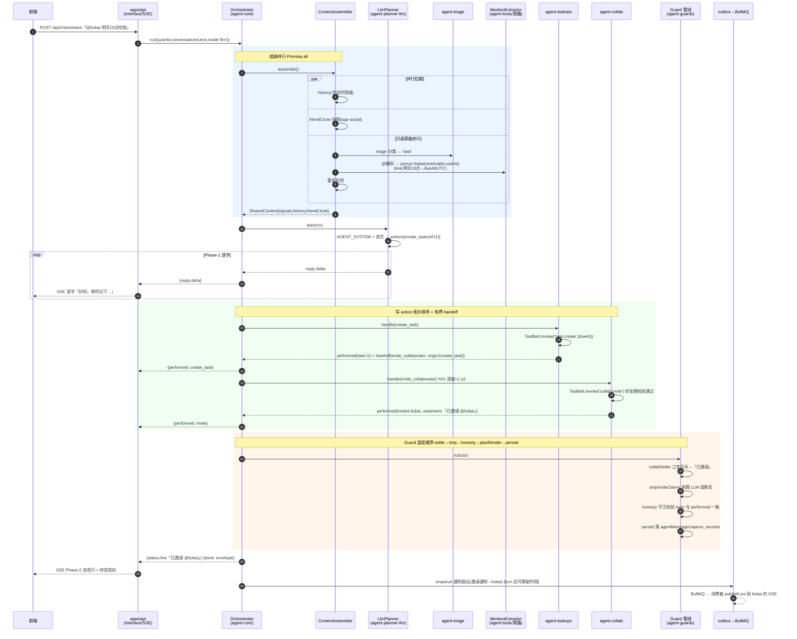
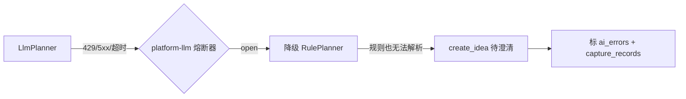
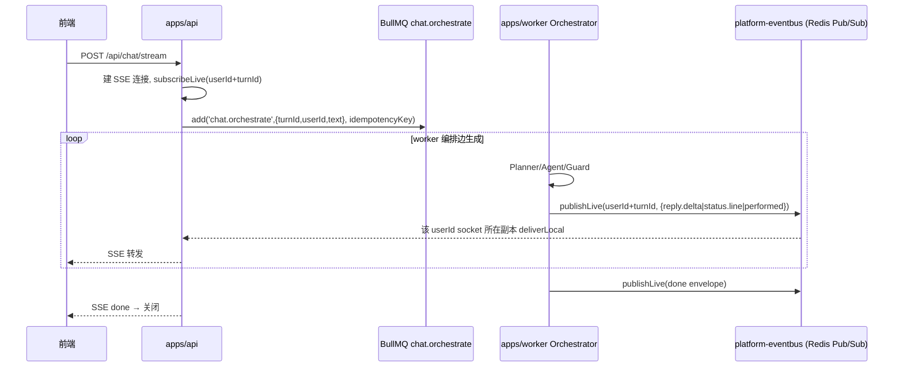
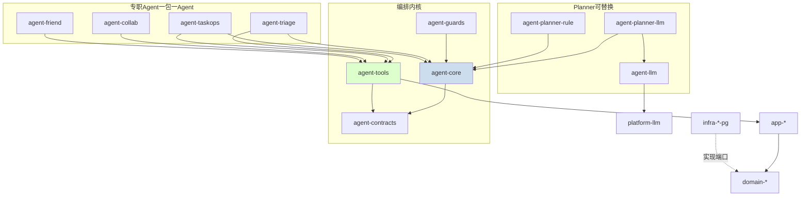

# LinX 灵信 · 多 Agent 编排详细设计（ADR-016 / ADR-017 落地）

> 本文将 ADR-000 主文档 §8 的多 Agent 拍板落成**可实现**的详细设计：编排器/注册表/上下文接口、专职 Agent 契约、Tool Registry、时序图、rule/llm 回退、Guard 中间件位置、worker×流式协同、包拆分。命名、分层、异步模型严格遵循主文档，冲突以主文档为准。

---

## 0. 顶层收敛：为什么这样拆能消灭 `chat.js` God-file

现状（`server/src/services/chat.js` ~350 行 + `agentChat.js`）双写同一套 `create/complete/update/convert/settle/guard`，规则与 LLM 两条链各写一遍。**根因**是「决策（谁产 action）」与「执行（如何落库/守卫/流式）」耦合在同一个文件里。

拍板的唯一切口：

> **离线（rule）与 AI（llm）两种模式的差异，只存在于「谁产出 `Action[]`」这一层（`PlannerStrategy`）。** `Action[]` 之后的一切——路由到 Agent、Tool 执行、Guard 管线、流式信封——两条链**完全共用**。

于是 `chat.js` 被分解为：

| 原 God-file 职责 | 迁往 | 包 |
|---|---|---|
| `detectIntent` / `parseTaskCommand` / 规则 triage | `RulePlanner` | `agent-planner-rule` |
| `AGENT_SYSTEM` 提示 / `normalizeAction` / `TYPE_ALIAS` / 流式 JSON | `LlmPlanner` | `agent-planner-llm` |
| action 分派 / 拓扑排序 / handoff | `Orchestrator` | `agent-core` |
| create/complete/update/convert 的实际落库 | Tool → `app-*` use-case | `agent-tools` → `app-*` |
| `collabSettle` / `stripInviteClaims` / honesty / planRender | Guard 中间件 | `agent-guards` |
| reply 增量提取 / extractJson | `LlmGateway` | `agent-llm` |
| SSE 信封拼装 | interface 层薄封装 | `apps/api` |

**净结果**：不存在任何一个文件同时知道「意图规则」+「如何落库」+「如何守卫」。每层单一变更理由，命中北极星⑤。

---

## 1. `agent-core`：编排器 / 注册表 / 上下文接口（TS）

`agent-core` 只依赖 `agent-contracts`（纯类型）与 `agent-tools`（Tool 执行接口）。**不 import 任何 `app-*`/`infra-*`/具体 Agent**——所有具体 Agent 与 Planner 由 composition root（`apps/api|worker/src/bootstrap.ts`）注入。

### 1.1 核心契约类型（`agent-contracts`）

```ts
// packages/agent-contracts/src/action.ts
import { z } from 'zod';
import type { Uuid } from '@linx/kernel-types';

/** 内部 A2A 总线上的最小单元。Planner 产出，Orchestrator 路由，Agent 消费。 */
export const ActionType = z.enum([
  'create_task', 'create_idea', 'create_nontodo',
  'complete_task', 'delete_task', 'update_task',   // 改期/改优先级/开始/改名
  'convert_idea', 'move_out',                       // 纠错 move-out → nonTodo
  'invite_collaborator', 'settle_collaboration',    // 协作
  'plan_next_block', 'commit_plan',
  'remember', 'answer_identity', 'answer_question',
  'friend_request', 'greeting', 'help',
]);
export type ActionType = z.infer<typeof ActionType>;

export interface Action<P = unknown> {
  readonly type: ActionType;
  readonly payload: P;
  /** handoff 溯源：防环（深度≤2 + origin 去重）。根 action origin=[] */
  readonly origin: readonly ActionType[];
  /** 拓扑排序用：本 action 依赖的、同批次内先产的 action 的稳定引用键 */
  readonly dependsOn?: readonly string[];
  /** 稳定引用键，供后续 action 通过 dependsOn 指向（如 create → invite） */
  readonly ref?: string;
}

/** Agent 执行 action 的产物，回灌编排上下文 */
export interface Performed {
  readonly action: ActionType;
  readonly ok: boolean;
  readonly entity?: { kind: string; id: Uuid };
  /** 权威状态行文本（供 Phase-2 流式），如「已邀请 @liubai」 */
  readonly statement?: string;
  /** 触发的 handoff（受白名单/深度约束） */
  readonly handoffs?: readonly Action[];
  readonly error?: { code: string; message: string };
}
```

```ts
// packages/agent-contracts/src/stream.ts
/** 对外契约不变：{intent,reply,entities,plan,performed,userMessage,agentMessage} 由此拼装 */
export type StreamEvent =
  | { type: 'reply.delta'; text: string }          // Phase-1 Planner 逐字（仅 llm）
  | { type: 'status.line'; text: string }          // Phase-2 权威状态行
  | { type: 'reply.final'; reply: string }         // strip 删改后终态兜底
  | { type: 'performed'; performed: Performed }
  | { type: 'done'; envelope: ChatEnvelope };

export interface ChatEnvelope {                     // == 现有对外形状，冻结
  intent: string;
  reply: string;
  entities: unknown;
  plan?: unknown;
  performed: Performed[];
  userMessage: { id: string; text: string };
  agentMessage: { id: string; text: string };
}
```

### 1.2 上下文接口 `SharedContext` / `ContextAssembler`

```ts
// packages/agent-core/src/context.ts
import type { Uuid } from '@linx/kernel-types';

/** 单 turn 生命周期内的只读快照 + 可写累积区。跨 Agent 共享，禁止各 Agent 私查 DB。 */
export interface SharedContext {
  readonly reqId: string;
  readonly userId: Uuid;
  readonly conversationId: Uuid;
  readonly text: string;                    // 入站原文
  readonly mode: PlannerMode;               // 'rule' | 'llm'
  /** 只读旁路产物（triage 分类 + @提及 + 重复检测），由并行阶段填充 */
  readonly signals: TurnSignals;
  /** 会话作用域多轮上下文（近 N 轮 + 引用实体），组装阶段并行拉取 */
  readonly history: ConversationSlice;
  /** 好友圈快照（协作口径单点真理，来自 app-social.FriendCircleQuery） */
  readonly friendCircle: FriendCircleSnapshot;
  /** 累积执行结果，Guard 与流式读取 */
  readonly performed: Performed[];
  /** 累积待流式的权威状态行 */
  readonly statements: string[];
}

export interface TurnSignals {
  readonly triage?: { class: 'task' | 'idea' | 'nontodo'; confidence: number };
  readonly mentions: Mention[];             // 人/时间/文档三类结构化
  readonly duplicateOf?: Uuid;              // 重复检测命中
}

export type Mention =
  | { kind: 'person'; raw: string; userId?: Uuid; resolvable: boolean }
  | { kind: 'time'; raw: string; dueAt?: string /* UTC ISO */ }
  | { kind: 'doc'; raw: string; ref?: string };

/** 组装并行（Promise.all）：history / friendCircle / signals 三路并发 */
export interface ContextAssembler {
  assemble(input: {
    reqId: string; userId: Uuid; conversationId: Uuid; text: string; mode: PlannerMode;
  }): Promise<SharedContext>;
}
```

### 1.3 `PlannerStrategy`（rule/llm 的唯一差异点）

```ts
// packages/agent-core/src/planner.ts
export type PlannerMode = 'rule' | 'llm';

export interface PlanResult {
  readonly intent: string;                  // greeting/help/plan/query/complete/...
  readonly actions: Action[];
  /** llm 模式：Phase-1 逐字 reply 流；rule 模式：整段一次性 */
  readonly replyStream: AsyncIterable<string>;
}

export interface PlannerStrategy {
  readonly mode: PlannerMode;
  plan(ctx: SharedContext): Promise<PlanResult>;
}
```

### 1.4 `AgentRegistry` 与 `Agent` 接口

```ts
// packages/agent-core/src/agent.ts
export interface AgentHandleResult {
  readonly performed: Performed[];
  readonly handoffs: Action[];              // 受白名单/深度约束
}

export interface Agent {
  readonly name: string;                    // 'triage' | 'taskops' | 'collab' | ...
  /** 声明可处理的 action 类型，Registry 据此路由 */
  readonly handles: readonly ActionType[];
  handle(action: Action, ctx: SharedContext): Promise<AgentHandleResult>;
}

export interface AgentRegistry {
  register(agent: Agent): void;
  resolve(type: ActionType): Agent;         // 找不到抛 AppError('AGENT_UNROUTED')
}

/** 声明式定义辅助，供各 agent-* 包使用 */
export function defineAgent(spec: Agent): Agent { return spec; }
```

### 1.5 Guard 中间件管线（不是 Agent）

```ts
// packages/agent-core/src/pipeline.ts
export interface GuardMiddleware {
  readonly name: string;
  /** 严格串行、固定顺序运行，无视路由结果，观测聚合产物后改写 ctx.performed/statements */
  run(ctx: SharedContext, next: () => Promise<void>): Promise<void>;
}

/** 固定顺序：settle → strip → honesty → planRender → persist（主文档 §8.3） */
export function composeGuards(guards: GuardMiddleware[]): GuardMiddleware {
  return {
    name: 'guard-pipeline',
    run(ctx, done) {
      const dispatch = (i: number): Promise<void> =>
        i < guards.length ? guards[i].run(ctx, () => dispatch(i + 1)) : done();
      return dispatch(0);
    },
  };
}
```

### 1.6 `Orchestrator`（确定性，无 LLM）

```ts
// packages/agent-core/src/orchestrator.ts
export interface OrchestratorDeps {
  assembler: ContextAssembler;
  planners: Record<PlannerMode, PlannerStrategy>;
  registry: AgentRegistry;
  guards: GuardMiddleware;                   // composeGuards(...) 结果
  clock: Clock;                              // kernel-clock，禁 new Date()
}

const MAX_HANDOFF_DEPTH = 2;

export class Orchestrator {
  constructor(private d: OrchestratorDeps) {}

  /** 单 turn 编排。产出 StreamEvent 异步流，interface 层转 SSE。 */
  async *run(input: TurnInput): AsyncGenerator<StreamEvent> {
    const ctx = await this.d.assembler.assemble(input);          // 组装并行
    const planner = this.d.planners[ctx.mode];
    const plan = await planner.plan(ctx);

    // ── Phase 1：Planner reply 流（llm 逐字；rule 整段）──
    for await (const delta of plan.replyStream) {
      yield { type: 'reply.delta', text: delta };
    }

    // ── 写 action 拓扑排序（create_* 先于引用它的 invite/update）──
    const ordered = topoSort(plan.actions);                     // 依 dependsOn/ref
    const queue: Action[] = [...ordered];

    // ── 派发 + 有界 handoff（闭集白名单、深度≤2、origin 去重防环）──
    while (queue.length) {
      const action = queue.shift()!;
      if (action.origin.length > MAX_HANDOFF_DEPTH) continue;   // 深度闸
      const agent = this.d.registry.resolve(action.type);
      const { performed, handoffs } = await agent.handle(action, ctx);
      ctx.performed.push(...performed);
      for (const p of performed) {
        yield { type: 'performed', performed: p };
        if (p.statement) ctx.statements.push(p.statement);
      }
      for (const h of dedupeByOrigin(handoffs, action)) queue.push(h);
    }

    // ── Guard 管线：settle → strip → honesty → planRender → persist ──
    await this.d.guards.run(ctx, async () => {});

    // ── Phase 2：权威状态行 + 终态兜底 ──
    for (const line of ctx.statements) yield { type: 'status.line', text: line };
    yield { type: 'done', envelope: assembleEnvelope(ctx, plan) };
  }
}
```

**确定性串/并行规则**（非模型决定，主文档 §8.3）：

| 阶段 | 并/串 | 依据 |
|---|---|---|
| SharedContext 组装（history/friendCircle） | 并行 `Promise.all` | 互不依赖 |
| 只读旁路（triage + @解析 + 重复检测） | 并行 | 无副作用 |
| 写 action | 串行 + 拓扑排序 | `create_task` 必先于引用它的 `invite_collaborator` |
| Guard 管线 | 严格串行固定顺序 | settle 依赖全部 performed，honesty 依赖 settle 结果 |
| 通知/SSE 扇出 | 异步出队（outbox→BullMQ） | turn 后可靠副作用，不阻塞响应 |

---

## 2. 专职 Agent 的接口与职责（一 Agent 一包）

所有 Agent 实现同一 `Agent` 接口，**只依赖 `agent-core`+`agent-contracts`+`agent-tools`**，通过 `ToolBelt` 调用 use-case，Agent 间**零 import**、只走类型化 handoff。

| Agent 包 | `handles`（action） | 职责 | 允许 handoff → |
|---|---|---|---|
| `agent-triage` | （旁路，不产写 action） | 规则/LLM triage 分类 → 写 `ctx.signals.triage`；分类为 idea/nontodo 时产 `create_idea`/`create_nontodo` | taskops |
| `agent-taskops` | `create_task` `complete_task` `delete_task` `update_task` `convert_idea` `move_out` | 任务全生命周期落库（经 ToolBelt→`app-tasks`）；改期/改优先级/开始/改名 | collab（含 @人时触发邀请）、plan |
| `agent-plan` | `plan_next_block` `commit_plan` | planNextBlock 计算 + commit 写 `plannedAt` | — |
| `agent-clarify` | （旁路 + `create_idea`） | 低置信 triage → 待澄清想法；生成澄清 reply | taskops（澄清后转任务） |
| `agent-collab` | `invite_collaborator` `settle_collaboration` | 邀请-确认/关注模式/批量/auto_rules；权限收口经 `FriendCircleQuery` | friend（非好友→引导加好友） |
| `agent-friend` | `friend_request` | 邮箱精确请求/接受/拒绝/限流 | — |
| `agent-memory` | `remember` | 写 AgentProfile 记忆/偏好 | — |
| `agent-identity` | `answer_identity` | 身份提问后端直答（不走 LLM） | — |
| `agent-converse` | `greeting` `help` `answer_question` | 闲聊/帮助/一般问答 reply | — |

示例（`agent-taskops`，展示 handoff 生成而不 import collab）：

```ts
// packages/agent-taskops/src/index.ts
import { defineAgent } from '@linx/agent-core';
import type { ToolBelt } from '@linx/agent-tools';

export const makeTaskOpsAgent = (belt: ToolBelt) => defineAgent({
  name: 'taskops',
  handles: ['create_task', 'complete_task', 'update_task', 'convert_idea', 'move_out', 'delete_task'],
  async handle(action, ctx) {
    switch (action.type) {
      case 'create_task': {
        const p = action.payload as CreateTaskPayload;
        const task = await belt.invoke('task.create', {   // → app-tasks use-case
          userId: ctx.userId, title: p.title, dueAt: p.dueAt, priority: p.priority,
          projectId: p.projectId, sourceIdeaId: p.sourceIdeaId,
        });
        // @人 提及 → 生成 invite handoff（不 import collab，只产类型化 action）
        const handoffs = ctx.signals.mentions
          .filter((m): m is Extract<Mention,{kind:'person'}> => m.kind === 'person' && m.resolvable)
          .map(m => inviteAction(task.id, m.userId!, action.type));  // origin 追加自身
        return {
          performed: [{ action: 'create_task', ok: true,
            entity: { kind: 'task', id: task.id },
            statement: `已创建任务「${task.title}」，截止 ${fmt(task.dueAt)}` }],
          handoffs,
        };
      }
      // complete/update/convert/move_out ...
    }
  },
});
```

---

## 3. Tool Registry 与 tool→use-case 映射（TS）

`agent-tools` 是 Agent 与 `app-*` 之间的**唯一接线层**：注册 Tool（Zod 输入校验 + 权限 scope + 幂等标记），`ToolBelt` 做**权限收口**（team·@·指派·邀请均限好友圈）。Tool 的 `handler` 只调 `app-*` use-case，**不碰 DB/Redis**。

```ts
// packages/agent-tools/src/registry.ts
import { z } from 'zod';

export interface ToolDef<I, O> {
  readonly name: string;                    // 'task.create' | 'collab.invite' | ...
  readonly input: z.ZodType<I>;
  readonly sideEffect: boolean;
  readonly scope: ToolScope;                // 权限：'self' | 'friend-circle' | 'admin'
  readonly idempotent: boolean;             // 供 platform-idempotency 判重入
  handler(input: I, cx: ToolCtx): Promise<O>;
}

export interface ToolCtx {
  readonly userId: Uuid;
  readonly friendCircle: FriendCircleSnapshot;   // scope 判定用
  readonly idem?: string;                        // 幂等键
}

export class ToolRegistry {
  private tools = new Map<string, ToolDef<any, any>>();
  register<I, O>(t: ToolDef<I, O>) { this.tools.set(t.name, t); }
  get(name: string) {
    const t = this.tools.get(name);
    if (!t) throw new AppError('TOOL_UNKNOWN', 400, `no tool ${name}`);
    return t;
  }
}

/** ToolBelt：Agent 唯一入口，做 Zod 校验 + 权限收口 + 幂等 */
export class ToolBelt {
  constructor(private reg: ToolRegistry, private cx: ToolCtx) {}
  async invoke<O = unknown>(name: string, raw: unknown): Promise<O> {
    const t = this.reg.get(name);
    const input = t.input.parse(raw);                        // 修 P5：校验统一在此
    enforceScope(t.scope, input, this.cx);                   // 越权抛 AppError('FORBIDDEN')
    return t.handler(input, this.cx) as Promise<O>;
  }
}
```

tool→use-case 映射示例（接线在 `bootstrap.ts`，Tool 只依赖 `app-*` 接口）：

```ts
// apps/api/src/bootstrap/tools.ts
import { ToolRegistry } from '@linx/agent-tools';
import type { TaskUseCases } from '@linx/app-tasks';
import type { CollabUseCases } from '@linx/app-collaboration';

export function registerTools(reg: ToolRegistry, app: {
  tasks: TaskUseCases; collab: CollabUseCases;
}) {
  reg.register({
    name: 'task.create', sideEffect: true, scope: 'self', idempotent: false,
    input: z.object({ userId: Uuid, title: z.string().min(1),
      dueAt: z.string().datetime().optional(), priority: z.number().int().min(1).max(4).optional(),
      projectId: Uuid.optional(), sourceIdeaId: Uuid.optional() }),
    handler: (i) => app.tasks.create(i),          // → domain-tasks 不变量 → infra-tasks-pg
  });

  reg.register({
    name: 'collab.invite', sideEffect: true, scope: 'friend-circle', idempotent: true,
    input: z.object({ taskId: Uuid, inviteeId: Uuid, mode: z.enum(['collaborator','follower']) }),
    handler: (i, cx) => app.collab.invite({ ...i, actorId: cx.userId }),  // 三态口径在此
  });
  // task.complete / task.update / idea.convert / plan.commit / friend.request ...
}
```

**tool→use-case→分层** 全景：`agent-tools`（校验/权限/幂等）→ `app-*`（事务边界/发事件）→ `domain-*`（不变量）← `infra-*-pg`（Drizzle 落库），与主文档 §4 全局分层一致。

---

## 4. 时序图：`@liubai 明天10点吃饭`（LLM 模式）



**关键节点对照北极星**：并行旁路（②高并发）、类型化 handoff `create_task→invite`（③协同、防 collab↔friends 环）、Guard 三态 settle（协作口径统一）、turn 后 outbox 通知（④水平扩展、跨用户 pushChat）。

---

## 5. 规则版与 LLM 版在同一编排下的回退

**同一 `Orchestrator`、同一 Agent/Tool/Guard/流式信封，仅 `PlannerStrategy` 不同。**

```ts
// apps/api/src/bootstrap/planner.ts
function selectPlanner(cfg: AiConfig, health: ProviderHealth): PlannerMode {
  if (!cfg.enabled) return 'rule';               // 用户/团队关闭 AI
  if (health.circuitOpen) return 'rule';         // 熔断降级（platform-llm 熔断器 open）
  return 'llm';
}
```

| 维度 | RulePlanner（`agent-planner-rule`） | LlmPlanner（`agent-planner-llm`） |
|---|---|---|
| 意图 | `detectIntent`（关键词/命令解析） | LLM 分类 + `normalizeAction`/`TYPE_ALIAS` |
| 命令 | `parseTaskCommand`（改期/改优先级/开始/改名 离线可解析） | LLM 抽 action + payload |
| triage | 规则版 triage | LLM triage（低置信 → `agent-clarify`） |
| reply 流 | 整段模板一次性（`replyStream` yield 一次） | `makeReplyExtractor` 逐字增量 |
| 产物 | `PlanResult{intent,actions,replyStream}` | **同构** `PlanResult` |

**回退链（三级，保证 capture 闭环不丢想法）**：



- LLM provider 调用失败（超时 30s / 429 / 5xx / 网络）→ `platform-llm` adapter 重试（BullMQ `attempts:3` 指数退避，仅重试路径中的可重试错）→ 熔断器 open → 本 turn 直接切 `RulePlanner`。
- 规则也解析不出 → 兜底产 `create_idea`（待澄清想法），reply 走 `agent-clarify` 模板，**想法必落库**，标 `ai_errors`。
- **对外信封形状两条链完全一致**（`ChatEnvelope`），前端无感知；仅 llm 有 Phase-1 逐字，rule 直接 Phase-2 状态行。

---

## 6. 诚实守卫 / 协作口径作为 pipeline 中间件的位置

**硬性：Guard 是中间件，不是可路由 Agent。** 若做成 Agent，编排顺序保证会变脆（模型/路由可能乱序）。Guard 无视路由结果、观测 `ctx.performed` 聚合产物、**固定顺序串行**运行。

```
写 action 派发完毕 → Guard 管线（固定序）→ 流式 Phase-2
   settle ── strip ── honesty ── planRender ── persist
```

| 顺序 | Guard（`agent-guards`） | 职责 | 为何在此位 |
|---|---|---|---|
| 1 | `collabSettle` | @成员协作三态互斥（已邀请/待确认/无法邀请），综合 performed 定稿 | 必先于一切文本改写，是口径真相源 |
| 2 | `stripInviteClaims` | 剥离 LLM reply 里的邀请误断言（模型说「已邀请」但实际 performed 未成功） | 依赖 settle 的权威结论 |
| 3 | `honesty`（诚实守卫） | 校验最终 reply 与 `performed` 一致，无幻觉动作 | 需 settle+strip 后的净文本 |
| 4 | `planRender` | 把 `plan_next_block` 结果渲染成权威状态行 | 在诚实校验后追加，不参与幻觉判定 |
| 5 | `persist` | 落 agentMessage / capture_records / ai_errors | 终态确定后一次性落库 |

**与流式的交互（罕见 strip 删改已流出文字）**：Phase-1 已把 LLM「已邀请」逐字流给前端，但 strip 判定该断言不实并删除 → Orchestrator 发 `{type:'reply.final', reply}` 控制事件，前端以**终态信封兜底**覆盖已渲染文本。规则模式无 Phase-1 逐字，天然无此问题。

```ts
// packages/agent-guards/src/honesty.ts
export const honestyGuard: GuardMiddleware = {
  name: 'honesty',
  async run(ctx, next) {
    const claimed = extractClaims(ctx.draftReply);           // reply 中声称的动作
    const real = new Set(ctx.performed.filter(p => p.ok).map(p => p.action));
    ctx.draftReply = reconcile(claimed, real, ctx.statements); // 删无据断言，补权威行
    await next();
  },
};
```

---

## 7. 重活入队列（worker）与流式协同

**三种异步机制严格分工（主文档 ADR-012~014），编排×异步边界见 §8.3。**

| 层次 | 机制 | 落点 |
|---|---|---|
| 单 turn 内编排（Planner→Agent→handoff→Guard） | **进程内**，可 await LLM I/O，handoff 不走 BullMQ | Orchestrator |
| 跨请求/响应卸载（整段 LLM 编排） | **BullMQ job** `chat.orchestrate` | `apps/worker` |
| turn 后可靠副作用（通知扇出/跨用户 pushChat） | **outbox→BullMQ→消费者→publishLive** | `platform-outbox`+`platform-queue` |
| 实时 token 扇出 | **Redis Pub/Sub**（`platform-eventbus`），至多一次，REST 兜底 | `platform-eventbus` |

**LLM 模式整段编排下沉 worker、边生成边流式**（避免 8s LLM 占住 API 事件循环）：



- **无 sticky**：`publishLive(userId+turnId, evt)` 经 Redis 广播到所有副本，仅持有该 socket 的副本 `deliverLocal` 成功，余者 no-op → nginx `least_conn` 即可（`/api/events`、`/api/chat/stream` 需 `proxy_buffering off`、`proxy_read_timeout 3600s`）。
- **worker 优雅关闭**：`close()` 排空在途 job + `closeEvents()` 断 Redis（保留现有优雅关闭语义）。
- **重活举例入 worker**：planNextBlock、批量协作邀请、每日 `pg_dump`、`ai_errors` 归档、记忆整理、多 Agent 长链（FlowProducer fan-out）。
- **幂等**：`chat.orchestrate` 带 `idempotencyKey=turnId`（`platform-idempotency` SETNX），重复投递不重复落库。

**API 直连 vs 下沉 worker 的选择**：短 turn（rule 模式、身份直答）API 进程内直接跑 Orchestrator，零队列跳；长 turn（llm 模式）下沉 worker。二者共用同一 `Orchestrator` 类，仅 composition root 装配不同（API 版注入 in-proc bus，worker 版注入 Redis bus）。

---

## 8. `agent-*` 包拆分与依赖

```
packages/
  agent-contracts/     纯类型+Zod：Action/Intent/Performed/Entity/Mention/StreamEvent
  agent-core/          Orchestrator/AgentRegistry/pipeline/ContextAssembler/PlannerStrategy 接口
  agent-tools/         ToolRegistry + ToolBelt(权限收口) + tool→app use-case 接线契约
  agent-guards/        collabSettle/stripInviteClaims/honesty/planRender/persist 中间件
  agent-llm/           LlmGateway：适配 platform-llm + makeReplyExtractor(流式增量) + extractJson
  agent-planner-llm/   LlmPlanner（AGENT_SYSTEM + normalizeAction/TYPE_ALIAS + 流式）
  agent-planner-rule/  RulePlanner（detectIntent/parseTaskCommand/规则 triage → actions）
  agent-triage/ agent-taskops/ agent-plan/ agent-clarify/
  agent-collab/ agent-friend/ agent-memory/ agent-identity/ agent-converse/   一 Agent 一包
```

**依赖铁律（dependency-cruiser CI 强制，主文档 §5.4 闸 2）**：



| 包 | 依赖 | **禁止** |
|---|---|---|
| `agent-contracts` | 仅 `kernel-*` | 一切业务/框架 |
| `agent-core` | `agent-contracts`、`agent-tools`（接口）、`kernel-clock` | import 具体 Agent / `app-*` / `infra-*` |
| `agent-tools` | `agent-contracts`、`app-*`（接口） | import DB/Redis/`infra-*` |
| `agent-guards` | `agent-core`、`agent-contracts` | import 具体 Agent |
| `agent-<X>`（专职） | `agent-core`、`agent-contracts`、`agent-tools` | **import 其它 `agent-<Y>` / repo / db** |
| `agent-llm` | `platform-llm`、`agent-contracts` | 领域口径逻辑外包（守卫留在 guards） |
| `agent-planner-*` | `agent-core`；llm 版加 `agent-llm` | 互相 import |

**dependency-cruiser 关键禁令**（主文档已给）：

```js
{ name:'agents-no-cross-import', severity:'error',
  from:{ path:'^packages/agent-(?!core|contracts|tools|guards|llm|planner)' },
  to:{   path:'^packages/agent-(?!core|contracts|tools|guards)' } }
```

→ **`collab↔friends` 循环结构上不可能再现**：Agent 间零 import，正向依赖（collab 邀请前判好友）走 `agent-tools`→`app-social.FriendCircleQuery`（好友圈单点真理），反向依赖（friends 解除→清协作）走领域事件 `social.friendship.removed`→`app-collaboration` 订阅。

---

## 9. God-file 消除对照（验收）

| 现状 `chat.js`/`agentChat.js` 职责 | 重构落点 | 独立变更理由 |
|---|---|---|
| 意图规则解析 | `agent-planner-rule` | 规则改动不碰 LLM |
| LLM 提示/流式 JSON | `agent-planner-llm` + `agent-llm` | 提示词/传输独立演进 |
| action 分派/拓扑/handoff | `agent-core/Orchestrator` | 编排策略独立 |
| create/complete/update/convert 落库 | `agent-taskops`→`app-tasks`→`infra-tasks-pg` | 任务领域独立 |
| 协作 settle/三态口径 | `agent-guards/collabSettle` + `agent-collab` | 协作口径单点 |
| 诚实守卫 | `agent-guards/honesty` | 守卫顺序固定 |
| reply 增量提取 | `agent-llm/makeReplyExtractor` | 传输细节独立 |
| SSE 信封拼装 | `apps/api` interface 薄层 | 协议独立 |

无任何文件再同时持有「决策 + 执行 + 守卫」三重职责；rule/llm 双写消除（收敛到 `PlannerStrategy` 一层）；`collab↔friends` 环由三道闸物理禁止。命中北极星 ①（新增 Agent/Tool 有模板、改动局部）③（确定性编排 + 一 Agent 一包 + handoff/Flow）⑤（细粒度包、命名自解释、禁环禁越层）。

---

**新增能力模板回执**（北极星①，改动局部化）：
- 新增 Tool：`app-*` 实现用例 → `agent-tools` 注册 `{name,input(Zod),sideEffect,scope,idempotent,handler}` → 归属 Agent allowlist → 扩 Planner（LLM 提示 + rule 映射）→ 契约测试（越权抛错/幂等重入/rule-llm 行为对齐）。
- 新增 Agent：`defineAgent({name,handles,handle})` → `AgentRegistry.register` → 需推理经 `agent-llm` 受预算门控 → Guard 零改动。

（以上为本主题完整交付，与 ADR-000 主文档拍板、§5 命名法、§7-§8 异步/编排模型严格一致；未写入磁盘文件，按要求以文本返回。）
