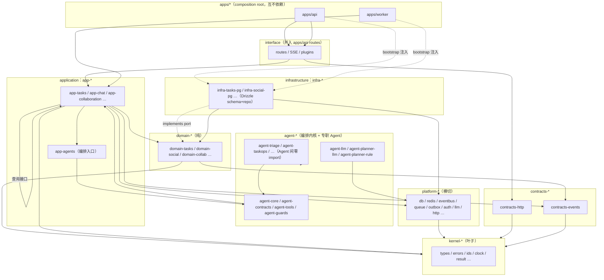

# LinX 灵信 · 后端重构细化文档之一：包结构与目录规范（ADR-002 / ADR-003 落地）

> 遵循 ADR-000 主文档全部拍板与命名法。本篇只讲**包结构、目录、边界、命名、扩展模板**，不重复技术选型理由。冲突以主文档为准。
> 贯穿五北极星，重点服务 **⑤【硬】细粒度多包 / 清晰 / 易改** 与 **① 易扩展**。

---

## 0. 顶层心智模型（一句话）

> **包 = (bounded context) × (layer)** 的交叉单元；横切能力沉到 `platform-*` / `kernel-*`；Agent 编排自成 `agent-*` 系。看包名即知**层 + 上下文 + 技术**三要素，import 方向只准向内，环被三道闸物理禁止。

一个功能的完整纵切固定五段：`contracts-http` →（`domain-X` → `app-X` → `infra-X-pg`）→ `apps/api` 挂路由。横向零污染。

---

## 1. 完整 Monorepo 目录树

```
linx/                                    # repo root（pnpm workspace 根）
├── pnpm-workspace.yaml                  # packages: ["apps/*","packages/*"]
├── turbo.json                           # 任务图：typecheck/build/test/lint/depcruise
├── tsconfig.base.json                   # strict/NodeNext/composite 基线，paths 由 references 承载
├── tsconfig.json                        # solution 文件：references 全量包（IDE 单一入口）
├── drizzle.config.ts                    # schema: './packages/infra-*/src/schema.ts'
├── .dependency-cruiser.cjs              # 闸 2：越层/环 CI 红线
├── .eslintrc.cjs                        # 闸 3：eslint-plugin-boundaries 实时飘红
├── vitest.workspace.ts                  # 汇总各包 vitest 项目
├── package.json                         # 私有根，devDeps：turbo/tsup/tsx/vitest/dep-cruiser
│
├── apps/                                # ── 可部署入口 + composition root（互不依赖）──
│   ├── api/                             # HTTP/SSE 副本（无状态，--scale api=N）
│   │   └── src/
│   │       ├── bootstrap.ts             # composition root：装配所有 infra→port，注入 app 层
│   │       ├── server.ts                # Fastify 实例 + 插件注册顺序 + setErrorHandler
│   │       ├── plugins/                 # 认证 preHandler、reqId、rate-limit、swagger 挂载
│   │       ├── routes/                  # 仅接线：按 context 分文件，调 app use-case
│   │       │   ├── tasks.routes.ts  ideas.routes.ts  projects.routes.ts
│   │       │   ├── auth.routes.ts   users.routes.ts  friends.routes.ts
│   │       │   ├── collaboration.routes.ts  conversations.routes.ts
│   │       │   ├── notifications.routes.ts  settings.routes.ts
│   │       │   ├── chat.routes.ts   chat.stream.routes.ts  events.sse.routes.ts
│   │       │   ├── search.routes.ts plan.routes.ts  data.routes.ts
│   │       │   └── admin.routes.ts  health.routes.ts
│   │       └── main.ts                  # entrypoint（读 config → bootstrap → listen）
│   │
│   └── worker/                          # 离线副本（同镜像不同 entrypoint，--scale worker=M）
│       └── src/
│           ├── bootstrap.ts             # 复用装配，但注册 BullMQ Worker/Processor
│           ├── processors/              # chat.orchestrate / notify.fanout / outbox.relay
│           │   ├── chat-orchestrate.processor.ts
│           │   ├── notify-fanout.processor.ts
│           │   ├── collab-cleanup.processor.ts     # friendship.removed → 清协作
│           │   ├── reminder-scan.processor.ts      # 到期/逾期每任务每天一次
│           │   ├── ai-errors-archive.processor.ts
│           │   └── outbox-relay.processor.ts       # outbox → BullMQ
│           ├── crons/                   # repeatable jobs
│           │   ├── pg-dump.cron.ts      # 每日 pg_dump
│           │   └── session-gc.cron.ts   # 会话 GC（替代手动 GC）
│           └── main.ts
│
├── packages/
│   │
│   ├── ── kernel-*  （零业务零 I/O，依赖树叶子，仅 kernel 间互依）──
│   │   ├── kernel-types/                # Brand<T>/Uuid/Result<T,E>/Opaque/DeepReadonly
│   │   ├── kernel-result/               # Result/Ok/Err + combinators（若不并入 kernel-types）
│   │   ├── kernel-errors/               # AppError{code,httpStatus,message,details} 基类 + 错误码枚举
│   │   ├── kernel-ids/                  # UUIDv7 生成 + 前缀化 typed-id 工厂（修 P6）
│   │   ├── kernel-clock/                # Clock 端口 + UTC now()/Instant 值对象（修 P7，替 nowIso）
│   │   ├── kernel-assert/               # invariant()/exhaustive()/never 守卫
│   │   └── kernel-pagination/           # keyset cursor 编解码（万人级分页）
│   │
│   ├── ── contracts-*  （前后端契约，仅依赖 kernel）──
│   │   ├── contracts-http/              # 全 API request/response DTO（Zod schema，手写，冻结现契约）
│   │   │   └── src/{tasks,auth,friends,collaboration,chat,notifications,settings,admin,search,plan}.ts
│   │   └── contracts-events/            # 领域事件/集成事件/LiveEvent schema（domain 与 infra 共用）
│   │
│   ├── ── platform-*  （横切技术能力，无业务语义，依赖 kernel + 外部库）──
│   │   ├── platform-config/             # Zod env schema，boot fail-fast，SSRF URL 形态校验（修 P8）
│   │   ├── platform-logger/             # pino + AsyncLocalStorage reqId 贯穿（修 P13）
│   │   ├── platform-observability/      # prom-client metrics + /health ⟂ /ready 探针
│   │   ├── platform-db/                 # Drizzle 实例 + pg.Pool + tx 助手 + advisory-lock 迁移 runner
│   │   ├── platform-redis/              # ioredis 连接工厂（cache/ratelimit/events/queue 分前缀）
│   │   ├── platform-eventbus/           # 实时 Pub/Sub 扇出 + 进程内回退（承 events.js 语义，SSE 无 sticky）
│   │   ├── platform-outbox/             # 事务 outbox 表 + relay（唯一可靠投递入口）
│   │   ├── platform-queue/              # BullMQ 队列/Flow/job 类型定义
│   │   ├── platform-cache/              # 读穿 cached() + 主动 invalidate()（单层 Redis）
│   │   ├── platform-ratelimit/          # Redis 滑动窗口 + 复合键（修 P4）
│   │   ├── platform-idempotency/        # 幂等键 SETNX（写接口/消费者）
│   │   ├── platform-auth/               # opaque session store（PG+Redis）+ argon2 + preHandler（修 P3）
│   │   ├── platform-llm/                # LLM Provider 端口 + Vercel AI SDK adapter + 流式 + SSRF 深检（修 P15）
│   │   └── platform-http/               # Fastify 装配助手：type-provider-zod 接线、错误信封序列化、swagger
│   │
│   ├── ── domain-*  （领域模型/规则/端口/事件，纯，仅依赖 kernel + contracts-events）──
│   │   ├── domain-tasks/                # Task+TodoIdea 聚合（同生命周期 move-out→nonTodo，不拆）
│   │   ├── domain-ideas/               # NonTodo（若独立不变量）— 见 §拆包停止条件
│   │   ├── domain-projects/             # Project 实体 + 智能归属规则接口
│   │   ├── domain-identity/             # User(name/account_name/role)+Session 不变量+首账号admin
│   │   ├── domain-social/               # Friend 关系（请求/接受/解除/反向自动/谢绝陌生人）
│   │   ├── domain-collab/               # task_collaborators + auto_rules + 关注模式 + 好友圈权限口径
│   │   ├── domain-conversations/        # Conversation 线程 + 作用域 + 置顶 + 自动命名规则
│   │   ├── domain-notifications/        # Notification 生成/去重（每任务每天一次）
│   │   ├── domain-settings/             # AppSettings + AgentProfile + 每用户 AI 配置覆盖
│   │   ├── domain-capture/              # CaptureRecord 溯源 + ai_errors + triage 判定值对象
│   │   ├── domain-search/               # 搜索查询模型（/search /mentions 结构化）
│   │   └── domain-plan/                 # 规划：planNextBlock 领域服务 + plannedAt/plannedAt 不变量
│   │
│   ├── ── app-*  （use-case 编排/事务边界/发事件，依赖 domain + 其它 app 查询接口 + platform 接口）──
│   │   ├── app-tasks/                    # CRUD/生命周期/详情/纠错/视图过滤/批量 use-cases
│   │   ├── app-ideas/                    # convert/archive/discard/convert-to-todo
│   │   ├── app-projects/                 # 创建 + 聊天智能归属
│   │   ├── app-identity/                # 注册/登录/登出/me/改称呼与账户名/改密吊销
│   │   ├── app-social/                  # 好友用例 + FriendCircleQuery.isFriend()（好友圈单点真理）
│   │   ├── app-collaboration/           # 邀请-确认/关注/批量/auto_rules；订阅 friendship.removed
│   │   ├── app-conversations/           # 列表/新建/改名/删除/作用域/置顶/跨用户注入
│   │   ├── app-notifications/           # 列表/已读/内联动作/到期提醒调度
│   │   ├── app-settings/                # AppSettings + AgentProfile + 每用户 AI 配置读写
│   │   ├── app-capture/                 # Capture 闭环：triage → 落库 + capture_records + ai_errors
│   │   ├── app-search/                  # /search 命令面板 + /mentions 聚合
│   │   ├── app-plan/                     # planNextBlock + commit 写 plannedAt
│   │   ├── app-data/                     # 导出 JSON / 清空
│   │   ├── app-admin/                    # overview / 用户详情（只读监控）
│   │   └── app-chat/                     # 对话入口 use-case（调 app-agents 编排；无 God-file）
│   │
│   ├── ── infra-*  （端口实现：Drizzle schema+repo+映射，被 DI 注入，依赖对应 domain+platform）──
│   │   ├── infra-tasks-pg/              # schema.ts + TaskRepo/IdeaRepo + row↔domain 映射（修 P1）
│   │   ├── infra-projects-pg/
│   │   ├── infra-identity-pg/           # users/sessions schema + 映射
│   │   ├── infra-social-pg/
│   │   ├── infra-collab-pg/
│   │   ├── infra-conversations-pg/
│   │   ├── infra-notifications-pg/
│   │   ├── infra-settings-pg/
│   │   ├── infra-capture-pg/            # capture_records / ai_errors schema
│   │   ├── infra-search-pg/             # 全文检索 sql`` 逃生舱查询
│   │   ├── infra-plan-pg/
│   │   └── infra-agents-llm/            # AgentProfile→LLM 记忆/偏好装配的 infra 实现
│   │
│   ├── ── agent-*  （多 Agent 编排内核 + 专职 Agent，一 Agent 一包，Agent 间零 import）──
│   │   ├── agent-contracts/             # Action/Intent/Performed/Entity/Mention/StreamEvent 纯类型+Zod
│   │   ├── agent-core/                  # Orchestrator/AgentRegistry/pipeline/ContextAssembler/handoff/PlannerStrategy 接口
│   │   ├── agent-tools/                 # Tool Registry + ToolBelt（权限收口）+ Tool→app use-case 接线
│   │   ├── agent-guards/                # settle/stripInviteClaims/honesty/planRender/rateLimit 中间件管线
│   │   ├── agent-llm/                   # LlmGateway：适配 platform-llm + makeReplyExtractor + extractJson
│   │   ├── agent-planner-llm/           # LlmPlanner（AGENT_SYSTEM 提示 + normalizeAction/TYPE_ALIAS + 流式）
│   │   ├── agent-planner-rule/          # RulePlanner（detectIntent/parseTaskCommand/规则 triage → actions）
│   │   ├── agent-triage/                # 意图分诊 Agent（task/idea/nonTodo）
│   │   ├── agent-taskops/               # 任务增删改查 Agent（改期/改优先级/开始/改名）
│   │   ├── agent-plan/                  # 规划 Agent（planNextBlock 编排）
│   │   ├── agent-clarify/               # 待澄清想法 Agent
│   │   ├── agent-collab/                # 协作 Agent（@成员三态口径）
│   │   ├── agent-friend/                # 好友 Agent（@提及人）
│   │   ├── agent-memory/                # 记忆 Agent（remember/记忆整理）
│   │   ├── agent-identity/              # 身份提问后端直答 Agent
│   │   └── agent-converse/              # greeting/help/question 兜底会话 Agent
│   │
│   └── ── 交付支撑 ──
│       └── migrations/                  # drizzle-kit generate 产物 + 手写 down + __migrations 记录
│           └── sql/0001_*.sql …
│
├── docs/
│   ├── adr/                             # ADR-000 主文档 + 七篇细化（本篇 = ADR-002 落地）
│   │   ├── ADR-000-architecture.md
│   │   ├── ADR-002-package-structure.md    # ← 本文
│   │   └── ADR-004…018-*.md
│   ├── backend-rearchitecture-requirements.md
│   └── openapi.gen.json                 # @fastify/swagger 导出，契约回归基线
│
└── infra/deploy/
    ├── Dockerfile                       # 多阶段：pnpm build → 单镜像，api/worker 靠 CMD 分流
    ├── docker-compose.yml               # api×N + worker×M + pg16 + redis7
    ├── nginx/todo.conf                  # upstream 多端口，/api/events proxy_buffering off
    └── scripts/{migrate.sh,pg-dump.sh,deploy.sh}
```

**包数量对齐主文档 §5.3**：kernel 7 + contracts 2 + platform 14 + domain 12 + app 15 + infra 12 + agent 15 + migrations 1 = **约 78 包**（可按拆包停止条件合并 ideas/capture 等到 45–60 区间；宁细勿混）。

---

## 2. 单包内部结构模板

### 2.1 目录布局（以 `domain-tasks` / `app-tasks` / `infra-tasks-pg` 为范式）

```
packages/domain-tasks/
├── package.json
├── tsconfig.json
├── src/
│   ├── index.ts               # 唯一 public barrel，显式 re-export，禁 export *
│   ├── model/                 # 实体/值对象/枚举
│   │   ├── task.ts            #   Task 聚合根 + 不变量方法（complete()/moveOut()）
│   │   ├── todo-idea.ts
│   │   └── enums.ts           #   status/priority(1-4)/privacy(work|personal|mixed)
│   ├── ports/                 # 端口接口（infra 实现，app 依赖）
│   │   ├── task-repo.port.ts  #   interface TaskRepo { … }
│   │   └── task-view.port.ts  #   查询端口（view/scope/search/today）
│   ├── events/                # 领域事件（引用 contracts-events schema）
│   │   └── task-events.ts     #   task.created / task.moved-out …
│   └── services/              # 纯领域服务（无 I/O）
│       └── task-policy.ts
└── test/                      # Vitest 单元测试（纯，无 DB）

packages/app-tasks/
├── src/
│   ├── index.ts               # 导出 use-case 工厂 + 查询接口
│   ├── use-cases/             # 一 use-case 一文件（事务边界）
│   │   ├── create-task.ts     #   makeCreateTask(deps) → (input) => Result
│   │   ├── complete-task.ts   move-out-task.ts  update-task.ts  bulk-*.ts
│   │   └── list-tasks.ts      #   view/scope/search/today 过滤编排
│   ├── queries/               # 供其它 app 依赖的只读查询接口实现
│   └── ports.ts               # 本层对外暴露的依赖聚合类型（DI 契约）

packages/infra-tasks-pg/
├── src/
│   ├── index.ts               # 导出 repo 工厂（返回 domain port 类型）
│   ├── schema.ts              # ★ Drizzle schema-as-code（drizzle-kit glob 抓这里）
│   ├── task.repo.ts           # implements TaskRepo（Drizzle 查询 + sql`` 逃生舱）
│   ├── mappers/               # row ↔ domain 显式映射（修 P1，无隐式 ORM 魔法）
│   │   └── task.mapper.ts
│   └── task.repo.pglite.test.ts   # drizzle-orm/pglite 进程内真 PG 测试
```

**布局铁律**：
- **`index.ts` 是唯一公开面**，深层文件外部 import 不到（配合 dependency-cruiser `not-to-unreachable`）。
- domain 无 `infra`/框架 import；infra 的 `schema.ts` 是 Drizzle 唯一真相源。
- 测试与源码同包共置（`*.test.ts`），Vitest workspace 汇总。

### 2.2 `package.json` 规范

```jsonc
{
  "name": "@linx/domain-tasks",          // 强制 @linx/<prefix>-<context>[-<tech>]
  "version": "0.0.0",                     // workspace 内部包恒 0.0.0，不发布
  "private": true,
  "type": "module",                       // 纯 ESM
  "exports": { ".": { "types": "./dist/index.d.ts", "import": "./dist/index.js" } },
  "main": "./dist/index.js",
  "types": "./dist/index.d.ts",
  "scripts": {
    "build": "tsup src/index.ts --format esm --dts",   // 库出 ESM+d.ts
    "typecheck": "tsc -p tsconfig.json --noEmit",
    "test": "vitest run",
    "lint": "eslint src"
  },
  "dependencies": {
    "@linx/kernel-types": "workspace:*",   // 内部依赖恒 workspace:*
    "@linx/contracts-events": "workspace:*"
    // ★ domain-tasks 禁止出现任何 @linx/infra-* / @linx/app-* / drizzle / pg
  },
  "devDependencies": { "tsup": "*", "vitest": "*", "typescript": "*" }
}
```

### 2.3 TS project references（闸 1）

```jsonc
// packages/app-tasks/tsconfig.json
{
  "extends": "../../tsconfig.base.json",
  "compilerOptions": { "composite": true, "rootDir": "src", "outDir": "dist" },
  "include": ["src"],
  "references": [
    { "path": "../domain-tasks" },
    { "path": "../kernel-types" },
    { "path": "../platform-config" }
    // 未在此列出的包，物理 import 不到 —— 越层在编译期即失败
  ]
}
```

```jsonc
// tsconfig.base.json 核心
{
  "compilerOptions": {
    "strict": true, "module": "NodeNext", "moduleResolution": "NodeNext",
    "target": "ES2023", "verbatimModuleSyntax": true, "isolatedModules": true,
    "noUncheckedIndexedAccess": true, "exactOptionalPropertyTypes": true,
    "composite": true, "declaration": true, "declarationMap": true
  }
}
```

---

## 3. 依赖图（mermaid，允许方向 + 禁环）



**允许方向速记**：`apps → app/interface → domain ← infra`；`app → platform 接口`；`agent-* → agent-core/contracts/tools`；一切 → `kernel`。
**禁止**（三道闸拦截）：domain→外层任意、app→infra 具体、domain-A→domain-B、agent 专职包互相 import、apps 互依、任何环。

---

## 4. 边界强制（三道闸具体规则）

### 4.1 dependency-cruiser（闸 2，CI 红线）

```js
// .dependency-cruiser.cjs
module.exports = {
  forbidden: [
    { name: 'domain-no-outward', severity: 'error',
      from: { path: '^packages/domain-' },
      to:   { path: '^packages/(infra-|app-|apps|platform-(?!config))' } },

    { name: 'app-no-concrete-infra', severity: 'error',
      from: { path: '^packages/app-' }, to: { path: '^packages/infra-' } },

    { name: 'no-cross-domain', severity: 'error',
      from: { path: '^packages/domain-([^/]+)' },
      to:   { path: '^packages/domain-(?!\\1)([^/]+)' } },

    { name: 'agents-no-cross-import', severity: 'error',
      from: { path: '^packages/agent-(?!core|contracts|tools|guards|llm|planner)' },
      to:   { path: '^packages/agent-(?!core|contracts|tools|guards)' } },

    { name: 'apps-isolated', severity: 'error',
      from: { path: '^apps/([^/]+)' }, to: { path: '^apps/(?!\\1)' } },

    { name: 'contracts-pure', severity: 'error',
      from: { path: '^packages/contracts-' },
      to:   { path: '^packages/(?!kernel-|contracts-)' } },

    { name: 'no-deep-import', severity: 'error',    // 只准 import 包的 index barrel
      from: {}, to: { path: '^packages/[^/]+/src/(?!index)', pathNot: '\\.(test)\\.' } },

    { name: 'no-circular', severity: 'error', from: {}, to: { circular: true } },
  ],
  options: { tsConfig: { fileName: 'tsconfig.json' }, doNotFollow: { path: 'node_modules' } },
};
```

### 4.2 eslint-plugin-boundaries（闸 3，编辑器实时）

```js
// .eslintrc.cjs（节选）
settings: {
  'boundaries/elements': [
    { type: 'kernel',    pattern: 'packages/kernel-*' },
    { type: 'contracts', pattern: 'packages/contracts-*' },
    { type: 'platform',  pattern: 'packages/platform-*' },
    { type: 'domain',    pattern: 'packages/domain-*' },
    { type: 'app',       pattern: 'packages/app-*' },
    { type: 'infra',     pattern: 'packages/infra-*' },
    { type: 'agent',     pattern: 'packages/agent-*' },
    { type: 'apps',      pattern: 'apps/*' },
  ],
},
rules: {
  'boundaries/element-types': ['error', {
    default: 'disallow',
    rules: [
      { from: 'domain',   allow: ['kernel', 'contracts'] },
      { from: 'app',      allow: ['kernel', 'contracts', 'domain', 'platform', 'app', 'agent'] },
      { from: 'infra',    allow: ['kernel', 'contracts', 'domain', 'platform'] },
      { from: 'platform', allow: ['kernel', 'contracts'] },
      { from: 'contracts',allow: ['kernel'] },
      { from: 'agent',    allow: ['kernel', 'contracts', 'agent', 'app', 'platform'] },
      { from: 'apps',     allow: ['kernel','contracts','platform','domain','app','infra','agent'] },
    ],
  }],
},
```

### 4.3 闸 1 = TS project references（§2.3）——未 reference 物理 import 不到。
**CI 门禁（修 P14）**：`pnpm -r typecheck && depcruise --validate . && vitest run && pnpm migrate:check`，全绿方可合并。

---

## 5. 命名规范（包 / 文件 / 符号）

| 层级 | 规则 | 示例 |
|---|---|---|
| **npm 包名** | `@linx/<prefix>-<context>[-<tech>]`，全小写 kebab | `@linx/infra-tasks-pg`、`@linx/agent-triage` |
| **前缀白名单** | `apps` `kernel` `contracts` `platform` `domain` `app` `infra` `agent`（`interface` 可选） | — |
| **目录名** | 与包名去 scope 一致 | `packages/domain-tasks/` |
| **文件名** | kebab-case + 角色后缀：`*.repo.ts` `*.port.ts` `*.mapper.ts` `*.use-case.ts`（或 use-cases/ 下动词名）`*.routes.ts` `*.processor.ts` `*.cron.ts` `*.events.ts` `*.policy.ts` | `create-task.ts`、`task.repo.ts` |
| **测试** | 同名 + `.test.ts`；需真 PG 者 `.pglite.test.ts` | `task.repo.pglite.test.ts` |
| **类型/接口** | PascalCase，端口以领域名 + `Repo`/`Query`/`Port`/`Store` | `TaskRepo`、`FriendCircleQuery`、`SessionStore` |
| **use-case 工厂** | `make<Verb><Noun>(deps) => (input) => Result` | `makeCreateTask` |
| **Zod schema** | `<Noun>Schema` / `<Noun>Dto`；请求/响应加 `Req`/`Res` | `CreateTaskReqSchema` |
| **事件名** | `<context>.<aggregate>.<pastVerb>` 点分小写 | `social.friendship.removed` |
| **BullMQ job** | `<domain>.<action>` | `chat.orchestrate`、`notify.fanout` |
| **Redis key** | `<ns>:<context>:<id>`，前缀由 platform-redis 统一注入 | `rl:auth:login:<ip>` |
| **导出** | 每包唯一 `index.ts` barrel，显式具名 re-export，**禁 `export *`** | — |

---

## 6. 标准扩展步骤（copy-paste 级）

### 6.1 新增一个实体（例：`Reminder`）

```
1. contracts-http/src/reminders.ts   ← 定义 CreateReminderReqSchema / ReminderDto（Zod，前后端契约）
2. contracts-events/src/reminder-events.ts ← reminder.created 等事件 schema（若需发事件）
3. packages/domain-reminders/        ← model/reminder.ts（不变量）+ ports/reminder-repo.port.ts
      package.json name=@linx/domain-reminders，deps 仅 kernel-*/contracts-events
4. packages/app-reminders/           ← use-cases/create-reminder.ts …；tsconfig references domain-reminders
5. packages/infra-reminders-pg/      ← schema.ts（Drizzle 表）+ reminder.repo.ts + mappers/
6. pnpm drizzle-kit generate         ← 产 sql 迁移，人工补 down，review 后入 migrations/sql
7. apps/api/src/routes/reminders.routes.ts ← 挂路由，调 app-reminders use-case
8. apps/api/src/bootstrap.ts         ← new ReminderRepoPg(db) 注入 app-reminders
9. 各包补 tsconfig references + .test.ts；CI 四闸绿 → 合并
```
横向零污染：其它 context 包**一行不改**。

### 6.2 新增一个功能模块（bounded context）
同 6.1，但一次落齐 `domain-X / app-X / infra-X-pg` 三包 + contracts；若跨 context 交互，**只经领域事件（发布/订阅）或 application 查询接口**，绝不 import 对方 domain 内部。

### 6.3 新增一个 Agent（例：`agent-summary`）

```
1. packages/agent-summary/src/index.ts
     export const summaryAgent = defineAgent({
       name: 'summary',
       handles: (action) => action.type === 'summarize_tasks',
       handle: async (action, ctx) => { … 经 ctx.tools 调用，经 ctx.llm 受预算门控 … },
     });
2. deps 仅 @linx/agent-core + @linx/agent-contracts + @linx/agent-tools（禁 import 其它 agent-* / repo / db）
3. apps 侧 AgentRegistry.register(summaryAgent)
4. 若需新 action：agent-contracts 加 Action 类型 + Zod；planner 两侧映射（6.4）
5. Guard 管线无需改动（settle/strip/honesty/planRender 固定）
6. 契约测试：越权 action 被拒、handoff 深度≤2 去重、流式信封一致
```

### 6.4 新增一个 Tool（例：`snooze_task`）

```
1. app 层实现用例：app-tasks/src/use-cases/snooze-task.ts
2. agent-tools 注册：
     registerTool({
       name: 'snooze_task',
       input: SnoozeTaskInputSchema,      // Zod
       scope: 'task:write',               // ToolBelt 权限收口（好友圈/责任人校验）
       idempotent: true,
       sideEffect: true,
       handler: (input, ctx) => ctx.app.tasks.snooze(input),
     });
3. 归属 Agent allowlist：agent-taskops.tools += 'snooze_task'
4. 扩 Planner：
     agent-planner-llm ← AGENT_SYSTEM 提示补该 tool + normalizeAction 别名
     agent-planner-rule ← parseTaskCommand 加规则映射（离线模式对齐）
5. 契约测试：越权抛错 / 幂等重入 / rule 与 llm 两模式行为对齐
```

---

## 7. 这套结构如何落地「业务细拆、好改、易扩展」

| 目标 | 结构机制 | 可验证证据 |
|---|---|---|
| **业务细拆** | 包 = context × layer，一个不变量/一个变更理由一个包；78→(可合)45–60 包，无 God-file | `chat.js`/`agentChat.js` 双 God-file 拆成 `app-chat` 多 use-case + `agent-core` Orchestrator + 一 Agent 一包 |
| **改动局部化（好改）** | 纵切五段模板，横向零 import 污染；DIP 把「变化」关进单包 | 新增/改一个实体只碰其 5 段包，`depcruise` 保证不外溢 |
| **易扩展** | 6.1–6.4 copy-paste 模板，新增实体/模块/Agent/Tool 各有确定落点与步骤 | 新 Agent 零侵入 Guard；新 Tool 两 planner 对齐即得离线+AI 双模式 |
| **禁 God-file / 禁循环** | 三道闸物理拦截：references（编译期）+ dependency-cruiser（CI）+ eslint-boundaries（编辑器） | `collab↔friends` 循环被「friendship.removed 事件 + FriendCircleQuery 查询接口 + 类型化 handoff」三重消环，结构上不可复现 |
| **万人级演进** | 包边界 = 未来服务边界；`apps/api` 无状态可 `--scale`，重活下沉 `apps/worker` | 从 Modular Monolith 剥服务零重写；composition root 集中装配便于替换实现 |
| **契约稳定** | `contracts-http` 手写冻结现契约，`docs/openapi.gen.json` 作回归基线，DTO≠DB row | 前端 TS 模块 1:1 依赖不变；drizzle-zod 仅在 infra 内部行校验，不泄漏到 API |

---

**与主文档一致性**：本篇所有包名、前缀、依赖方向、三道闸、扩展模板均严格采用 ADR-000 §4/§5/§8 的拍板；未引入任何新技术选型，未与决策速查表冲突。文件路径引用对齐现网 `server/src/*`（`services/{collab,friends,chat,agentChat,events}.js`、`repositories/index.js`、`lib/{rateLimit,ids,dates}.js`、`services/triage/*`）的重构落点。本文以文本形式返回，未写入磁盘。
