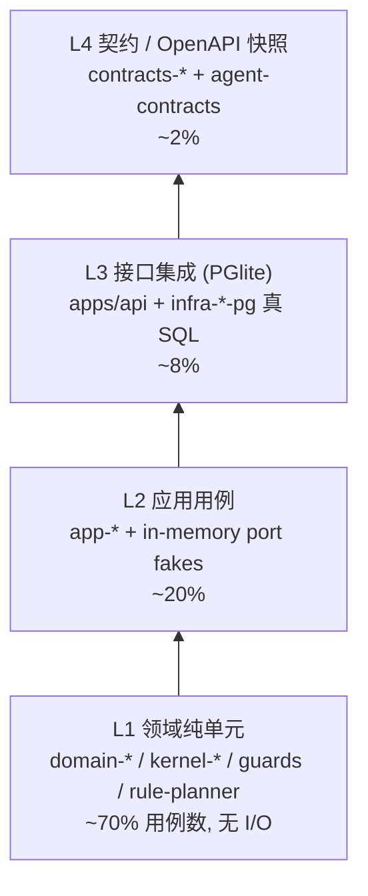

# LinX 灵信 · 后端重构细化文档之七：《测试策略 + CI》（ADR-019 / ADR-003 展开）

> 本文在 ADR-000 主文档拍板内展开，冲突以主文档为准。核心遵循：**ADR-019**（Vitest 3 + PGlite，迁移 159 用例）、**ADR-003**（pnpm + Turborepo + 三道边界闸 + CI 修 P14）、**ADR-006**（契约 = OpenAPI 回归基线）、**ADR-016/017**（Orchestrator + PlannerStrategy 可测性）。
> **一处必须的口径对齐**：任务文字写「Nx affected」，但 ADR-003 已拍板 **Turborepo 首日即用、明确否 Nx**。故本文的「受影响包测试」一律用 **`turbo run test --filter=...[<base>]`** 实现（Turbo 的 affected 等价物），语义与 Nx affected 相同、不引入 Nx。下文所有 CI 骨架据此。

---

## 1. 测试金字塔与包的映射（分层测试）

测试层级**必须与分层架构（ADR-001）同构**：一个包只测它自己那层的职责，越层的协作用 mock/stub 顶替。这样「测试也随包细拆」，与北极星⑤一致。

| 层 | 测什么 | 被测包 | 依赖处理 | 运行环境 | 速度基线 | 命中现状修复 |
|---|---|---|---|---|---|---|
| **L1 领域纯单元** | 实体不变量、值对象、纯领域服务、领域事件产出、Guard 纯逻辑 | `domain-*`、`kernel-*`、`agent-guards`、`agent-planner-rule` | **零 mock**（本就无 I/O） | 纯内存，无 PG/Redis | <5ms/例，全包 <2s | P1（row↔domain 移出后 domain 可纯测）、P7（时间值对象） |
| **L2 应用用例** | use-case 编排、事务边界、发事件时机、端口调用序列 | `app-*` | **端口用 in-memory fake / vi.fn stub**（domain port 的假实现） | 内存 fake repo | <20ms/例 | P9（业务从路由/God-file 下沉到 app 后可单测） |
| **L3 接口集成** | 路由↔app↔infra↔真 PG 全链路、Zod 校验、认证中间件、SSE 编码、Drizzle repo 真实 SQL、迁移 | `apps/api`、`infra-*-pg`、`platform-auth`、`platform-db` | **PGlite 进程内真 PG** + **ioredis-mock / 真 Redis 容器**（见 §5.3） | PGlite（`drizzle-orm/pglite`）+ Fastify `.inject()` | 50–300ms/例 | P2（迁移可跑真库验证）、P1（真 SQL 验证映射） |
| **L4 契约测试** | request/response DTO 与 `contracts-http` Zod 一致、OpenAPI 不回退、A2A action schema 稳定 | `contracts-http`、`contracts-events`、`agent-contracts`、`apps/api`（schema 快照） | 无外部 I/O（纯 schema 断言 / OpenAPI diff） | 内存 + 快照 | <10ms/例 | P11、P12（契约同步、防破坏前端） |



**分配原则**：把断言尽量下沉到 L1/L2（快、稳、定位精确），L3 只保留「真 SQL / 真中间件 / 真 SSE」必须的那部分，L4 是廉价的防回退网。现有 159 用例迁移后按此重新归层（§4.4）。

---

## 2. 每层的测试写法与 TS 草图

### 2.1 L1 领域纯单元（`domain-*`）

domain 无框架、无 I/O，测试即纯函数断言。时间用 `kernel-clock` 注入的 `FakeClock`（消除 P7 的隐式 `Date.now()`）。

```ts
// packages/domain-tasks/test/task.lifecycle.test.ts
import { describe, it, expect } from 'vitest';
import { Task } from '../src/task.js';
import { FakeClock } from '@linx/kernel-clock/testing';

describe('Task lifecycle 不变量', () => {
  const clock = new FakeClock('2026-07-14T00:00:00Z');

  it('done→archived 合法，archived 后不可再 complete', () => {
    const t = Task.create({ title: 'x', ownerId: uid() }, clock);
    t.start(clock); t.complete(clock);
    expect(() => t.complete(clock)).toThrowError(/already/); // 不变量
  });

  it('move-out（纠错）产出 domain event 且不丢 source 溯源', () => {
    const t = Task.create({ title: 'x', ownerId: uid() }, clock);
    const evt = t.moveOutToNonTodo('misclassified', clock);
    expect(evt.type).toBe('tasks.task.movedOut');
    expect(t.pullEvents()).toContainEqual(evt);
  });
});
```

`agent-guards`、`agent-planner-rule` 同属 L1（无 I/O、确定性），是**编排逻辑回归的主力**：诚实守卫、协作 settle 三态、`stripInviteClaims`、`detectIntent`/`parseTaskCommand` 全在这里穷举断言（迁移现有规则模式用例，§4.4）。

### 2.2 L2 应用用例（`app-*`）— in-memory port fake

domain port 定义在 domain，测试提供**内存实现**（非 mock 框架 spy，可复用、可断言状态）。事务边界用 fake `UnitOfWork` 验证「同一 tx 内 outbox.enqueue 被调用」。

```ts
// packages/app-collaboration/test/invite.test.ts
import { InMemoryCollabRepo } from './fakes/collab-repo.js';
import { FakeFriendCircle } from './fakes/friend-circle.js';   // 顶替 app-social 查询接口
import { FakeOutbox } from '@linx/platform-outbox/testing';
import { inviteCollaborator } from '../src/invite.js';

it('邀请前必须过好友圈判定（权限收口），非好友抛 AppError', async () => {
  const friends = new FakeFriendCircle({ '<u1>': ['<u2>'] });   // u1-u2 是好友
  const repo = new InMemoryCollabRepo();
  const outbox = new FakeOutbox();

  await expect(inviteCollaborator(
    { taskId, inviterId: '<u1>', inviteeId: '<u3>' }, // u3 非好友
    { repo, friends, outbox },
  )).rejects.toMatchObject({ code: 'COLLAB_NOT_FRIEND', httpStatus: 403 });

  // 好友则成功 + 事务内投递集成事件
  await inviteCollaborator({ taskId, inviterId:'<u1>', inviteeId:'<u2>' }, { repo, friends, outbox });
  expect(outbox.enqueued).toContainEqual(expect.objectContaining({ type:'collab.invited' }));
});
```

> **关键收益**：collab↔friends 循环已被 `FriendCircleQuery` 接口打断（主文档 §4），测试里 `FakeFriendCircle` 独立顶替，`app-collaboration` 的测试**不 import friends 任何实现**，结构性验证了消环。

### 2.3 L3 接口集成（PGlite 真 PG + Fastify inject）

统一测试夹具：迁移一次 → 每例事务回滚（或每例建 schema，PGlite 进程内极快）。用 `app.inject()` 不起网络端口。

```ts
// packages/testkit-integration/src/harness.ts  （复用型测试包，供所有 infra/api 集成测试）
import { PGlite } from '@electric-sql/pglite';
import { drizzle } from 'drizzle-orm/pglite';
import { runMigrations } from '@linx/platform-db/migrate';

export async function makeTestDb() {
  const client = new PGlite();                 // 进程内真 PG16 语义
  const db = drizzle(client, { schema });
  await runMigrations(db, { dir: MIGRATIONS_DIR }); // 跑真迁移，顺带验证 P2
  return { db, client, reset: () => client.query('ROLLBACK') };
}

// apps/api/test/tasks.routes.int.test.ts
const app = await buildApp({ db, auth: fakeAuth('<u1>') }); // composition root 注入测试依赖
const res = await app.inject({ method:'POST', url:'/api/tasks', payload:{ title:'buy milk' } });
expect(res.statusCode).toBe(201);
expect(res.json()).toMatchObject({ id: expect.stringMatching(UUID_V7_RE), status:'todo' });
```

**per-user 隔离**、**privacy 过滤 SQL**、**collab 作用域收口**、**today 视图**、**keyset 分页**这些「必须真 SQL 才能验证」的逻辑（含 `sql\`\`` 逃生舱）都在 L3。

### 2.4 L4 契约测试（防破坏前端 / OpenAPI 基线）

两类断言，都廉价：

```ts
// 1) DTO 双向：contracts-http 的 Zod 能 parse 真实响应，且 response = schema
// packages/contracts-http/test/task.dto.test.ts
it('TaskDTO schema 与 API 实际响应结构一致', () => {
  const parsed = TaskDTO.safeParse(sampleApiResponse);
  expect(parsed.success).toBe(true);
});

// 2) OpenAPI 冻结：apps/api 启动时由 @fastify/swagger 产出 spec，与基线 diff
// apps/api/test/openapi.snapshot.test.ts
const spec = app.swagger();                    // fastify-type-provider-zod 生成
expect(spec).toMatchSnapshot();                // 破坏契约 = 快照失败 = CI 红
```

OpenAPI 快照即「API 契约稳定」硬约束的**机器执法**：任何字段增删/类型变更让快照测试红，PR 必须显式更新快照（reviewer 看 diff 判断是否兼容前端）。`agent-contracts`（Action/Intent/Performed/StreamEvent）同法快照，保 A2A 与对外 `{intent,reply,entities,plan,performed,...}` 信封稳定。

---

## 3. Agent / 编排的可测性（ADR-016/017 落地）

编排的可测性完全依赖主文档的拍板：**确定性 Orchestrator（无 LLM）+ 可替换 PlannerStrategy + Guard 中间件**。三个可测性支点：

### 3.1 打桩 LLM —— `StubPlanner` 与 `StubLlmGateway`

LLM 是唯一的非确定性来源，被隔离在 `agent-llm`（gateway）与 `agent-planner-llm` 之后。测试注入桩，**编排全程确定性**。

```ts
// packages/agent-core/testing/stub-planner.ts
export class StubPlanner implements PlannerStrategy {
  constructor(private script: Record<string, PlannerOutput>) {}
  async plan(ctx: TurnContext): Promise<PlannerOutput> {
    return this.script[ctx.userMessage] ?? { reply:'', actions:[] };  // 固定映射
  }
}

// 流式提取单测：喂固定 SSE chunk 序列，断言增量 reply 抽取（保留领域逻辑）
// packages/agent-llm/test/reply-extractor.test.ts
it('makeReplyExtractor 从 OpenAI 兼容增量 chunk 累积 reply', () => {
  const ex = makeReplyExtractor();
  for (const c of loadFixture('openai-stream.jsonl')) ex.push(c);
  expect(ex.reply()).toBe('好的，已为你创建任务「买牛奶」。');
});
```

**两种模式等价性测试**（核心收益）：因 action 之后路由/Agent/Tool/Guard 全共用，用**同一 actions 输入**跑 RulePlanner 与 StubLlmPlanner，断言 `performed`/`agentMessage` 终态一致——机器证明「离线与 AI 唯一差异只在 Planner」这一拍板。

```ts
it.each(['rule','llm'])('模式 %s 对相同 action 产生一致副作用', async (mode) => {
  const planner = mode==='rule' ? new RulePlanner() : new StubPlanner(SCRIPT);
  const out = await orchestrator.run(turn('把买牛奶改到明天'), { planner, tools, guards });
  expect(out.performed).toEqual([{ type:'task.rescheduled', taskId, dueAt:'2026-07-15T...' }]);
});
```

### 3.2 Tool mock —— `ToolBelt` 权限收口的契约测试

Tool 注册为 `{name,input:Zod,sideEffect,scope,idempotent,handler}`。测试有三个必查项（对应主文档 §8.4 模板）：

| 契约项 | 断言 |
|---|---|
| **越权抛错** | 非好友圈 invitee → tool.handler 抛 `AppError{code:COLLAB_NOT_FRIEND}`，ToolBelt 不执行副作用 |
| **幂等重入** | 同 `idempotencyKey` 重放 → 副作用只发生一次（`platform-idempotency` fake 断言） |
| **input 校验** | 非法 input 被 Zod 拒于 handler 前，产结构化错误 |

```ts
// agent-tools 用 fake app use-case 注入，Tool 不碰真 repo
const belt = makeToolBelt({ tasks: fakeTaskUseCases, scopeOf:(u)=>friendCircle(u) });
await expect(belt.invoke('invite_collaborator', { taskId, invitee:'<stranger>' }, ctxU1))
  .rejects.toMatchObject({ code:'COLLAB_NOT_FRIEND' });
```

### 3.3 Guard 管线 —— 固定顺序的中间件测试

Guard 是中间件不是 Agent（硬性），顺序固定 **settle → strip → honesty → planRender → persist**。测试用「观测聚合产物 + 假 action 结果」驱动，断言：

- **协作 settle 三态互斥**：已邀请/待确认/无法邀请三态在同一 turn 不冲突叠加。
- **stripInviteClaims 剥离 LLM 误断言**：Planner 文本声称「已邀请 X」但实际 invitee 非好友 → strip 删除该句 → 若删的是已流出文字则发 `{type:'reply.final'}` 控制事件（单测断言事件产出）。
- **honesty guard**：无 tool 执行却声称完成 → 被拦截改写。

```ts
it('strip 删除已流式输出的误断言时补发 reply.final', () => {
  const stream = new CapturingStream();
  runGuards({ reply:'已邀请 @张三', performed:[], invited:[] }, { stream });
  expect(stream.events).toContainEqual({ type:'reply.final', reply: expect.not.stringContaining('已邀请') });
});
```

### 3.4 编排×异步的测试边界

| 关切 | 测法 |
|---|---|
| 单 turn handoff（进程内，深度≤2，origin 去重防环） | L1/L2 纯内存，断言 handoff action 白名单 + 环检测抛错 |
| 跨请求卸载（`chat.orchestrate` BullMQ job） | 用 `bullmq` 的内存/单进程模式或直接单测 job processor 函数（不必起 Redis），断言 job 产出 = 同步编排产出 |
| turn 后 outbox 副作用 | L3 断言 outbox 行随业务 tx 落库；relay→consumer 单测消费者幂等 |

---

## 4. 159 个 node:test 迁移到 Vitest（等价保证）

### 4.1 迁移策略：语义等价的机械替换 + 分层重新归属

node:test 与 Vitest 的断言/结构高度同构，迁移是**低风险机械转换**，风险点集中在「异步生命周期」「进程内 PG 夹具」「隔离性」三处，逐一给等价保证。

| node:test 构造 | Vitest 等价 | 等价保证 / 注意 |
|---|---|---|
| `import { test } from 'node:test'` | `import { it, describe } from 'vitest'` | `test` 亦可，统一用 `it` |
| `t.mock.method(obj,'m',fn)` | `vi.spyOn(obj,'m').mockImplementation(fn)` | 语义一致；改后一律优先换成注入 fake（去 mock） |
| `assert.equal/deepEqual/throws` | `expect().toBe/toEqual/toThrow` | 深比较语义一致；`assert.rejects`→`await expect().rejects` |
| `before/after/beforeEach` | 同名 `beforeEach/afterAll` | Vitest hooks 支持 async 返回，天然 await |
| `--test-concurrency` | `test.concurrent` / `poolOptions.threads` | 见 §4.3 隔离 |
| 自建 PG 夹具（现测试用 PGlite） | 复用型 `testkit-integration` harness | **驱动从裸 PGlite 换成 `drizzle-orm/pglite`**，SQL 语义不变 |

### 4.2 codemod 加人工复核（不盲目自动）

```bash
# 一次性转换脚本（放 scratchpad，非入库）：正则替换 import + assert→expect
npx jscodeshift -t scripts/nodetest-to-vitest.ts "packages/**/*.test.ts"
```

codemod 只做 import/assert 的机械替换；**夹具与 mock 改写人工做**（因为要顺带下沉到正确层、去 mock 换 fake）。转换后逐包对比用例数不减。

### 4.3 等价保证的四个校验闸

1. **用例计数守恒**：迁移前 `node --test` 报告用例数 N=159；迁移后 `vitest run --reporter=json` 断言总数 ≥159（重新归层可能拆多，不可少）。CI 加一个 guard 脚本比对。
2. **隔离等价**：node:test 每文件独立进程；Vitest 默认 worker 线程隔离，**集成测试（L3）设 `pool:'forks'` + `isolate:true`** 复现进程级隔离，避免 PGlite/全局态串扰。L1/L2 用 threads 提速。
3. **PGlite 行为等价**：迁移到 `drizzle-orm/pglite` 后，同一 schema/SQL 的读写结果与旧裸 PGlite 一致；保留旧测试的关键断言（尤其排序/时区，验证 P7 timestamptz 修复不破坏原期望——**允许期望值更新**，需 reviewer 确认是修复而非回退）。
4. **优雅关闭/落盘领域逻辑保留**：现有涉及 `syncToFs`、Redis 扇出+进程内回退、每日 pg_dump 的测试，迁移后落到对应 `platform-*`/`apps/worker` 包，断言不变（硬约束「领域逻辑与测试保留」）。

### 4.4 归层落表（159 用例去向示意）

| 现状测试主题 | 迁移后层 | 落包 |
|---|---|---|
| triage 规则版分类、parseTaskCommand、detectIntent | L1 | `agent-planner-rule` / `domain-tasks` |
| 诚实守卫、@协作三态、stripInviteClaims、流式提取 | L1 | `agent-guards` / `agent-llm` |
| task CRUD/生命周期/纠错、privacy/view/today 过滤 | L3（真 SQL） + L1（不变量） | `infra-tasks-pg` + `domain-tasks` |
| 认证注册/登录/改密吊销/Bearer 中间件/per-user 隔离 | L3 | `platform-auth` + `apps/api` |
| 好友请求/接受/反向自动/限流、协作邀请-确认/auto_rules | L2 + L3 | `app-social`/`app-collaboration` + infra |
| 多会话作用域/自动命名/跨用户注入、SSE 扇出+回退 | L2 + L3 | `app-chat` + `platform-eventbus` |
| 契约/响应结构 | L4（新增，防回退） | `contracts-http` |

---

## 5. Monorepo 测试运行（按包 / 受影响包）

### 5.1 Vitest workspace（每包独立配置，一条命令全跑）

```ts
// vitest.workspace.ts（根）—— Vitest 3 workspace，自动发现各包 vitest.config
export default [
  'packages/*/vitest.config.ts',
  'apps/*/vitest.config.ts',
];
```

每包一份 `vitest.config.ts`，**按层选 pool**：

```ts
// packages/infra-tasks-pg/vitest.config.ts（L3 集成 → forks 隔离）
export default defineConfig({ test:{
  pool:'forks', poolOptions:{ forks:{ isolate:true } },
  setupFiles:['@linx/testkit-integration/setup'],
  testTimeout: 15_000,
}});
// packages/domain-tasks/vitest.config.ts（L1 → threads 提速，无 setup）
export default defineConfig({ test:{ pool:'threads' }});
```

### 5.2 Turborepo 缓存 + 受影响包（= 任务要的「Nx affected」）

`turbo.json` 定义 test 依赖 build/typecheck，输入变则缓存失效：

```jsonc
// turbo.json
{
  "tasks": {
    "typecheck": { "dependsOn": ["^build"], "outputs": [] },
    "build":     { "dependsOn": ["^build"], "outputs": ["dist/**"] },
    "test": {
      "dependsOn": ["^build"],
      "inputs": ["src/**", "test/**", "vitest.config.ts", "../*/src/**"],
      "outputs": ["coverage/**"]
    }
  }
}
```

```bash
# 本地全量：Turbo 只跑内容变化的包（内容哈希缓存）
turbo run test typecheck

# CI 受影响包（affected 等价物）：只测相对 base 变更波及的包及其下游依赖
turbo run test --filter="...[origin/main]"
#   ...[base]  = 变更包 + 依赖它们的包（下游），正是 Nx affected 语义
```

> **为何等价 Nx affected**：Turbo 的 `--filter=...[<ref>]` 用 git diff 求变更包，`...` 前缀纳入**依赖者（下游）**，确保「改了 `domain-tasks` 就重跑 `app-tasks`/`infra-tasks-pg`/`apps/api` 的测试」。与 Nx affected 同义，但不引入 Nx（守 ADR-003）。

### 5.3 集成测试的 PG/Redis 依赖

- **PG**：L3 用 **PGlite 进程内**，CI 无需 service 容器（这是选 PGlite 的一大理由，修 P2/P1 且 CI 轻量）。
- **Redis**：默认 **`platform-eventbus` 的进程内回退 + `platform-redis` 的 ioredis-mock** 覆盖大多数逻辑；**只有** Pub/Sub 多副本扇出、BullMQ 可靠投递、Redis 限流这三类必须真 Redis 的用例，在 CI 起 `redis:7` service 容器（下 §6 job `integration`）跑。分层让 90% 集成测试零外部依赖。

---

## 6. 边界校验（dependency-cruiser）纳入 CI

三道闸中的**闸 2**是 CI 红线（主文档 §5.4），与测试同级门禁。`.dependency-cruiser.cjs` 的禁令已在主文档给出（domain-no-outward / app-no-infra / no-cross-domain / agents-no-cross-import / no-circular / apps-isolated）。CI 执行：

```bash
pnpm depcruise --config .dependency-cruiser.cjs --validate packages apps
# 违规（越层/循环/串包）非零退出 → PR 红，进不了 main
```

补充在 CI 加**边界回归的可视化产物**（可选，PR 附图便于 review）：

```bash
pnpm depcruise --output-type dot packages | dot -Tsvg > dep-graph.svg  # 上传为 artifact
```

> 与测试的分工：**dependency-cruiser 管「结构」（谁能 import 谁），Vitest 管「行为」。** 例如 collab↔friends 消环，depcruise 保证编译期无环，L2 测试保证运行期 `FakeFriendCircle` 顶替下行为正确——双重保险。

---

## 7. 后端 CI 流水线（YAML 骨架，修 P14）

单一 workflow，jobs 拓扑：`setup → (lint ∥ typecheck ∥ boundaries ∥ contracts) → test → integration → build → migration-check`。全绿才可合并。用 Turbo 缓存 + affected 让 PR 快、main 全量。

```yaml
# .github/workflows/backend-ci.yml
name: backend-ci
on:
  pull_request: { branches: [main] }
  push:         { branches: [main] }

env:
  TURBO_TELEMETRY_DISABLED: 1
  # PR 用 affected(受影响包)，main 用全量
  FILTER: ${{ github.event_name == 'pull_request' && '...[origin/main]' || '' }}

jobs:
  setup:
    runs-on: ubuntu-latest
    steps:
      - uses: actions/checkout@v4
        with: { fetch-depth: 0 }            # affected 需要完整 git history 求 diff
      - uses: pnpm/action-setup@v4          # 严格 node_modules，堵幽灵依赖
      - uses: actions/setup-node@v4
        with: { node-version: 22, cache: pnpm }
      - run: pnpm install --frozen-lockfile

  quality:                                   # lint + typecheck + 边界 + 契约（并行 matrix）
    needs: setup
    runs-on: ubuntu-latest
    strategy:
      matrix: { task: [lint, typecheck, boundaries, contracts] }
    steps:
      - uses: actions/checkout@v4
        with: { fetch-depth: 0 }
      - uses: pnpm/action-setup@v4
      - uses: actions/setup-node@v4
        with: { node-version: 22, cache: pnpm }
      - run: pnpm install --frozen-lockfile
      - name: run ${{ matrix.task }}
        run: |
          case "${{ matrix.task }}" in
            lint)       pnpm eslint . --max-warnings=0 ;;          # 含 eslint-plugin-boundaries
            typecheck)  pnpm turbo run typecheck --filter="$FILTER" ;;  # tsc --noEmit, project refs
            boundaries) pnpm depcruise --config .dependency-cruiser.cjs --validate packages apps ;;
            contracts)  pnpm turbo run test --filter="$FILTER" -- --project=contracts ;; # L4 OpenAPI 快照
          esac

  test:                                      # L1 + L2（纯/用例，无外部依赖，快）
    needs: quality
    runs-on: ubuntu-latest
    steps:
      - uses: actions/checkout@v4
        with: { fetch-depth: 0 }
      - uses: pnpm/action-setup@v4
      - uses: actions/setup-node@v4
        with: { node-version: 22, cache: pnpm }
      - run: pnpm install --frozen-lockfile
      - name: unit + app use-case (+coverage)
        run: pnpm turbo run test --filter="$FILTER" -- --coverage
      - name: 用例计数守恒守卫 (≥159)
        run: node scripts/assert-testcount.mjs --min 159   # §4.3 闸1
      - uses: codecov/codecov-action@v4     # 或自托管；覆盖率门禁见 §8

  integration:                               # L3：PGlite 进程内 + 少量真 Redis
    needs: quality
    runs-on: ubuntu-latest
    services:
      redis:                                 # 仅 Pub/Sub扇出 / BullMQ / 限流 用例需要
        image: redis:7
        ports: ['6379:6379']
        options: >-
          --health-cmd "redis-cli ping" --health-interval 5s --health-retries 5
    env: { REDIS_URL: redis://localhost:6379 }
    steps:
      - uses: actions/checkout@v4
        with: { fetch-depth: 0 }
      - uses: pnpm/action-setup@v4
      - uses: actions/setup-node@v4
        with: { node-version: 22, cache: pnpm }
      - run: pnpm install --frozen-lockfile
      - name: integration (PGlite 真 PG)
        run: pnpm turbo run test:int --filter="$FILTER"   # infra-*-pg / apps/api / platform-auth

  migration-check:                           # 迁移可跑 + schema 与 drizzle-kit 无 drift（数据零丢失前提）
    needs: quality
    runs-on: ubuntu-latest
    steps:
      - uses: actions/checkout@v4
      - uses: pnpm/action-setup@v4
      - uses: actions/setup-node@v4
        with: { node-version: 22, cache: pnpm }
      - run: pnpm install --frozen-lockfile
      - name: drizzle drift 检测（schema 改了但没 generate 迁移 → 红）
        run: pnpm drizzle-kit check                # generate 无新增 diff 才算同步
      - name: 迁移在 PGlite 上正反向可跑
        run: pnpm tsx scripts/migrate-check.ts     # runMigrations 全跑 + down 冒烟

  build:                                     # tsup 库 + apps 可构建（产物给部署）
    needs: [test, integration, migration-check]
    runs-on: ubuntu-latest
    steps:
      - uses: actions/checkout@v4
        with: { fetch-depth: 0 }
      - uses: pnpm/action-setup@v4
      - uses: actions/setup-node@v4
        with: { node-version: 22, cache: pnpm }
      - run: pnpm install --frozen-lockfile
      - run: pnpm turbo run build --filter="$FILTER"   # apps/api + apps/worker 同镜像两 entrypoint
```

**分支保护**：`quality`、`test`、`integration`、`migration-check`、`build` 全设为 required status checks；depcruise 与 OpenAPI 快照失败即阻断合并。

**流水线要点回执**：

| 任务要求 | 对应 job/step |
|---|---|
| lint | `quality:lint`（含 eslint-plugin-boundaries 编辑器/CI 双查） |
| typecheck | `quality:typecheck`（`tsc --noEmit`，project references） |
| test（分层） | `test`（L1/L2）+ `integration`（L3）+ `quality:contracts`（L4） |
| build | `build`（tsup 库出 ESM+d.ts，apps 打包） |
| migration check | `migration-check`（drizzle-kit check drift + 迁移正反向冒烟 + 每 migrate 前 pg_dump 在部署流程强制，非 CI） |
| 边界校验 | `quality:boundaries`（dependency-cruiser） |
| affected（任务写 Nx） | `FILTER=...[origin/main]` via Turbo，语义等价 |

---

## 8. 覆盖率与门禁

### 8.1 provider 与差异化阈值（不搞一刀切）

用 Vitest 的 v8 coverage provider（快、无插桩改写）。**按层设阈值**：越靠内层要求越高（纯逻辑无理由不覆盖），集成层看关键路径。

```ts
// vitest.config 根 coverage（各包可覆写）
coverage: {
  provider: 'v8',
  reporter: ['text-summary', 'lcov', 'json-summary'],
  reportsDirectory: './coverage',
  thresholds: {
    // 全局兜底
    lines: 80, functions: 80, branches: 75, statements: 80,
    // 逐层/逐包（glob）门禁 —— 内层严、外层松
    'packages/domain-**':          { lines: 95, branches: 90 },
    'packages/app-**':             { lines: 90, branches: 85 },
    'packages/agent-guards/**':    { lines: 95, branches: 92 },  // 守卫是安全/口径要害
    'packages/agent-planner-rule/**': { lines: 90, branches: 88 },
    'packages/infra-**':           { lines: 75, branches: 65 },  // repo 映射看关键 SQL
    'apps/api/**':                 { lines: 70 },                // 路由薄，逻辑已下沉
  },
  exclude: ['**/*.config.ts','**/testing/**','**/test/**','**/*.d.ts','**/schema.ts'],
}
```

> `schema.ts`（Drizzle）与 `contracts-*` 的纯声明式 Zod 排除出覆盖分母（声明无分支可测，计入会稀释信号）。

### 8.2 门禁策略（three-tier）

| 门 | 触发 | 行为 |
|---|---|---|
| **硬门（阻断合并）** | 任一被测包低于其层阈值 | Vitest `--coverage` 非零退出 → CI 红。**新增/改动包必须自带测试达标**（北极星①「新增有可复制落点」含测试模板） |
| **不回退门（ratchet）** | main 覆盖率较基线下降 >0.5% | `codecov` project status `threshold: 0.5%` fail；只准升不准降 |
| **patch 门（新代码严）** | PR diff 行覆盖 <85% | `codecov` patch status → 新写代码必须测到，防「加功能不加测」 |

### 8.3 覆盖率之外的质量信号（门禁补充）

覆盖率是必要非充分。额外三个 CI 断言，防「覆盖率高但测得空」：

1. **用例计数守恒**（§4.3 闸1）：`≥159`，迁移不丢断言。
2. **契约快照必须显式更新**：OpenAPI/agent-contracts 快照变更需 PR 带 diff（reviewer 判兼容性），杜绝无意破坏前端。
3. **flaky 隔离**：集成层 `retry: 2` 仅用于已知网络抖动，且 flaky 用例打 `@flaky` tag 单独统计，连续 3 次 flaky 进阻断名单（不让不稳定测试稀释信号）。

---

## 9. 一致性回执（与主文档拍板对齐）

| 主文档拍板 | 本文如何遵循 |
|---|---|
| ADR-019 Vitest 3 + PGlite，迁移 159 | §4 机械迁移 + 四闸等价保证 + 计数守恒；§2.3/5.3 PGlite 用 `drizzle-orm/pglite` |
| ADR-003 Turborepo 首日、**否 Nx** | §5.2「受影响包」用 `turbo --filter=...[base]` 实现，显式不引入 Nx（纠正任务文字的「Nx affected」措辞） |
| ADR-003 三道边界闸 | §6 depcruise 入 CI（闸2）+ project references（闸1）+ eslint-boundaries（闸3，`quality:lint`） |
| ADR-001 分层 DIP | §1 测试层与架构层同构；§2.2 domain port 用 in-memory fake，collab↔friends 消环由测试结构验证 |
| ADR-006 契约 = OpenAPI 基线 | §2.4/§7 OpenAPI 快照 + DTO 双向校验为 required check |
| ADR-016/017 Orchestrator + PlannerStrategy + Guard | §3 打桩 LLM（StubPlanner/StubGateway）、Tool 三项契约测试、Guard 固定顺序中间件测试、双模式等价性测试 |
| ADR-005 迁移零丢失可回退 | §7 `migration-check` job：drizzle-kit drift + 正反向冒烟；pg_dump 前置属部署流程强制 |
| 硬约束「领域逻辑与测试保留」 | §4.3 闸4：优雅关闭 syncToFs / Redis 扇出+回退 / 诚实守卫 / @协作三态 / 流式提取 迁移后断言不变 |

---

（以上为《测试策略 + CI》完整交付物：分层测试→包映射、各层 TS 草图、Agent/编排可测性三支点、159 用例迁移的机械做法与四闸等价保证、Turbo affected 的受影响包运行、dependency-cruiser 入 CI、完整 GitHub Actions YAML 骨架、分层覆盖率与三级门禁。全文在 ADR-000 拍板与 §5 命名法内，未与主文档冲突；仅将任务文字的「Nx affected」按 ADR-003 校正为 Turbo filter 等价实现。按要求未写入磁盘，以文本返回。）
