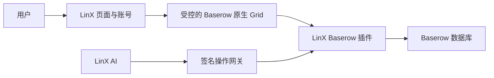

# LinX × Baserow 首版集成

## 结果

Baserow 是任务的唯一新数据源；LinX 继续提供账号、聊天 AI、导航、搜索、提醒和通知。旧 PostgreSQL 任务表保留，但在 `TASK_BACKEND=baserow` 时不再读写。



数据库页加载的是可编辑的 Baserow 原生前端，因此用户仍可拖动列、改列宽、新增动态列、筛选、排序、隐藏、分组和使用协作 Grid。LinX 隐藏 Baserow 的账号、工作区和产品外壳，并限制可进入的路由。

## 数据模型

每个 LinX 团队对应一个 Baserow Workspace 和一个 `Todo 数据库`：

- `团队任务`：团队成员均可见、可编辑。
- `个人任务`：只有创建者和当前负责人可读取；负责人只能修改普通内容，不能改负责人或删除任务。

两张表都由插件幂等创建：

- 固定列 `任务名称`：主文本列，不可删除、改名或改类型。
- 默认动态列 `状态`、`截止日期`、`负责人`：可重命名、调整、改类型或删除。
- 系统列 `来源记录`：只读且始终隐藏；行详情中可查看带时间、操作者、聊天消息 ID 和原话的追加日志，不能修改或删除。

默认动态列删除后，标题 CRUD 继续工作。按相同名称和原类型重建默认列时，插件会自动重新连接对应语义。

## 身份与会话

1. 管理员通过 `POST /api/admin/baserow/invitations` 创建 7 天有效的一次性邀请。
2. 用户只注册并登录 LinX；邀请令牌在账号创建时原子认领。
3. 打开数据库页时，LinX 创建 60 秒有效的一次性启动票据。
4. iframe 访问 `/linx/session`；Baserow 插件用 HMAC 向 LinX 服务端兑换票据。
5. 插件幂等创建不可使用密码登录的 Baserow 内部身份，发放 15 分钟 access token 和 8 小时 refresh token。
6. 启动票据随即从地址栏移除；重复使用或过期均返回拒绝。

浏览器看不到服务端共享密钥，AI 也不持有 Baserow 管理员令牌。LinX 后端以当前用户身份签名每次操作；插件重新执行与原生页面相同的权限检查。

## 安全边界

个人行隔离不是前端隐藏，而是五层服务端约束：

- LinX 权限管理器固定排在所有 Baserow 内置管理器之前；个人表的通用 REST 行列表入口直接关闭，避免它绕过逐行主体过滤。
- 原生 Grid 的首屏、分页、搜索、计数、筛选和分组查询经过同一行过滤。
- 单行及批量读取、更新和删除由 RowHandler 守卫复核。
- WebSocket 表页与单行页事件都只发送给该行的创建者和负责人；移除负责人时额外推送删除事件，使其界面立即移除该行。
- 来源审计与负责人主体关系保存在独立插件表中，不依赖可编辑的单元格。

托管 Workspace 同时关闭数据库 Token、内置 MCP、Webhook、应用快照、公开分享、导入导出和通用回收站入口。这些入口可能形成第二套身份或包含整表副本，不属于首版安全边界。

iframe 与父页面通信会同时校验 `event.origin` 和 `event.source`。Baserow 页面只允许 `LINX_PARENT_ORIGIN` 通过 CSP 嵌入；直接打开 Baserow 前端会回到 LinX。

## AI 能力

聊天 AI 使用与用户相同的绑定身份，可执行：

- 读取动态表结构和当前可见的动态列值；查询、新增、更新和删除行，并按列名修改任意允许的动态属性。
- 新增、重命名、排序、隐藏、改类型和删除允许的字段。
- 读取并完整替换共享 Grid 的平面筛选、排序和分组配置。

删除任务、删除字段和改变字段类型必须在本轮用户原话中出现明确确认；模型返回的参数本身不能伪造确认。每次聊天行变更把完整用户原话及其准确消息 ID 写入不可变审计条目和只读来源日志。

负责人新增后，由 Baserow 插件在数据库事务提交后向 LinX 发送签名事件。因此用户在原生 Grid 手动指派与 AI/API 指派会得到同样的 LinX 通知；稳定事件 ID 保证重试不会产生重复通知，点击通知可打开对应 Baserow 行。

首版 AI 网关将嵌套筛选组按叶子筛选读取；复杂嵌套组仍可由用户在原生 Grid 中编辑。官方 Baserow MCP 暂不直连 LinX AI。

## 启动

复制 `.env.example` 为 `.env`，至少替换：

```bash
BASEROW_SHARED_SECRET=$(openssl rand -hex 32)
LINX_POSTGRES_PASSWORD=$(openssl rand -hex 24)
```

然后运行：

```bash
docker compose --env-file .env -f deploy/docker-compose.yml up -d --build
docker compose --env-file .env -f deploy/docker-compose.yml ps
```

试验环境可把 `BASEROW_BIND_ADDRESS` 改为服务器 IP 并临时开放独立端口。正式环境必须让 `app.example.com` 与 `tables.example.com` 使用 HTTPS，并参考 `deploy/nginx-baserow.conf.example`。

## 验收顺序

1. 三个账号均只登录一次，且映射到三个不同 Baserow 身份。
2. 团队任务三人可见；个人任务不能从 Grid、REST、搜索、批量接口或实时消息泄漏。
3. 负责人变化、删除负责人列或改变其类型后，旧负责人立即失去读取能力；非创建者不能改负责人或删除。
4. 固定列和来源列不可篡改；三个默认动态列可调整或删除。
5. 用户与其 AI 执行同一操作时得到相同权限结果。
6. 过期或重复票据、邀请及 HMAC nonce 均被拒绝。
7. Chrome、Edge 在 1280px 和 1440px 下完成 Grid 编辑；移动端不验收表格。

## 回滚

把 API 环境变量改为 `TASK_BACKEND=legacy` 后重启 `chattodo-api`。前端发现 `/api/baserow/status` 不存在时会加载保留的旧任务表和详情抽屉；旧 PostgreSQL 数据从未被删除或迁移。

回滚不会把 Baserow 新任务复制回旧库，两边在切换期间的数据不会自动合并。回滚前应暂停写入并导出/备份 Baserow；再次启用时把变量改回 `baserow` 即可。
